# Inhoudsopgave

[Het autoscript](#het-autoscript)

[Toolbar](#toolbar)

[Belopdrachtstatussen](#belopdrachtstatussen-1)

[Scriptvelden](#scriptvelden)

[Belopdrachtnotitie](#belopdrachtnotitie)

[Pagina footer](#pagina-footer)

[Scriptdefinitie instellingen](#scriptdefinitie-instellingen)

[Extra autoscript instellingen](#extra-autoscript-instellingen)

[Globale campagne instellingen](#globale-campagne-instellingen)

[Agentgroup instellingen](#agentgroup-instellingen)

[Campagne instellingen](#campagne-instellingen)

[Status instellingen](#status-instellingen)

[Veld weergave](#veld-weergave)

[Textbox](#textbox)

[Textarea](#textarea)

[Radiobutton](#radiobutton)

[Checkbox](#checkbox)

[Combobox](#combobox)

[Label](#label)

[HTML](#html)

[Hidden](#hidden)

[Weergave opties](#weergave-opties)

[Datum velden](#datum-velden)

[Naam velden](#naam-velden)

[Overige functies](#overige-functies)

[Opmaak](#opmaak)

[Geavanceerde opmaak met het autoscript](#fulfilment-variabelen-voor-server-side-opmaak)

[Maatwerk opmaak voor invoervelden](#maatwerk-opmaak-voor-invoervelden)

[Plaats velden binnen een tabcontrol](#plaats-velden-binnen-een-tabcontrol)

[Belhistorie resultaten aanpassen met CSS opmaak](#belhistorie-resultaten-aanpassen-met-css-opmaak)

[Afcoderingen verbergen in de statuslijst met CSS opmaak](#afcoderingen-verbergen-in-de-statuslijst-met-css-opmaak)

[Custom validatie tijdens afcoderen](#custom-validatie-tijdens-afcoderen)

[Antwoordservice pagina](#antwoordservice-pagina)

[Scriptvelden](#scriptvelden-1)

[Contactpersonen (ContactID)](#contactpersonen-contactid)

[Acties (ContactAction)](#acties-contactaction)

[Contactpersoon berichten via (SendEmail, SendSMS)](#contactpersoon-berichten-via-sendemail-sendsms)

[Notitie voor contactpersoon (ContactNote)](#notitie-voor-contactpersoon-contactnote)

[Aanpassen scriptweergave](#aanpassen-scriptweergave)

[Weergave introductie tekst](#weergave-introductie-tekst)

[Pauze pagina](#pauze-pagina)

[Belscripts maken voor gevorderden](#Belscripts-maken-voor-gevorderden)

[Script systeemacties](#script-systeemacties)

[Terugbellenscherm](#terugbellenscherm)

[Verwerkscherm](#verwerkscherm)

[Niet-bereikt scherm](#niet-bereikt-scherm)

[Belopdracht afcoderen](#belopdracht-afcoderen)

[Starten windows applicatie](#starten-windows-applicatie)

[Herstellen/annuleren wijzigingen](#herstellenannuleren-wijzigingen)

[Aanmelden](#aanmelden)

[Pauze](#pauze)

[Uitloggen](#uitloggen)

[Telefoonnummer kiezen](#telefoonnummer-kiezen)

[Beëindig gesprek](#beëindig-gesprek)

[Doorschakelen naar Bel-me-niet IVR](#doorschakelen-naar-bel-me-niet-ivr)

[Beantwoord gesprek](#Beantwoord-gesprek)

[Dialing configuratie](#dialing-configuratie)

[Verander wachtwoord](#verander-wachtwoord)

[Nieuwe belopdracht](#nieuwe-belopdracht)

[Zoek belopdracht](#zoek-belopdracht)

[Terug navigeren](#terug-navigeren)

[Vooruit navigeren](#vooruit-navigeren)

[Belopdracht eigenschappen](#belopdracht-eigenschappen)

[Oproep agendamodul3](#oproep-agendamodule)

[Volgende belopdracht](#volgende-belopdracht)

[Call blending; overschakelen op andere dial mode](#call-blending-overschakelen-op-andere-dial-mode)

[Work modus van agent; het plaatsen van een agent in een work modus](#work-modus-van-agent-het-plaatsen-van-een-agent-in-een-work-modus)

[Cancel belopdracht; de belopdracht wordt beëindigd zonder te bewaren](#cancel-belopdracht-de-belopdracht-wordt-beëindigd-zonder-te-bewaren)

[Speciale hyperlink anchors](#speciale-hyperlink-anchors)

[Opnemen gesprek](#opnemen-gesprek)

[Gesprek direct doorschakelen (blind transfer)](#gesprek-direct-doorschakelen-blind-transfer)

[Gesprek met ruggespraak doorverbinden (attended transfer)](#gesprek-met-ruggespraak-doorverbinden-attended-transfer)

[Doorverbinden met ruggespraak annuleren](#doorverbinden-met-ruggespraak-annuleren)

[Doorverbinden met ruggespraak voltooien](#doorverbinden-met-ruggespraak-voltooien)

[Doorverbinden wissel gesprekken](#doorverbinden-wissel-gesprekken)

[Verstuur DTMF-tonen](#verstuur-dtmf-tonen)

[Zet een gesprek on hold](#zet-een-gesprek-on-hold)

[Belscript (querystring) parameters](#belscript-querystring-parameters)

[Belscript startpagina](#belscript-startpagina)

[Pauze pagina](#pauze-pagina-1)

[Inbound pagina](#inbound-pagina)

[Belscript systeemvelden (OBSOLETE)](#belscript-systeemvelden-deprecated)

[Object hiërarchische velden](#object-hiërarchische-velden)

[Basis eigenschappen](#basis-eigenschappen)

[oEntry](#oentry)

[oAttempt](#oattempt)

[oCallList](#ocalllist)

[oDialer](#odialer)

[oAgent](#oagent)

[oCallstatus](#ocallstatus)

[oAppointment](#oappointment)

[CallPro objectmodel](#callpro-objectmodel)

# Belscripts maken voor beginners

CallPro wordt geleverd met een autoscript. Met het autoscript wordt een
eenvoudige callflow op basis van de velden in de scriptdefinitie
gemaakt. Hiermee kan een basis campagne zeer snel worden opgestart. Dit
hoofdstuk hoort bij de cursus “Belscript maken voor beginners”.

# Het autoscript

Het autoscript bestaat uit een aantal vaste onderdelen zoals in
onderstaand afbeelding weergegeven.

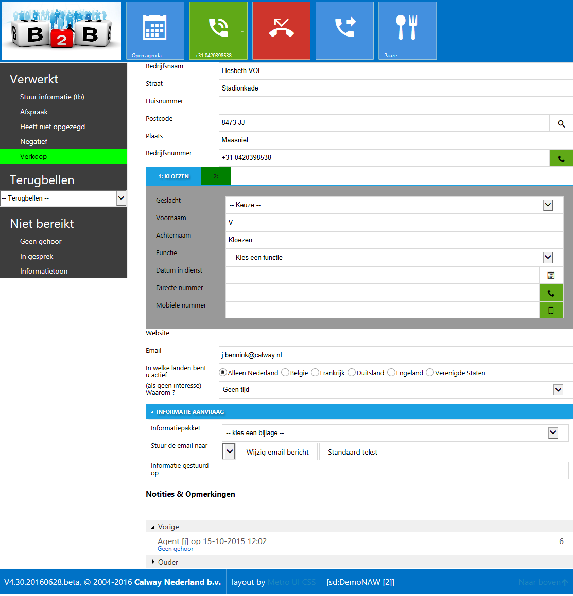

## Toolbar

In de toolbar wordt campagne en belopdracht informatie afgebeeld.
Helemaal links staat het logo dat is ingesteld op de scriptdefinitie. Op
deze manier kan per opdracht(gever) een eigen identiteit aan de campagne
gegeven worden. Zorg ervoor dat een afbeelding met formaat 310x150 wordt
gebruikt, of een verhouding die hieraan gelijk is.


De tweede tile geeft informatie over de laatste belpoging weer. Daarna
komt een optionele tile om de agendamodule te openen. Deze tile wordt
alleen afgebeeld als er een afspraak status wordt gebruik in de lijst
met belopdrachtstatussen.

Daar weer naast staan 4 tiles voor het bellen, ophangen, doorschakelen
en optioneel een bel-me-niet tile. Helemaal rechts staat de Pauze tile.

Als gebruikt wordt gemaakt van een CTI-koppeling kan met de “Bel nummer”
knop (groen) het gesprek worden gestart, met “Ophangen” (rood) kan het
telefoongesprek worden beëindigd. De doorverbinden tile toont een popup
met doorverbinden met of zonder ruggespraak.

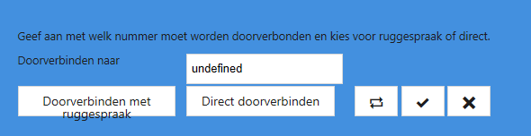

De “Bel-me-niet” tile (hier niet afgebeeld) kan indien beschikbaar het
gesprek worden doorgezet naar de bel-me-niet IVR.

Aanvullend kan ook Campagne informatie worden afgebeeld die in het
informatiebord bij de campagne staat ingesteld (weergeven in belscript).
Als extra kan ook een variabele SCRIPT.INFO worden gebruikt om
informatie hier te plaatsen.

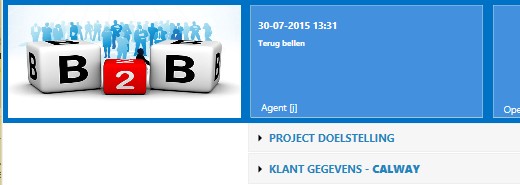

Voor de weergave wordt gebruik gemaakt van een accordion.

## Belopdrachtstatussen

De voor de scriptdefinitie geactiveerde belopdrachtstatussen worden links in de groepen waarin ze binnen CallPro zijn gedefinieerd afgebeeld. 

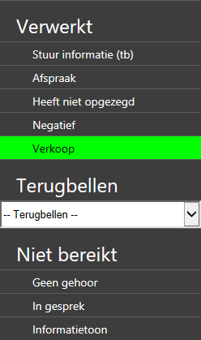

Voor de groepering wordt gebruik gemaakt van de status groep waar de betreffende statussen in zijn aangemaakt. Subgroepen met zelfde naam worden samengevoegd. De volgorde van de statussen kan worden bepaald met de Resource Explorer. Ga op de groep “Belopdracht statussen” staan en right-click. Kies “Volgorde groepen…” om de weergave volgorde van de groepen te bepalen, en “Volgorde…”om de volgorde van de statussen te bepalen binnen deze groepen.

| | |
| --- | --- |
| 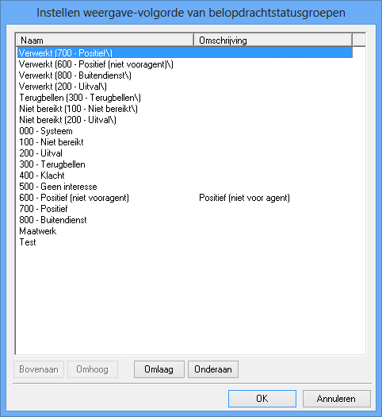 | 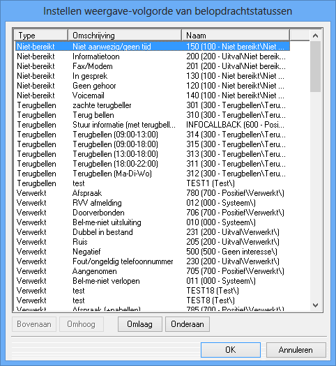 |

## Scriptvelden

Alle velden uit de scriptdefinitie worden in een standaard opmaak
afgebeeld. Vanaf V4.30 wordt het onderscheid tussen een blok met NAW en
BODY afgeschaft. Alle velden komen in 1 blok te staan in de volgorde
zoals ze in de scriptdefinitie staan. Hoewel de SCRIPT.NAW en
SCRIPT.BODY variabelen in de huidige versie nodig wel werken worden die
in de toekomst verwijderd en adviseren wij om nu al het gebruik af te
bouwen.

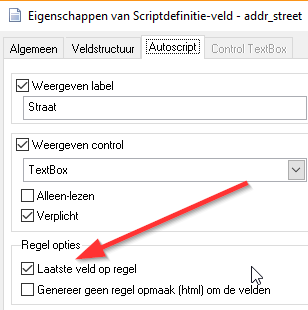

De scriptvelden worden standaard in de volgorde
uit de scriptdefinitie met 1 veld per regel weergegeven. Met de optie
“Laatste veld op de regel” wordt bepaald op het volgende veld op een
nieuwe regel komt, door dit bij een veld uit te zetten komt het volgende
veld ook op dezelfde horizontale regel.

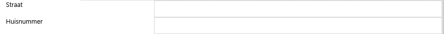

Of weergave op 1 regel met de velden achter elkaar:

| | |
| --- | --- |
| 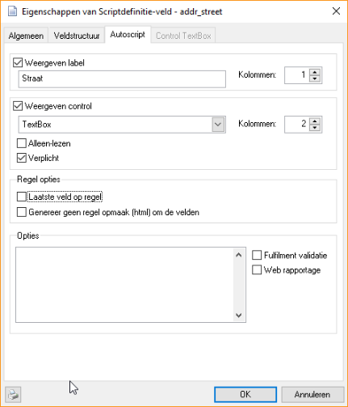 | 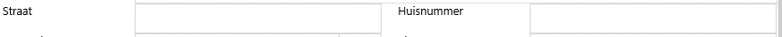 | 

## Belopdrachtnotitie

Hier kan een notitie worden vastgelegd door de telemarketeer. Tevens
wordt eronder een lijst afgebeeld met voorgaande belpogingen, alleen de
laatste is zichtbaar, de overige kunnen worden getoond door de blauwe
knoppen te gebruiken. In het grijze vlak staat de huidige notitie. In
het lege veld kan een nieuwe notitie worden gezet. Via knippen en
plakken kan ook informatie uit de vorige notitie worden overgenomen.

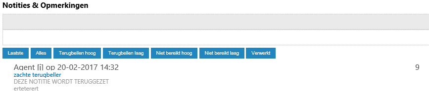

## Pagina footer

In de pagina footer wordt het versienummer van het autoscript afgebeeld
en staat tussen haakjes \[ \] de naam van de scriptdefinitie afgebeeld.
Helemaal rechts is een knop om snel naar boven te springen.


Met het hyperlink symbool gevolgd door een cijfer wordt aangegeven of
deprecated opties of ander problemen zijn herkend met de gebruikte
autoscript opties. Klik op dit item om een venster te openen met de
details.

## Scriptdefinitie instellingen

Met behulp van enkele variabelen die kunnen worden gedefinieerd bij de
campagne, of de scriptdefinitie kan het gedrag van het autoscript worden
beïnvloed. Hoewel elke schrijfwijze met hoofd- en kleine letters werkt
raden wij aan om de schrijfwijze uit deze handleiding aan te houden.

<table>
<thead>
<tr class="header">
<th>Variabele</th>
<th>Type</th>
<th>Betekenis</th>
</tr>
</thead>
<tbody>
<tr class="odd">
<td>SCRIPT.TITLE</td>
<td>Memo</td>
<td><strong>(Alleen voor intern gebruik)</strong></td>
</tr>
<tr class="even">
<td>SCRIPT.TOOLBAR</td>
<td>Bool</td>
<td><strong>True</strong>/False Bepaald of de toolbar in het autoscript wordt weergegeven.</td>
</tr>
<tr class="odd">
<td>SCRIPT.TOOLBAR.LOGO</td>
<td>Bool</td>
<td><strong>True</strong>/False Moet de Logo Tile worden afgebeeld.</td>
</tr>
<tr class="even">
<td>SCRIPT.TOOLBAR.LOGO.WIDE</td>
<td>Bool</td>
<td><strong>True</strong>/False Geeft aan of de Logo tile groot moet zijn.</td>
</tr>
<tr class="odd">
<td>SCRIPT.TOOLBAR.CALLHISTORY</td>
<td>Bool</td>
<td><strong>True</strong>/False Moet de Callhistory Tile worden afgebeeld</td>
</tr>
<tr class="even">
<td>SCRIPT.TOOLBAR.CUSTOMTILE1</td>
<td>Memo</td>
<td><strong>(Expert)</strong> Met deze variabele is het mogelijk om rechts van de Callhistory tile extra tiles in te voegen met eigen custom gedrag. Er is geen beperking op wat hier ingevoegd kan worden dus let op dat de toolbar opmaak niet wordt verstoord.</td>
</tr>
<tr class="odd">
<td>SCRIPT.TOOLBAR.DIAL</td>
<td>Bool</td>
<td><strong>True</strong>/False Moet de Dial Tile worden afgebeeld.</td>
</tr>
<tr class="even">
<td>SCRIPT.TOOLBAR.DIAL.SMALL</td>
<td>Bool</td>
<td>True/<strong>False</strong> Geeft aan of de Dial knop klein moet zijn</td>
</tr>
<tr class="odd">
<td>SCRIPT.TOOLBAR.DIAL.AUTOSELECTSTAT</td>
<td>Bool</td>
<td>True/<strong>False</strong> Geeft aan of de Dial knop in de toolbar bij automatisch bellen CTI resultaten automatisch afcodeert of alleen een melding geeft.<br />
Alle overige bellen knoppen in het script laten alleen zien wat het resultaat is maar coderen de belopdracht niet af. Op deze manier kunnen meerdere bekende nummers geprobeerd worden.</td>
</tr>
<tr class="even">
<td>SCRIPT.TOOLBAR.HANGUP</td>
<td>Bool</td>
<td><strong>True</strong>/False Moet de Hangup Tile worden afgebeeld</td>
</tr>
<tr class="odd">
<td>SCRIPT.TOOLBAR.HANGUP.SMALL</td>
<td>Bool</td>
<td>True/<strong>False</strong> Geeft aan of de Hangup knop klein moet zijn</td>
</tr>
<tr class="even">
<td>SCRIPT.TOOLBAR.INBOUND</td>
<td>Bool</td>
<td><strong>True</strong>/False Deze variabele bepaald of bij inbound/call blending campagnes de tiles voor zoeken, nieuw en annulerenvan een belopdracht worden getoond.</td>
</tr>
<tr class="odd">
<td>SCRIPT.TOOLBAR.CALLPARK</td>
<td>Bool</td>
<td>True/<strong>False</strong> Geeft aan of de Parkeren knop zichtbaar is. Met deze knop kan een actief gesprek worden geparkeerd zodat de klant je niet hoort. De klant krijgt music on hold.</td>
</tr>
<tr class="even">
<td>SCRIPT.TOOLBAR.CALLPARK.SMALL</td>
<td>Bool</td>
<td>True/<strong>False</strong> Geef de parkeren knop weer als kleine tile</td>
</tr>
<tr class="odd">
<td>SCRIPT.TOOLBAR.CALLTRANSFER</td>
<td>Bool</td>
<td>True/<strong>False</strong> Geeft aan of de doorschakelen knoppen zichtbaar moeten zijn</td>
</tr>
<tr class="even">
<td>SCRIPT.TOOLBAR.CALLTRANSFER.SMALL</td>
<td>Boolt</td>
<td>True/<strong>False</strong> Geef de doorschakelen knoppen weer met kleine tiles</td>
</tr>
<tr class="odd">
<td>SCRIPT.TOOLBAR.CUSTOMTILE2</td>
<td>Memo</td>
<td><strong>(Expert)</strong> Met deze variabele is het mogelijk om links van de Break tile extra tiles in te voegen met eigen custom gedrag. Er is geen beperking op wat hier ingevoegd kan worden dus let op dat de toolbar opmaak niet wordt verstoord.</td>
</tr>
<tr class="even">
<td>SCRIPT.TOOLBAR.BREAK.SMALL</td>
<td>Bool</td>
<td>True/<strong>False</strong> Geeft aan of de Break tile klein moet zijn.</td>
</tr>
<tr class="odd">
<td>SCRIPT.AGENTMOOD</td>
<td>Bool</td>
<td>True/<strong>False</strong> Geeft aan of voor het afcoderen altijd een AgentMood moet worden gekozen door de agent</td>
</tr>
<tr class="even">
<td>SCRIPT.HEADER</td>
<td>Memo</td>
<td><p>De inhoud van deze variabele wordt direct aan het begin van de pagina geplaatst, voor de opmaak. Als eerste wordt bij de campagne gekeken, daarna bij de scriptdefinitie.</p>
<p><strong>V4.3.3:</strong> Als deze variabele niet is gedefinieerd op de resource dan wordt in de folder hiërarchie omhoog gezocht naar een variabele met deze naam.</p>
<p>Deze variabele is vooral bedoeld om de Custom_ValdiationCheck() functie in de pagina te zetten die wordt opgeroepen als onderdeel van het afcoderen. Hiermee kunnen extra validaties worden uitgevoerd voor bepaalde statussen die het afcoderen afbreken.</p></td>
</tr>
<tr class="odd">
<td>SCRIPT.INFO</td>
<td>Memo</td>
<td><p>De inhoud van deze variabele wordt binnen het hoofd script blok geplaatst, direct onder de toolbar, maar rechts van de statussen. Als eerste wordt bij de campagne gekeken, daarna bij de scriptdefinitie.</p>
<p><strong>V4.3.3:</strong> Als deze variabele niet is gedefinieerd op de resource dan wordt in de folder hiërarchie omhoog gezocht naar een variabele met deze naam.</p>
<p>Voor informatieve inhoud is het beter om gebruik te maken van het Informatiebord en daar aan te geven, “weergeven in belscript”.</p>
<p>Voor speciale maatwerk wensen kijk bij de sectie “Geavanceerde opmaak met het autoscript”.</p></td>
</tr>
<tr class="even">
<td>SCRIPT.CAMPAIGNNOTES</td>
<td>Bool</td>
<td>True/<strong>False</strong> Bepaald of de campagne notities in het belscript boven de scriptvelden als accordion worden weergegeven.</td>
</tr>
<tr class="odd">
<td>SCRIPT.BODY</td>
<td>Memo</td>
<td><strong>(Alleen voor intern gebruik)</strong> De HTML opmaak code die hier wordt geplaatst komt in de plaats van de gegenereerde lijst met scriptvelden.</td>
</tr>
<tr class="even">
<td>SCRIPT.NOTES</td>
<td>Memo</td>
<td><strong>(Alleen voor intern gebruik)</strong> De HTML opmaak code die hier wordt geplaatst komt in de plaats van de weergave van Notitie en opmerkingen.</td>
</tr>
<tr class="odd">
<td>SCRIPT.NOTES.LOCATION</td>
<td>Karakter</td>
<td>TOP/<strong>BOTTOM</strong>/BOTH Met deze waarde wordt bepaald waar het Notitie &amp; Opmerkingen blok wordt geplaatst.</td>
</tr>
<tr class="even">
<td>SCRIPT.NOTES.CALLHISTORY</td>
<td>Bool</td>
<td><strong>True</strong>/False Moet de belhistorie worden afgebeeld onderaan de pagina</td>
</tr>
<tr class="odd">
<td>SCRIPT.STATUS</td>
<td>Memo</td>
<td><strong>(Alleen voor intern gebruik)</strong> Met deze variabele kan het complete status block worden vervangen met een eigen html opmaak voor de weergave van statussen.</td>
</tr>
<tr class="even">
<td>SCRIPT.FOOTER</td>
<td>Memo</td>
<td>De inhoud van deze variabele wordt direct boven de pagina footer afgebeeld (in het blauwe deel) over de gehele breedte van het scherm.</td>
</tr>
<tr class="odd">
<td>FEATURE.CSS</td>
<td>Memo</td>
<td><strong>(Alleen voor intern gebruik)</strong> Deze variabele voegt extra css features toe die nog niet standaard door CallPro worden ondersteunt. In de toekomst komt hiervoor misschien een optie in de scriptdefinitie.<br />
Hier kunnen CSS opmaak codes worden geplaatst die bestaande opmaak overschrijven, of extra opmaak die in eigen html/css wordt gebruikt.</td>
</tr>
<tr class="even">
<td>ANTWOORDSERVICE.CONTACT.MULTISELECT</td>
<td>Bool</td>
<td><p>True/<strong>False</strong> Met deze optie wordt aangegeven of het mogelijk is om in de contact lijst meerdere contactpersonen aan te vinken of slechts 1 die op de hoogte wordt gesteld van de notitie.</p>
<p><strong>Alleen in het antwoordservice script!</strong></p></td>
</tr>
</tbody>
</table>

## Extra autoscript instellingen

Er zijn ook enkele instellingen die met het autoscript mogelijk zijn die
betrekking hebben op andere onderdelen zoals de pauze pagina.

### Globale campagne instellingen

Instellingen die op de “Campaigns” root-folder kunnen worden gezet als
globale instellingen.

| Variabele                      | Type     | Betekenis                                                                                                                                                                                                                                                      |
| ------------------------------ | -------- | -------------------------------------------------------------------------------------------------------------------------------------------------------------------------------------------------------------------------------------------------------------- |
| BREAK.ShowHighscoreTile        | Bool     | True/**False** Geeft aan of de Highscore tile moet worden weergegeven.                                                                                                                                                                                         |
| BREAK.Highscore.Period         | Karakter | Vul hier DAY | WEEK | MONTH in om aan te geven dat de HighScore tile berekening over de betreffende periode moet lopen.                                                                                                                                        |
| BREAK.ShowScoreTiles           | Bool     | True/**False** Bepaald of de ScoreTiles worden weergegeven.                                                                                                                                                                                                    |
| BREAK.ScoreTiles.Category      | Karakter | Bepaald welke Belopdrachtstatuscategorie die wordt gebruikt als Score resultaat.                                                                                                                                                                               |
| BREAK.ShowLeaderboard          | Bool     | True/**False** Bepaald of het middelste tab “leaderboard” van de Engage Gamification wordt weergegeven.                                                                                                                                                        |
| BREAK.DisableCampaignSelection | Bool     | True/**False** Bepaald of agenten in het pauzescherm de campagne toekenning zelf kunnen aanpassen. Standaard staat dit aan, maar door deze variabele op True te zetten wordt het uitgeschakeld. Op Campagne niveau kan deze instelling worden aangepast.       |
| BREAK.MaxBreakHoursPerDay      | Decimal  | Het maximale aantal pauze minuten per dag voor agenten. Alleen pauze types die als agent werktijd worden geteld. Als dit aantal wordt overschreden wordt de Pauze tile rood                                                                                    |
| BREAK .INFO                     | Memo     | Hier kan extra informatie op de pauze pagina worden gezet in het rechter pagina deel.                                                                                                                                                                          |
| BREAK.TOOLBAR.CUSTOMTILE1      | Memo     | **(Expert)** Met deze variabele is het mogelijk om op de pauze pagina rechts van de Logo tile extra tiles in te voegen met eigen custom gedrag. Er is geen beperking op wat hier ingevoegd kan worden dus let op dat de toolbar opmaak niet wordt verstoord.   |
| BREAK.TOOLBAR.CUSTOMTILE2      | Memo     | **(Expert)** Met deze variabele is het mogelijk om op de pauze pagina links van de Break tile extra tiles in te voegen met eigen custom gedrag. Er is geen beperking op wat hier ingevoegd kan worden dus let op dat de toolbar opmaak niet wordt verstoord.   |
| INBOUND .INFO                   | Memo     | Hier kan extra informatie op de inbound pagina worden gezet in het rechter pagina deel.                                                                                                                                                                        |
| INBOUND.TOOLBAR.CUSTOMTILE1    | Memo     | **(Expert)** Met deze variabele is het mogelijk om op de inbound pagina rechts van de Logo tile extra tiles in te voegen met eigen custom gedrag. Er is geen beperking op wat hier ingevoegd kan worden dus let op dat de toolbar opmaak niet wordt verstoord. |
| INBOUND.TOOLBAR.CUSTOMTILE2    | Memo     | **(Expert)** Met deze variabele is het mogelijk om op de inbound pagina links van de Break tile extra tiles in te voegen met eigen custom gedrag. Er is geen beperking op wat hier ingevoegd kan worden dus let op dat de toolbar opmaak niet wordt verstoord. |

### Agentgroup instellingen

Instellingen die op een Agent group folder kunnen worden ingesteld.

| Variabele                | Type     | Betekenis                                                                                                                                                                          |
| ------------------------ | -------- | ---------------------------------------------------------------------------------------------------------------------------------------------------------------------------------- |
| Leaderboard.TeamColor    | Karakter | Een kleur MetroUI kleur class code die gebruikt wordt als achtergrond kleur voor de Agent tiles op het leaderboard (http://autoscript/MetroUI/leaderboard)                         |
| Weektargets.ScorePerHour | Numeriek | Weektargets is een optionele pagina met 4 tiles met informatie. Hiermee wordt de te behalen conversie voor de weektargets Tile ingesteld. (http://autoscript/services/weektargets) |

### Campagne instellingen

Instellingen op de Campagne folders van individuele projecten.

Bij de instellingen staat \<Score\> voor de waarde die is ingesteld bij
Break.ScoreTiles.Category

<table>
<thead>
<tr class="header">
<th>Variabele</th>
<th>Type</th>
<th>Betekenis</th>
</tr>
</thead>
<tbody>
<tr class="odd">
<td>&lt;Score&gt;.Type</td>
<td>Karakter</td>
<td><p>Geeft aan op welke manier de ScoreTile moet worden berekend.</p>
<p>Mogelijke waarden:</p>
<p>C – Conversie</p>
<p>U – Uren</p>
<p>S – Score</p></td>
</tr>
<tr class="even">
<td>&lt;Score&gt;.Conversion</td>
<td>Numeriek</td>
<td>De conversie als score/uur die moet worden gehaald voor de campagne</td>
</tr>
<tr class="odd">
<td>&lt;Score&gt;.Value</td>
<td>Numeriek</td>
<td>Wordt gebruikt bij type U en S om vast te leggen wat het absolute aantal uren of score resp. dat moet worden gehaald.</td>
</tr>
<tr class="even">
<td>&lt;Score&gt;.Price</td>
<td>Numeriek</td>
<td><p>De prijs per score (omzet) die wordt gehaald.</p>
<p>Deze parameter wordt op dit moment nog niet gebruikt!</p></td>
</tr>
<tr class="odd">
<td>BREAK.DisableCampaignSelection</td>
<td>Bool</td>
<td>True/<strong>False</strong> Bepaald of agenten in het pauzescherm de campagne toekenning zelf kunnen aanpassen. Standaard staat dit aan, maar door deze variabele op True te zetten wordt het uitgeschakeld.</td>
</tr>
</tbody>
</table>

Voor campagnes met sub-projecten kunnen de \<Score\> instellingen ook op
de bovenliggende campagne-folder worden ingesteld. Dit heeft de
betekenis dat de instellingen gelden voor alle direct er onder liggende
(1-niveau) campagnes.

### Status instellingen

Voor de belopdrachtstatus is een speciale autoscript optie beschikbaar

| Variabele       | Type | Betekenis                                                                                                                                                                                                     |
| --------------- | ---- | ------------------------------------------------------------------------------------------------------------------------------------------------------------------------------------------------------------- |
| STATUS.COLLAPSE | Bool | True/**False** Met deze variabele kan worden aangegeven dat deze status in een dropdown control moet worden weergegeven. Opvolgende statussen die allemaal deze instelling hebben komen in dezelfde dropdown. |

## Veld weergave

Het autoscript maakt gebruik van de informatie uit het tabblad
“Autoscript: invoertype” voor het afbeelden van de scriptvelden. De
volgende invoertypes worden ondersteund.

### Textbox

Dit maakt een invoerveld met 1 regel waar vrije tekst van een beperkte
lengte in kan worden ingevoerd. Zie als voorbeeld de **bedrijfsnaam**,
**voornaam**, **achternaam** en **plaats** velden.

### Textarea

Dit invoertype wordt gebruikt voor velden waar meer, en meerdere regels
aan vrije tekst worden ingevuld. In bovenstaande schermvoorbeeld is het
veld Q2 een goed voorbeeld. CallPro maakt zelf voor de belopdracht
notitie ook gebruik van die invoertype.

### Radiobutton

Een radiobutton geeft meerdere keuzes (minimaal 2) waarbij slechts 1
keuze gemaakt kan worden. Het veld Q1 is een voorbeeld van een
radiobutton. Meestal gaat het om Ja/Nee, of Groen/Geel/Rood keuzes
waarbij altijd 1 antwoord/keuze de juiste is.

### Checkbox

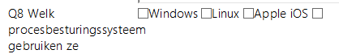De checkbox geeft de mogelijkheid om 1 of meer
keuzes waarbij het mogelijk is om, anders dan bij de radiobutton, ook
meerdere keuze te selecteren. Meestal gaat het om vragen over
kennisgebieden zoals “welke merken kent u”.

### Combobox

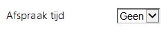Een combobox werkt op dezelfde manier als een
radiobutton, er is slechts 1 keuze mogelijk. Qua weergave biedt de
combobox een compacte weergave indien de lijst met opties erg lang is.

### Label

Inde de inhoud van het scriptveld alleen hoeft te worden afgebeeld, maar
het niet nodig is om de waarde te wijzigen kan gebruik worden gemaakt
van een label. Het autoscript gebruikt in de Pagina header bijvoorbeeld
labels voor het weergaven van de waarden.

### HTML

Voor situaties waarbij een complexe of samengestelde weergave wenselijk
is die niet met de voorgenoemde invoertypes mogelijk is kan Custom HTML
worden gebruikt. Met dit type moet de scriptbouwer zelf de HTML opmaak
invullen voor weergave van een scriptveld.

### Hidden

Als het veld wel gebruikt wordt in javascript dan kan het type hidden
worden gebruikt. Hiermee wordt het veld onzichtbaar op de pagina gezet.

## Weergave opties

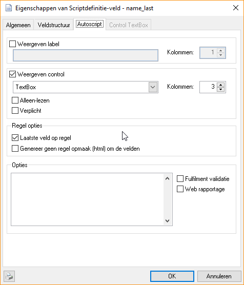

Het autoscript ondersteund speciale opties die de weergave beïnvloeden.
Deze worden opgegeven in het Opties veld. In dit veld kan een json object worden geplaatst met custom instellingen. Voor backward compatibility wordt tot 4.3.3 het noemen van de @functies driect in het veld ondersteund.

De opmaak is als volgt:
```
{  
“Version”: “1.0”,  
“DisplayFormat”: “\<format-strings\>”  
}
```
Voor \<format-strings\> kunnen vervolgens de volgende functies worden
gebruikt.

### Datum velden

Als een scriptveld van het datatype “Datum” is wordt bij het betreden
van het veld automatisch een kalender weergegeven. Voor bijvoorbeeld
karakter velden kan deze weergave worden geforceerd door bij de opties
de code @F(Date) in te vullen.

### Naam velden

Voor de weergave van namen zijn de volgende speciale format-strings
beschikbaar. Hiermee wordt de veldinhoud opgemaakt conform weergave
opties voor namen.

| Functie      | Werking                                                                                                  |
| ------------ | -------------------------------------------------------------------------------------------------------- |
| @F(Initials) | Weergave van initialen in hoofdletters met puntjes tussen de letters.                                    |
| @F(First)    | Weergave van de voornaam waarbij elke 1<sup>e</sup> letter van de naam in hoofdletters wordt gezet.      |
| @F(Middle)   | Weergave van tussenvoegsel in kleine letters.                                                            |
| @F(Last)     | Weergave van de Achternaam waarbij elke 1<sup>e</sup> letter van de naam in hoofdletters wordt gezet.    |
| @F(Lower)    | Weergave van tekst in kleine letters                                                                     |
| @F(Upper)    | Weergave van tekst in hoofdletters                                                                       |
| @F(Proper)   | Weergave van tekst met 1<sup>e</sup> letter van elk woord in hoofdletters, en de rest in kleine letters. |
| @F(TelNr)    | Forceer dat er een dialer knopje achter het veld wordt gezet                                             |
| @F(TelNr,M)  | Als voorgaande, maar nu met een mobiel icoon                                                             |

### Overige functies

Voor enkele andere velden zijn ook speciale format-strings beschikbaar.

<table>
<thead>
<tr class="header">
<th>Functie</th>
<th>Werking</th>
</tr>
</thead>
<tbody>
<tr class="odd">
<td>@F(Url)</td>
<td>Weergave van een wereldbol icoon knop achter het veld. Deze knop opent de website uit het veld in een popup venster.</td>
</tr>
<tr class="even">
<td>@F(Email)</td>
<td>Opmaak en controle van email adres invoer.</td>
</tr>
<tr class="odd">
<td>@F(IBAN)</td>
<td>Doe een IBAN check op een ingevoerd rekeningnummer. Dit is nog geen garantie dat het nummer correct is, of van de persoon die het nummer opgeeft!</td>
</tr>
<tr class="even">
<td>@F(ADDRESSPRO)</td>
<td><p>Voeg een knop achter het veld toe dat de systeem adres velden gebruikt voor een controle via de addresspro validatie service (hiervoor is een aparte licentie nodig).</p>
<p>Voor de validatie wordt het addr_zip en addr_number veld gebruikt om de addr_street en addr_city op te zoeken.</p></td>
</tr>
</tbody>
</table>

## Opmaak

De scriptvelden maken gebruik van een simpele opmaak. Elke scriptveld
wordt in een kolom gezet met een **Vraag** gevolgd door een **control**.
De Vraag komt uit het betreffende veld van het tabblad “Autoscript:
algemeen”. De control maakt gebruik van het op het tabblad “Autoscript:
invoertype” ingestelde invoertype.

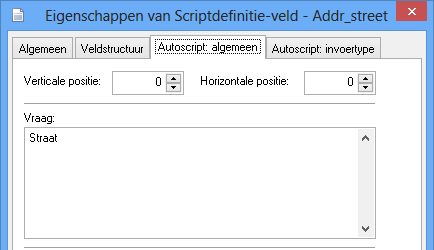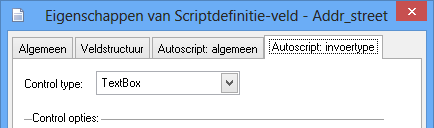

De tekst uit het Vraag veld kan worden opgemaakt met standaard html
opmaak. De gebruikte MetroUI stijl die wordt gebruikt biedt een aantal
speciale opmaakcodes. Voor nu wordt enkel verwezen naar de webpagina van
het Metro UI project: <https://metroui.org.ua/v3/typography.html>

## Fulfilment variabelen voor server-side opmaak

Ook in het autoscript zijn enkele fulfilment variabelen beschikbaar die
op de server worden uitgevoerd en in de pagina worden gezet. Deze velden
kunnen op de meeste plaatsen waar html of tekst kan worden geplaatst
worden gebruikt.

<table>
<thead>
<tr class="header">
<th>Veld</th>
<th>Waarde</th>
</tr>
</thead>
<tbody>
<tr class="odd">
<td>%AGENT.RESID%</td>
<td></td>
</tr>
<tr class="even">
<td>%AGENT.RESNAME%</td>
<td></td>
</tr>
<tr class="odd">
<td>%AGENT.RESDESCR%</td>
<td></td>
</tr>
<tr class="even">
<td>%AGENT.PARENTID%</td>
<td></td>
</tr>
<tr class="odd">
<td>%AGENT.ACCOUNT%</td>
<td></td>
</tr>
<tr class="even">
<td>%AGENT.EMAIL%</td>
<td></td>
</tr>
<tr class="odd">
<td>%AGENT.GENDER%</td>
<td></td>
</tr>
<tr class="even">
<td>%AGENT.MOBILETELNR%</td>
<td></td>
</tr>
<tr class="odd">
<td>%AGENT.HOMETELNR%</td>
<td></td>
</tr>
<tr class="even">
<td>%AGENT._____%</td>
<td>Aanvullend worden alle variabelen die bij de agent zijn vastgelegd ook opgenomen.<br />
<strong>LET OP! Indien een variabele naam overeenkomt met een van de bovenstaande velden wordt deze waarde overschreven!</strong></td>
</tr>
</tbody>
</table>

| Veld                | Waarde |
| ------------------- | ------ |
| %CAMPAIGN.RESID%    |        |
| %CAMPAIGN.RESNAME%  |        |
| %CAMPAIGN.RESDESCR% |        |
| %CAMPAIGN.PARENTID% |        |

| Veld                | Waarde |
| ------------------- | ------ |
| %CALLLIST.RESID%    |        |
| %CALLLIST.RESNAME%  |        |
| %CALLLIST.RESDESCR% |        |
| %CALLLIST.PARENTID% |        |
| %CALLLIST.SCRIPTID% |        |

| Veld                 | Waarde |
| -------------------- | ------ |
| %ENTRY.CLENTRYID%    |        |
| %ENTRY.STATID%       |        |
| %ENTRY.STATPRIORITY% |        |
| %ENTRY.TELNR%        |        |
| %ENTRY.TELNRID%      |        |
| %ENTRY.NOTES%        |        |

| Veld                  | Waarde |
| --------------------- | ------ |
| %STATUS.STATID%       |        |
| %STATUS.STATCODE%     |        |
| %STATUS.RESNAME%      |        |
| %STATUS.STATPRIORITY% |        |

| Veld                | Waarde                                                   |
| ------------------- | -------------------------------------------------------- |
| %SCRIPT.\_\_\_\_\_% | Voor elk veld uit de scriptdefinitie is er een variabele |

<table>
<thead>
<tr class="header">
<th>Veld</th>
<th>Waarde</th>
</tr>
</thead>
<tbody>
<tr class="odd">
<td>%VARIABLE._____%</td>
<td>Voor elke variabele dis is gedefinieerd op de scriptdefinitie is er een waarde. Daarna worden de variabelen op de campagne opgenomen.<br />
<strong>LET OP! Als op de campagne variabelen met dezelfde naam als op de scriptdefinitie zijn gedefinieerd dan worden deze waarden overschreven en blijft de waarde die is gedefinieerd bij de campagne over.</strong></td>
</tr>
</tbody>
</table>

## Geavanceerde opmaak met het autoscript

Met het autoscript kan een belscript in enkele minuten worden
klaargemaakt. Toch zijn er situaties waar de eenvoud van het autoscript
net niet voldoende is en je als scriptbouwer de weergave of validatie
van velden meer wilt controleren. Hiervoor kan de HTML weergave worden
gebruikt.

Het autoscript maakt standaard regels kolommen aan. Hierdoor worden ook
de custom velden altijd weergegeven binnen een opmaakt voor 1 regel
zoals:

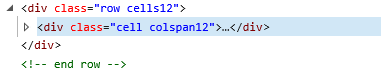

Hierbij staat de html opmaak binnen de binnenste div. Door de optie
“Genereer geen regel opmaak (html) om de velden” aan te vinken
genereert het autoscript geen regels en kolommen maar moet alle opmaak,
compatible met de tabel opmaak van de MetroUI stijl zelf worden
geplaatst in het HTML blok.

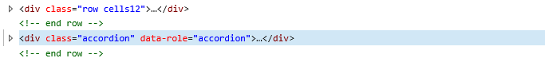

Het is goed te weten dat bij verkeerd gebruik van de html opmaak de
weergave in de war kan raken. Zorg altijd dat de weergave goed
gecontroleerd wordt bij het maken van het script tenzij wordt gewerkt
met maatwerk code die niet zichtbaar is zoals \<script\> blokken.

### Maatwerk opmaak voor invoervelden

Via de control weergave Html kan de gehele opmaak van het veld, of een
samenstel van meerdere velden worden gemaakt. Om deze regel te maken is
de onderstaande html nodig.


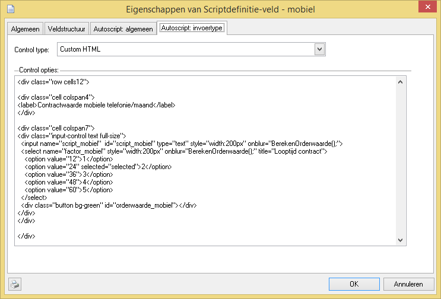

Kijk voor inspiratie en mogelijkheden van de MetroUI stijl op de website
<https://metroui.org.ua/v3> Controleer wel altijd de juiste werking
binnen CallPro omdat sommige controls via jQuery worden gemaakt en
hierdoor het in de opmaakcode gedefinieerde input veld niet wordt
gebruikt voor de opslag van de veldwaarde. CallPro kijkt altijd alleen
naar de originele input tag met de naam script\_\<veldnaam\> Als jQuery
onder water in het DOM model nieuwe velden aanmaakt zijn deze niet
gekoppeld tenzij ze ook de script\_\<veldnaam\> naam krijgen.

### Plaats velden binnen een tabcontrol

Om velden in het autoscript in een tabcontrol te plaatsen zijn 2 extra
scriptvelden nodig. De velden worden verder niet gebruikt dus het beste
kan het veldtype op karakter(1) worden gezet. De TAB01\_BEGIN wordt
boven het eerste veld geplaatst dat in de tabcontrol moet komen en
TAB01\_END wordt na het laatste veld geplaatst. Bij beide velden wordt
de optie “Genereer geen regel opmaak (html) om de velden” aangegeven en
ook “Laatste veld op regel”. Het voorgaande veld moet ook de optie
“Laatste veld op regel” aan hebben staan zodat de tabcontrol op een
nieuw regel begint.

 

 

In het autoscript ziet die er als volgt uit.


Om extra tabs te maken kan deze opmaak ook weer in een extra veld worden
geplaatst.

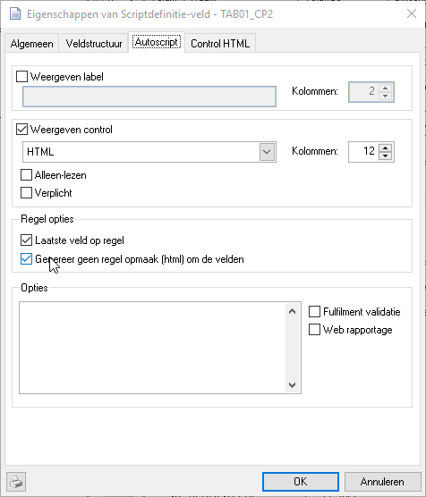 

### Belhistorie resultaten aanpassen met CSS opmaak

Als de belhistorie wordt afgebeeld komen alle eerdere belpogingen in de
lijst. Soms wil je bepaalde belresultaten niet weergeven, of juist
markeren in de belhistorie. Dit is mogelijk door gebruik te maken van de
variabele FEATURE.CSS en hier enkele CSS opmaak regels op te nemen.

Door de volgende stijl regel op te nemen kan een belpoging die is
afgecodeert met een belopdrachtstatus worden onzichtbaar gemaakt. In dit
voorbeeld wordt de “Geen gehoor” (120) belopdrachtstatus onzichtbaar
gemaakt.

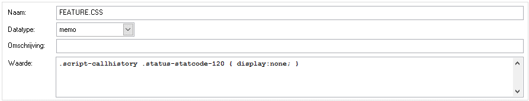

Door meerdere van deze regels op te nemen met telkens de statuscode (120
in het voorbeeld) kunnen meer belpogingen onzichtbaar worden gemaakt. De
opbouw van elke belpoging is als volgt.


Met deze informatie kunnen ook individuele onderdelen worden aangepast
via CSS opmaak. Bekijk de structuur van de autoscript html pagina eens
vanuit de browser en gebruik de “Inspect element” of “View source”
optie. Via CSS zijn diverse andere onderdelen ook cosmetisch aan te
passen.

### Afcoderingen verbergen in de statuslijst met CSS opmaak

Ook de afcoderingen in de linkerbalk kunnen worden weggehaald met CSS
opmaak. Hoewel er bij de status vanaf v4.30 kan worden opgegeven of deze
in het belscript zichtbaar moet zijn, is die instelling voor alle
belscripts (globaal over CallPro). Om een bepaalde (systeem) status weg
te laten uit 1 belscript, of zelfs voor 1 situatie kan de volgende CSS
opmaak worden gebruikt.


Met bovenstaande CSS opmaak wordt de Geen gehoor systeemstatus
onzichtbaar gemaakt in het autoscript.

### Custom validatie tijdens afcoderen

Tijdens het afcoderen roept het autoscript een functie
“Custom\_ValidationCheck” uitgevoerd. Als paramater wordt een
javascript object met de status code die is geklikt doorgegeven. Als
resultaat geeft deze functie een boolean terug die aangeeft of het
afcoderen door mag gaan of niet.

Deze functie oproep wordt vooral gebruikt om extra veld controles te
laten uitvoeren op basis van de afcodering die is gekozen. Bijvoorbeeld
om bij een nieuwe afspraak te controleren dat de NAW gegevens wel
compleet zijn ingevuld, of dat er een email adres voor de lead is
ingevuld. Doorgaan wordt deze functie in de variabele SCRIPT.HEADER
geplaatst.

```
function Custom\_ValidationCheck(status) {
var validationResult = true;
switch(status.code)
{
    case "780":
        // Basic gedrag.
        setFieldValue("script\_app\_email\_to",
        getFieldValue("script\_name\_email"));
        setFieldValue("script\_exp\_app","");
        break;
    case "710":
        if(getFieldValue("script\_info")=="")
        {
        status.errors.add("Kies eerst een informatiepakket");
        validationResult = false;
        }
        if(getFieldValue("script\_info\_email\_to")=="")
        {
        status.errors.add("Kies een email adres voor de verzending");
        validationResult = false;
        }
        if(\!checkValidEmail("script\_info\_email\_to"))
        {
        status.errors.add("Het opgegeven email adres is niet geldig");
        validationResult = false;
        }
        if(validationResult)
        {
        // Last check still valid
        setFieldValue("script\_exp\_info","");
        }
        break;
}
return validationResult;
}
```

In deze voorbeeld functie wordt bijvoorbeeld voor het versturen van
informatie (code 710) gecontroleerd ode diverse verplichte velden wel
zijn gevuld. Zo niet dan wordt de errors collectie van het status object
gevuld met een melding die vervolgens door het autoscript wordt
afgebeeld.

Het interne status object heeft de volgende velden die kunnen worden
uitgelezen en gebruikt.

<table>
<thead>
<tr class="header">
<th>Veld</th>
<th>Werking</th>
</tr>
</thead>
<tbody>
<tr class="odd">
<td>code</td>
<td>Dit is de code van de belopdrachtstatus die de agent heeft geklikt om af te coderen. Wij hanteren een 3-cijferige code</td>
</tr>
<tr class="even">
<td>logicalcategory</td>
<td><p>Dit is het type veld van de belopdrachtstatus zoals ingesteld op het tabblad “Type en Tijd”. Mogelijk waarden zijn:</p>
<p>1 – Niet bereikt</p>
<p>2 – Terugbellen</p>
<p>3 – Verwerkt</p></td>
</tr>
<tr class="odd">
<td>prioritycategory</td>
<td><p>Dit is de prioriteitscategory van de belopdrachtstatus. Mogelijke waarden:<br />
1 – Niet bereikt hoog</p>
<p>2 – Terugbellen laag</p>
<p>3 – Verwerkt</p>
<p>4 – Systeem</p>
<p>5 – Niet bereikt laag</p>
<p>6 – Terugbellen hoog</p></td>
</tr>
<tr class="even">
<td>errors</td>
<td>Een collectie met fouten. Via de Add functie kunnen aan de errors collectie extra meldingen worden toegevoegd (zie ook het voorbeeld)</td>
</tr>
<tr class="odd">
<td>callbackexpr</td>
<td>Hiermee kan tijdens het afcoderen het standaard gedrag van de belopdrachtstatus worden overschreven voor wat betreft de terugbeltijd expressie.</td>
</tr>
<tr class="even">
<td>callbackagent</td>
<td>Volledige pad+naam van de agent die als terugbelagent moet worden ingesteld.</td>
</tr>
<tr class="odd">
<td>mincallbackexpr</td>
<td>Als callbackexpr maar nu voor de betrefende parameter</td>
</tr>
<tr class="even">
<td>maxcallbackexpr</td>
<td>Als callbackexpr maar nu voor de betrefende parameter</td>
</tr>
<tr class="odd">
<td>autoselect</td>
<td>Een boolean veld dat aangeeft dat CallPro direct moet afcoderen en <strong>niet</strong> eerst het popupvenster van CallPro moet afbeelden.</td>
</tr>
<tr class="even">
<td>entrynote</td>
<td>Door dit veld te vullen kan het notitieveld worden gezet met de betreffende waarde. Deze waarde heeft voorrang boven een waarde die de agent in een veld in het belscript heeft ingevuld.</td>
</tr>
</tbody>
</table>

# Antwoordservice pagina

De antwoordservice module maakt gebruik van enkele extra velden die
nodig zijn in de scriptdefinitie. Verder is deze pagina grotendeels
gelijk aan de standaard autoscript pagina en kunnen de opties die
genoemd zijn ook worden toegepast.

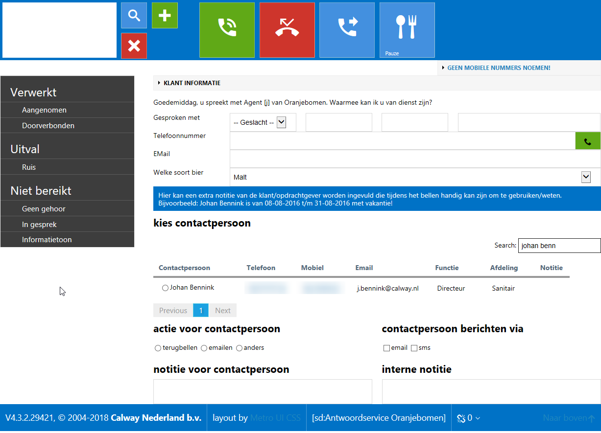

## Scriptvelden

De scriptdefinitie voor de antwoordservice bevat enkele verplichte
velden. Voor v4.3.2 was de opmaak vast met alle scriptvelden boven de
contactpersonen lijst en enkele vaste systeemvelden eronder. Vanaf
v4.3.2 is de opmaak gestuurd door de scriptdefinitie velden en kan
hierdoor ook worden aangepast.

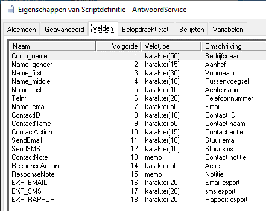

De velden die verplicht zijn voor de antwoordservice zijn: ContactID,
ContactName, ContactAction, SendEmail, SendSMS, ContactNote. De velden
ResponseAction en ResponseNote worden gebruikt vanuit de Customer Portal
login van de klant en worden niet weergegeven in het belscript. Ook de
drie EXP\_EMAIL, EXP\_SMS, EXP\_RAPPORT velden zijn verplicht en worden
door de fulfilment procedure gebruikt.

### Contactpersonen (ContactID)

Bij de antwoordservice wordt voor een klant een lijst met
contactpersonen vastgelegd waarvoor notities kunnen worden aangenomen.
De geselecteerde contactpersoon wordt vastgelegd in het ContactID
scriptveld. Vanaf v4.3.2 wordt de contactpersonen lijst afgebeeld via
dit scriptveld. Hiervoor moet de standaard opmaak als volgt zijn
ingesteld, maar deze mag worden aangepast. Belangrijk blijft om
ContactID en ContactName te vullen met de gekozen contactpersoon.

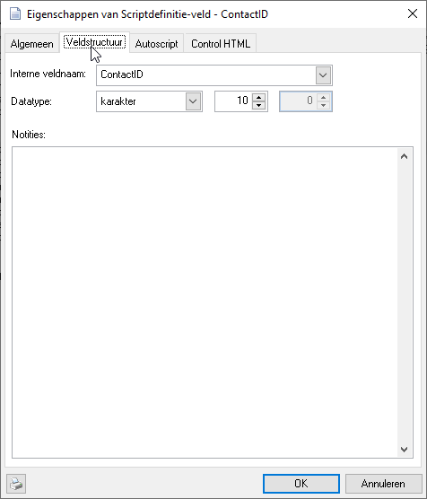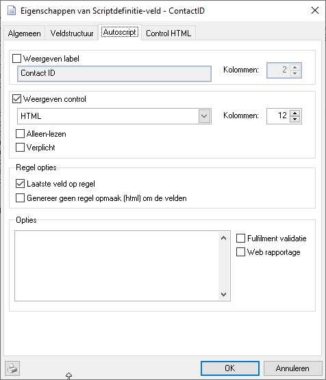
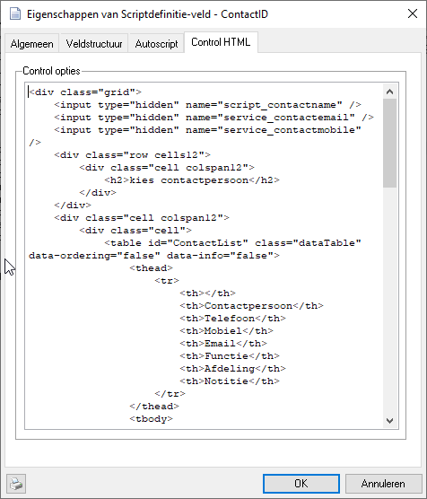

In het Control HTML veld staat de volgende standaard opmaak voor v4.3.2:
```
<div class="grid">
    <input type="hidden" name="script_contactname" />
    <input type="hidden" name="service_contactemail" />
    <input type="hidden" name="service_contactmobile" />

    <div class="row cells12">
        <div class="cell colspan12 fg-white" style="padding: 10px; background-color:\#0072c6;">
            %CURRENTCUSTOMER.SCRIPTTEXT2%
        </div>
    </div>
    <div class="row cells12">
        <div class="cell colspan12">
            <h2>kies contactpersoon</h2>
        </div>
    </div>
    <div class="cell colspan12">
        <div class="cell">
            <table id="ContactList" class="dataTable striped" data-ordering="false"
            data-info="false">
            <thead>
            <tr>
            <th></th>
            <th>Contactpersoon</th>
            <th>Telefoon</th>
            <th>Mobiel</th>
            <th>Email</th>
            <th>Functie</th>
            <th>Afdeling</th>
            <th>Notitie</th>
            </tr>
            </thead>
            <tbody>
            <!-- placeholder-->
            </tbody>
            </table>
        </div>
    </div>
</div>
<script>
var table;
$(document).ready(function() {
table = $('#ContactList').DataTable({
    "processing": true,
    "serverSide": true,
    "ajax": {
        "url":
        "/api/services/GetCustomerContacts?customerid=%CURRENTCUSTOMER.RESID%",
        "type": "GET",
    },
    "dom": "ftp",
    "columns": [
        { "data": "ResID" },
        { "data": "FullName" },
        { "data": "PhoneNumber" },
        { "data": "MobileNumber" },
        { "data": "Email" },
        { "data": "JobFunction" },
        { "data": "Department" },
        { "data": "Notes" },
    ],
    "columnDefs": [
        {
            "visible": false,
            "targets": [0]
        },
        {
            "render": function (data, type, row) {
                return "<input type='radio' class='DefaultRadioInput'
                name='script_contactid' value='" + row.ResID + "'
                onclick='setContactExtra("+row.ResID+")' />" + data
            },
            "targets": 1
        },
        {
            "render": function (data,type,row){
                return "<a href='\#' class='telnr' title='Gesprek doorverbinden'
                onclick='CallTransferBegin(" + '"' + data + '"' + ")'>" + data +
                "</a>";
            },
            "targets": [2,3]
        },
        {
            "render": function (data, type, row) {
                if(data==null || data=="")
                return "";
                else
                return "<a href='#' title='" + data + "'>Notitie</a>";
            },
            "targets": 7
        }
    ],
    "lengthMenu": [[10, 25], [10, 25]]
    } );
} );
</script>
```
In deze HTML opmaak is ook te zien dat gebruik wordt gemaakt van
server-side variabelen in de vorm van %CURRENTCUSTOMER.SCRIPTTEXT2% Deze
variabelen zijn op de server bekend ten tijde van het opmaken van de
pagina en zijn in de Fulfilment “merge-syntax”.

### Acties (ContactAction)

De actie voor de gekozen contactpersoon wordt bepaald via dit
scriptveld. Ook hier kan de standaard invullen worden aangepast. De
gekozen actie wordt direct overgenomen in de notificatie.

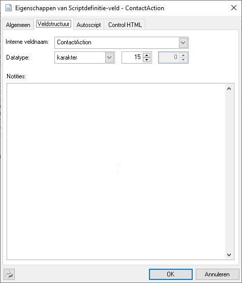 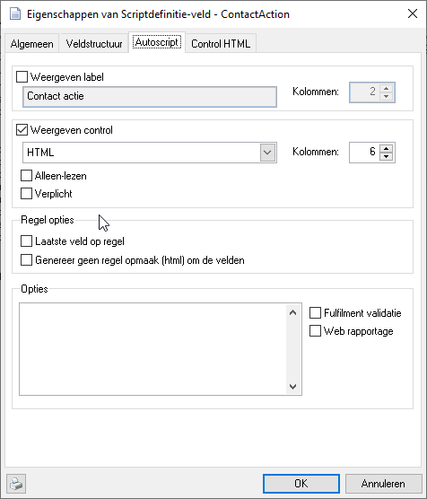
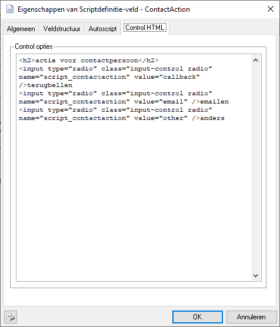

Ook hier wordt de opmaak gemaakt met een Control HTML blok:
```
<h2>actie voor contactpersoon</h2>

<input type="radio" class="input-control radio" name="script_contactaction" value="callback" />terugbellen

<input type="radio" class="input-control radio" name="script_contactaction" value="email" />emailen

<input type="radio" class="input-control radio" name="script_contactaction" value="other" />anders
```
Extra keuzemogelijkheden kunnen worden toegevoegd door meer radio regels
op te nemen.

### Contactpersoon berichten via (SendEmail, SendSMS)

De volgende twee velden bepalen op welke manier de notificatie wordt
verstuurd. Ook hier kunnen nieuwe methodes worden toegevoegd.

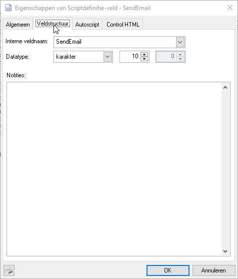 
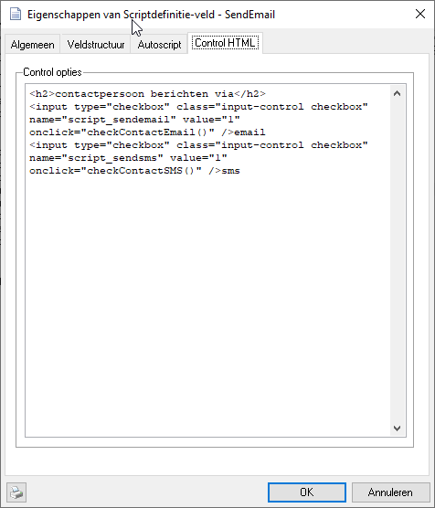

De opmaak wordt gemaakt met het SendEmail veld, bij het SendSMS veld
staat de optie “Weergeven control” uit.
```
<h2>contactpersoon berichten via</h2>

<input type="checkbox" class="input-control checkbox" name="script_sendemail" value="1" onclick="checkContactEmail()" />email

<input type="checkbox" class="input-control checkbox" name="script_sendsms" value="1" onclick="checkContactSMS()" />sms
```

### Notitie voor contactpersoon (ContactNote)

Bij de notificatie wordt een notitie meegestuurd. Daarnaast kan de agent
een interne notitie (entrynote) invullen. Voor de entrynote wordt niet
de standaard weergave gebruikt maar een compacte weergave voor de
antwoordservice.

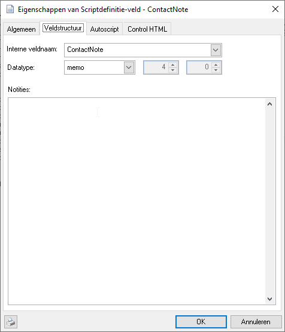 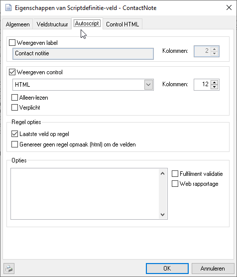
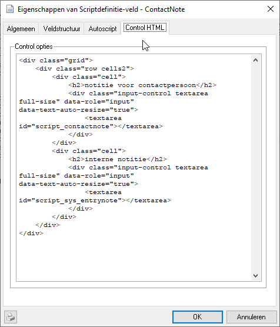

Ook hier wordt een Control HTML opmaak gebruikt:
```
<div class="grid">
    <div class="row cells2">
        <div class="cell">
            <h2>notitie voor contactpersoon</h2>
            <div class="input-control textarea full-size" data-role="input" data-text-auto-resize="true">
            <textarea id="script_contactnote"></textarea>
            </div>
        </div>
        <div class="cell">
            <h2>interne notitie</h2>
            <div class="input-control textarea full-size" data-role="input" data-text-auto-resize="true">
            <textarea id="script_sys_entrynote"></textarea>
            </div>
        </div>
    </div>
</div>
```
## Aanpassen scriptweergave

Hoewel de genoemde verplichte velden niet kunnen worden verwijderd uit
de scriptdefinitie kunnen velden wel onzichtbaar worden gemaakt. Ook kan
de volgorde van weergave en gebruik worden aangepast.

### Weergave introductie tekst

Bij de antwoordservice klant kunnen enkele velden worden vastgelegd die
in het belscript worden afgebeeld. De Introductietekst, of openingszin
is hier een van die in het belscript als volgt via de variabele
SCRIPT.INFO kan worden opgenomen in het belscript:

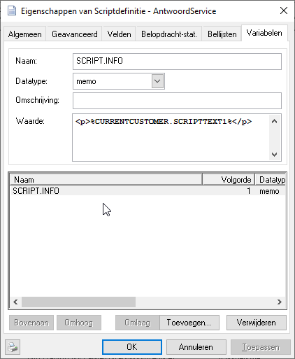

# Pauze pagina

Als een agent inlogt in de scriptmodule wordt als eerste de pauzepagina
getoond. Initieel worden de call center notities getoond, de
campagnelijst geeft een overzicht van de aan de agent gekoppelde
campagnes.

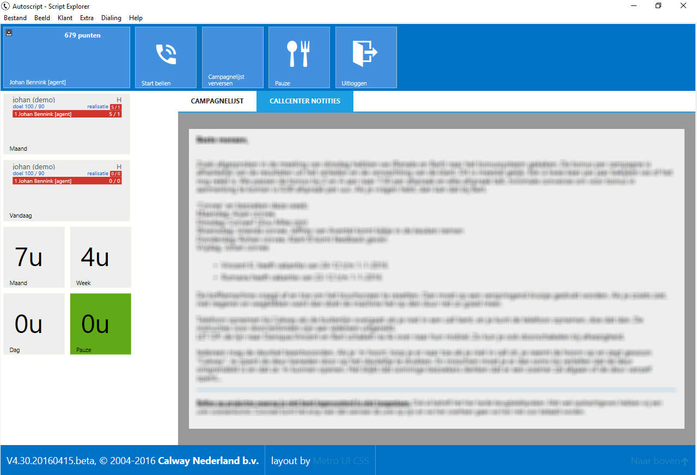

Enkele informatie tiles geven inzicht in de scores van de agent per
campagne en de gewerkte uren.

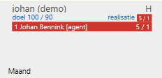

De score tile geeft per campagne een leaderboard top 5 met agenten op
basis van de instellingen op de campagne, en de globale variabele
BREAK.ScoreTiles.Category. De weergave van deze tiles kan worden
aangestuurd via de BREAK.ShowScoreTiles boolean variabele.

| Variabele                 | Type     | Betekenis                                                                                              |
| ------------------------- | -------- | ------------------------------------------------------------------------------------------------------ |
| BREAK.ScoreTiles.Category | Karakter | Geeft aan welke Belopdrachtstatus categoriegroep wordt gebruikt voor de Score Tiles. (Default = Score) |
| BREAK.ShowScoreTiles      | Bool     | True/**False** Bepaald of de Score Tiles worden weergegeven.                                           |

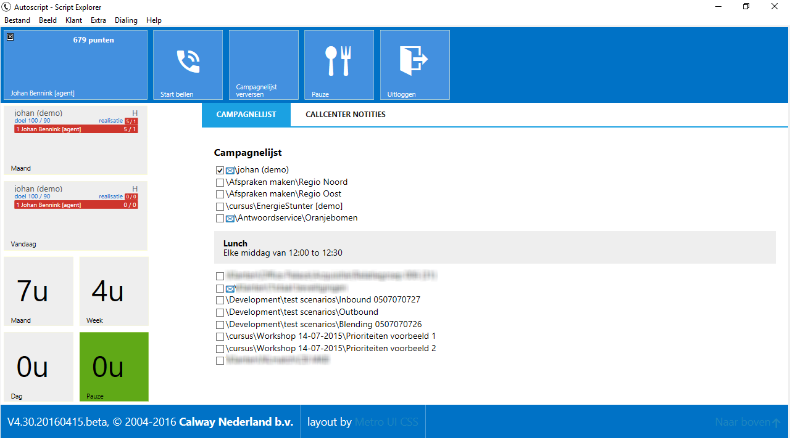

In de campagnelijst staan alle campagnes die aan de agent zijn
gekoppeld. Een blauwe enveloppe geeft aan dat er een notitie beschikbaar
is. Door op deze enveloppe te klikken wordt de informatie getoond. De
mogelijk voor de agent om zelf campagnes aan/uit te schakelen kan worden
beperkt op globaal niveau of per campagne worden ingesteld met de
variabele BREAK.DisableCampaignSelection.

| Variabele                      | Type | Betekenis                                                                                                                                                                                                                                                                        |
| ------------------------------ | ---- | -------------------------------------------------------------------------------------------------------------------------------------------------------------------------------------------------------------------------------------------------------------------------------- |
| BREAK.DisableCampaignSelection | Bool | True/**False** Bepaald of agenten in het pauzescherm zelf de campagnes aan/uit kunnen vinken waar ze aan zijn gekoppeld. Dit is een globale switch, op campagne. Als deze False is kan op campagne niveau met een zelfde variabele per campagne dit gedrag aan/uit worden gezet. |

# Belscripts maken voor gevorderden

Een belscript in CallPro kan ook met behulp van HTML worden gemaakt. De
gehele look-and-feel is dan vrij in te vullen met behulp van standaard
html pagina’s, of ASP.NET of php. Deze manier van belscripts maken biedt
meer vrijheid, maar vergt ook meer tijd en werk om een compleet
belscript te maken.

In situaties waar met meerdere pagina’s in het belscript gewerkt gaat
worden, of complexe beslissingsbomen (callflows) in het belscript
verwerkt moeten worden, of selectief belopdrachtstatussen beschikbaar
worden gemaakt per situatie (plek in het belscript) is het handmatig
opbouwen van het belscript de beste methode.

De scriptdefinitie wijst dan enkel naar de startpagina.

TODO Verder uitwerken.

# Script systeemacties

In het belscript kunnen diverse commando’s worden gebruikt om functies
van CallPro op te roepen via een hyperlink of vanuit javascript.

Bij het gebruik van de hyperlink methode wordt de systeemactie in het
href attribuut van de hyperlink gebruikt \<a
href=”**{systeemactie}**”\>{label}\</a\>. Een andere methode is om
vanuit javascript een document.location=”**{systeemactie}**” uit te
voeren.

In deze paragraaf worden deze systeemacties behandeld die telkens als
URL in een hyperlink worden gebruikt.

### Terugbellenscherm

Met deze systeemactie wordt het terugbellen scherm geactiveerd. De Agent
is vrij om een van de terugbel belopdrachtstatussen te kiezen uit de
keuzelijst.

\#SCRIPT\_SELECTSTAT?STATCAT=CALLBACK

### Verwerkscherm

Met deze systeemactie wordt het verwerk scherm geactiveerd. De agent is
vrij om een van de verwerkt belopdrachtstatussen te kiezen uit de
keuzelijst.

\#SCRIPT\_SELECTSTAT?STATCAT=PROCESS

### Niet-bereikt scherm

Met deze systeemactie wordt het Niet bereikt scherm geactiveerd. De
agent is vrij om een van de Niet bereikt belopdrachtstatussen te kiezen
uit de keuzelijst.

\#SCRIPT\_SELECTSTAT?STATCAT=NOREACH

### Belopdracht afcoderen

Activeert afhankelijk van de categorie van de StatCode-parameter het
terugbellenscherm, het verwerkscherm of het niet-bereiktscherm. In het
betreffende scherm is de belopdrachtstatus geselecteerd en kan niet
gewijzigd worden.

\#SCRIPT\_SELECTSTAT?STATCODE=\<status-code\>\[\&AUTOSELECT\]\[\&CALLBACKEXPR=\<callback-expr\>\]\[\&CALLBACKAGENT=\<agent-pad\>\[\&PRIORITY=\<number\>\]\[\&MOVEENTRY=\<bellijst-pad\>\]\[\&CHANGENOTE={
ON | OFF }\]\[\&CHANGETELNR={ ON | OFF }\]

Een aantal paramaters is optioneel. Deze parameters bepalen enkele extra
instellingen bij de status.

| Optionele paramater | Betekenis en gebruik                                                                                                                                                                                                            |
| ------------------- | ------------------------------------------------------------------------------------------------------------------------------------------------------------------------------------------------------------------------------- |
| \&AUTOSELECT        | Door deze parameter op te nemen wordt de weergave van het popupvenster onderdrukt en wordt direct afgecodeerd.                                                                                                                  |
| \&CALLBACKEXPR      | Met deze parameter kan de standaard terugbeltijd die voor de betreffende belopdrachtstatus geldt worden aangepast.                                                                                                              |
| \&CALLBACKAGENT     | Met deze parameter kan de standaard ingestelde (terugbel-)agent worden aangepast. Vul hier het volledige pad naar de Agent resource in.                                                                                         |
| \&PRIORITY          | Met deze parameter kan de standaard prioriteit van de betreffende belopdrachtstatus worden aangepast. De prioriteit moet wel liggen binnen de range die voor het type status (niet bereikt, terugbellen of verwerkt) geldig is. |
| \&MOVEENTRY         | Met deze parameter kan de belopdracht tijdens het afcoderen fysiek worden verplaatst naar een andere bellijst. De bellijst moet compatibel zijn qua velden en belopdrachtstatus met de bellijst waar de belopdracht uit komt.   |
| \&CHANGENOTE        | Geeft aan of de Agent in het CallPro popupvenster het notitieveld mag bewerken.                                                                                                                                                 |
| \&CHANGETELNR       | Geeft aan of de Agent in het CallPro popupvenster het ingestelde telefoonummerveld dat wordt gebruikt voor het terugbellen mag wijzigen.                                                                                        |

### Starten windows applicatie

Met deze systeemactie kan een externe windows applicatie worden geopend.
Geef het complete pad op naar de .EXE of .BAT/.CMD van het programma
gestart moet worden.

\#SCRIPT\_WINEXEC?FILE=\<bestandsnaam\>

### Herstellen/annuleren wijzigingen

Met deze systeemactie kunnen de veldwaarden in de actuele belscript
pagina worden teruggezet naar de waarden zoals ze waren toen de pagina
werd geladen. Let op\! Dit geldt alleen voor de velden die op deze
pagina staan.

\#SCRIPT\_RESTOREINPUT

### Aanmelden

Met deze systeemactie kan de agent zich aanmelden. Hij zal direct de
eerstvolgende belopdracht ontvangen. De AUTOSELECT-parameter zorgt
ervoor dat het dialoogvenster dat normaal wel wordt getoond niet wordt
getoond. Zonder AUTOSELECT wordt de meegegeven keuze (als die er is) als
standaardkeuze gebruikt.

\#SCRIPT\_SUBSCRIBE?\[DIALMODE={OUTBOUND | INBOUND | CALLBLENDING
}\[\&AUTOSELECT\]

### Pauze

Met deze systeemactie kan de agent aangeven dat hij na het huidige
gesprek naar de pauze-stand wil overgaan. CallPro zorgt ervoor dat de
agent na beëindiging van het huidige gesprek door een afcodeer
systeemactie automatisch overgaat in de pauze-stand.

Indien de NOCONFIRM-parameter wordt meegegeven wordt er overgegaan in de
pauze-stand zonder tussenkomst van een bevestigingscherm met de vraag
"wilt u na het beëindigen van het gesprek overgaan in de pauzestand?".
De andere twee parameters SET en CLEAR zorgen respectievelijk voor het
instellen en het opheffen van het pauze-verzoek.

\#SCRIPT\_BREAK?\[{ SET | CLEAR }\]\[\&NOCONFIRM\]

### Uitloggen

Met deze systeemactie kan de agent aangeven dat hij na het huidige
gesprek wil uitloggen. CallPro zorgt ervoor dat de agent na beëindiging
van het gesprek uitlogt. Indien de NOCONFIRM-parameter wordt meegegeven
wordt er uitgelogd zonder tussenkomst van een bevestigingsscherm met de
vraag "wilt u na het beëindigen van het gesprek uitloggen?". De andere
twee parameters SET en CLEAR zorgen respectievelijk voor het instellen
en het opheffen van het uitlog-verzoek.

\#SCRIPT\_LOGOUT?\[{ SET | CLEAR }\]\[\&NOCONFIRM\]

### Telefoonnummer kiezen

Met deze actie wordt het 1<sup>e</sup> telefoonnummer van de belopdracht
gekozen. Deze actie wordt vooral gebruikt bij preview dialing, maar kan
ook worden gebruikt om een tweede, alternatief nummer, te bellen. Met de
optionele parameter TELNR kan een willekeurig telefoonnummer ingesteld
worden.

\#SCRIPT\_DIAL?\[TELNR=\<telefoonnummer\>\] \[\&AUTOSELECTSTAT= { TRUE |
FALSE } \]

### Beëindig gesprek

Met deze systeemactie wordt een actief gesprek beëindigd, de
telefoonlijn wordt opgehangen.

\#SCRIPT\_HANGUP

### Doorschakelen naar Bel-me-niet IVR

Indien de bel-me-niet module beschikbaar is in de licentie wordt met
deze systeemactie een actief gesprek doorgezet naar de IVR voor een
bel-me-niet registratie. De agent komt hiermee in wrapup.

\#SCRIPT\_REGDONOTCALL

### Dialing configuratie

Met deze actie wordt het Dialing Configuratiescherm opgeroepen.

\#SCRIPT\_DIALOPTIONS

### Verander wachtwoord

Met deze systeemactie kan de agent zijn wachtwoord wijzigen.

\#SCRIPT\_CHANGEPASSWORD

### Nieuwe belopdracht

Met deze systeemactie kan een nieuwe belopdracht worden toegevoegd aan
een aan de agent gekoppelde bellijst. Deze actie is alleen beschikbaar
voor <span class="underline">inbound</span> campagnes. Nadat de agent
een campagne en bellijst heeft geselecteerd wordt het
Belopdracht-eigenschappenscherm geopend en kunnen de gegevens van de
nieuwe belopdracht worden ingevoerd.

\#SCRIPT\_NEWENTRY

### Zoek belopdracht

Met deze menuoptie wordt het Belopdracht/Prospect Zoeken-applet geopend.
Deze actie is alleen beschikbaar voor <span class="underline">inbound</span> campagnes.

\#SCRIPT\_SEARCHENTRY

### Terug navigeren

Bestaat het script uit meerdere pagina's dan kan deze actie worden
gebruikt om een stap terug te doen naar de vorige pagina.

\#SCRIPT\_BACK

### Vooruit navigeren

Als gebruik is gemaakt van de Terug-knop kan deze knop worden gebruikt
om weer naar voren te stappen in het script. De knop kan alleen worden
gebruikt om de stappen die terug zijn genomen ongedaan te maken en is
niet bedoeld om door het script te bladeren.

\#SCRIPT\_FORWARD

### Belopdracht eigenschappen

Met deze actie wordt het belopdracht-eigenschappenscherm opgeroepen.

\#SCRIPT\_PROPERTYENTRY

### Oproep agendamodule

Met deze systeemactie wordt de agendamodule gestart. Met de parameter
CALENDAR kan de standaard weergegeven agenda bepaald worden (CALENDAR
dient de naam van de agenda te bevatten). Met de parameter DISABLESWITCH
kan in de agenda voorkomen worden dat de gebruiker tussen meerdere
agenda's kan schakelen.

\#SCRIPT\_CALLMODULE?MODULE=CALENDAR.APP\[\&CALENDAR=\<calendar\>\]\[\&DISABLESWITCH\]

### Volgende belopdracht

Met deze systeemactie kan in de outbound-mode de eerstvolgende aan te
bieden belopdracht worden bepaald. De optie PROMPT toont een
info-messagebox na uitvoeren van de actie. De optie CLEAR annuleert de
eventueel ingestelde belopdracht.

Bij herhaaldelijk instellen van belopdrachten wordt de laatste impliciet
geannuleerd. Bij uitloggen na instellen van een belopdracht wordt de
belopdracht automatisch vrijgegeven. De belopdracht mag niet al in
gebruik (vergrendeld) zijn bij de aanvraag.

\#SCRIPT\_NEXTENTRY?{ ENTRYID=\<entryid\>\&CAMPAIGNID=\<campaignid\> |
CLEAR }\[\&PROMPT\]

### Call blending; overschakelen op andere dial mode

De agent zal door deze systeemactie afhankelijk van de context naar
inbound of outbound switchen. Het commando werkt analoog aan een
Pauze-verzoek; het verzoek zal ingewilligd worden indien het systeem
daar toe in staat is.

\#SCRIPT\_SWITCHDIALMODE?\[{ SET | CLEAR
}\]\[\&NOCONFIRM\]\[CAMPAIGNID=\<id\>\&NEWENTRY\]

Met de optie CAMPAIGNID=\<id\>\&NEWENTRY schakelt CallPro voor de
volgende call over naar de genoemde campagne en begint een nieuwe blanco
belopdracht.

### Work modus van agent; het plaatsen van een agent in een work modus

Hiermee kan een agent in een bepaalde work modus gezet worden. Een agent
die inbound aan het bellen is, kan zichzelf via deze scriptactie
(tijdelijk) afmelden bij de dialer waardoor hij geen gesprekken meer
ontvangt.

\#SCRIPT\_SETAGENT?MODE={ READY | NOT\_READY }

### Cancel belopdracht; de belopdracht wordt beëindigd zonder te bewaren

Hiermee een agent een belopdracht beëindigen zonder te bewaren. Deze
systeemactie werkt alleen in inbound campagnes.

\#SCRIPT\_CANCELENTRY

### Speciale hyperlink anchors

Met deze speciale anchors kan binnen de pagina worden gesprongen waarbij
bepaald gedrag kan worden onderdrukt.

\#\<name\>\&SCRIPT\_OPTION={ NODATA | NOSAVE | NORESTORE }

### Opnemen gesprek

Met deze systeemactie kan de opname van het gesprek worden gestuurd.

\#SCRIPT\_RECORDING?ACTION={ START | STOP | RESUME | PAUSE | TOGGLE }

### Gesprek direct doorschakelen (blind transfer)

Met deze systeemactie wordt een actief gesprek (live call) direct
doorgeschakeld naar het opgegeven nummer. De agent schakelt hierdoor
naar de wrapup fase.

\#SCRIPT\_TRANSFER?TYPE=BLIND\&CONTEXT=dialer-transfer\&TARGET=\<telefoonnummer\>

Een alternatieve variant hierop is:

\#SCRIPT\_TRANSFER?TYPE=BLINDEARLYMEDIA\&CONTEXT=dialer-transfer\&TARGET=\<telefoonnummer\>

Deze variant schakelt het audiokanaal aal door voordat de target heeft
opgenomen. Dit is vooral bruikbaar als er doorgeschakeld wordt naar
nummers die geen “answer” geven maar wel al audio afspelen zodat
gebruikt bij 0800 en 09xx nummers.

### Gesprek met ruggespraak doorverbinden (attended transfer) 

Met deze systeemactie wordt het doorverbinden van een actief gesprek
(live call) met ruggespraak gestart. Het actieve gesprek wordt
geparkeerd. Deze variant is bedoeld als de Agent uit meerdere nummers
kan kiezen en niet direct het eerste nummer geprobeerd moet worden maar
de agent nog tijd nodig heeft om het juiste nummer te vinden/kiezen.

\#SCRIPT\_TRANSFER?TYPE=ATTENDEDPREVIEW\&CONTEXT=dialer-transfer

Met deze systeemactie wordt het doorverbinden van een actief gesprek
(live call) met ruggespraak gestart en wordt direct het nummer gebeld
waarmee doorverbonden gaat worden na ruggespraak.

\#SCRIPT\_TRANSFER?TYPE=ATTENDED\&CONTEXT=dialer-transfer\&TARGET=\<telefoonnummer\>

### Doorverbinden met ruggespraak annuleren

Met deze systeemactie wordt een actieve doorverbind actie geannuleerd en
krijgt de agent de beller weer aan de lijn.

\#SCRIPT\_TRANSFER?TYPE=ABORT

Met deze systeemactie wordt een actieve doorverbind doel (gesprek)
beëindigt maar blijft de attended transfer actief. Hiermee kan de agent
een nieuwe attended transfer target bellen (met TYPE=ATTENDED) en blijft
het gesprek dat doorgeschakeld moet worden in de wacht staan.

\#SCRIPT\_TRANSFER?TYPE=SOFTABORT

### Doorverbinden met ruggespraak voltooien

Met deze systeemactie wordt een actieve doorverbind actie afgerond. De
Agent komt hierdoor in wrapupfase en de beller is doorverbonden met de
externe/andere partij.

\#SCRIPT\_TRANSFER?TYPE=COMPLETE

### Doorverbinden wissel gesprekken

Met deze systeemactie kan tijdens een actieve doorverbind actie met
ruggespraak worden gewisseld tussen de beller en de externe/andere
partij voor ruggespraak.

\#SCRIPT\_TRANSFER?TYPE=SWITCHPARTIES

### Verstuur DTMF-tonen

Met deze systeemactie kunnen DTMF tonen worden gestuurd die nodig zijn
om in een gesprek door een IVR de navigeren. Dit werkt alleen met G711
codec.

\#SCRIPT\_SENDDTMF?DIGITS=\<digits\>

### Zet een gesprek on hold

Met deze systeemactie kan een actief gesprek (live call) on hold worden
gezet zodat de beller niet hoort wat de agent zegt.

\#SCRIPT\_HOLD?{ ON | OFF | TOGGLE }

# Belscript (querystring) parameters

Bij het laden van het belscript wordt aan de eerste pagina een aantal
parameters in de url meegegeven. Deze parameters kunnen worden gebruikt
in dynamische ASP.NET of php pagina’s om op te slaan, en later te
gebruiken om extra informatie rechtstreeks uit de CallPro database te
lezen.

### Belscript startpagina

Bij het oproepen van de startpagina van het belscript worden de volgende
parameters meegegeven.

| Parameter  | Inhoud                                                                                                |
| ---------- | ----------------------------------------------------------------------------------------------------- |
| AGENTID    | De unieke ID van de Agent die is ingelogd op de werkplek                                              |
| CLENTRYID  | De unieke ID van de belopdracht die wordt geopend                                                     |
| CAMPAIGNID | De unieke ID van de campagne waar de belopdracht in wordt geopend                                     |
| RAWTELNR   | Het 1<sup>e</sup> telefoonnummer van de belopdracht die wordt geopend in RAW formaat (+31 0507070720) |
| CALLLISTID | De unieke ID van de bellijst waar de belopdracht uit komt                                             |
| DIALMODE   | De dialmode: 1 = Outbound, 5 = inbound                                                                |
| LANGUAGE   | De taal die staat ingesteld op de werkplek: nl                                                        |

### Pauze pagina

Bij het oproepen van de pauze pagina die geldt voor de belplek (of
globaal) worden de volgende parameters meegegeven.

| Parameter | Inhoud                                                   |
| --------- | -------------------------------------------------------- |
| AGENTID   | De unieke ID van de Agent die is ingelogd op de werkplek |
| LANGUAGE  | De taal die staat ingesteld op de werkplek: nl           |

### Inbound pagina

Bij het oproepen van de inbound (wacht) pagina die in de inbound modues
word tafgebeeld tussen gesprekken tijdens het wachten worden de volgende
parameters meegegeven.

| Parameter | Inhoud                                                   |
| --------- | -------------------------------------------------------- |
| AGENTID   | De unieke ID van de Agent die is ingelogd op de werkplek |
| LANGUAGE  | De taal die staat ingesteld op de werkplek: nl           |

# Belscript systeemvelden (deprecated)

In het belscript worden de velden voorafgegaan door een speciale prefix
**script\_**. De waarden van deze velden worden in de CallPro-database
opgeslagen. De prefix wordt in het belscript toegevoegd aan de veldnaam
om duidelijk het onderscheid aan te geven tussen bellijstvelden en
overige velden in het script.

Belscript-systeemvelden worden aan het belscript meegegeven. De waarden
van deze velden zijn dus beschikbaar in het belscript. Ze zijn te
herkennen aan de prefix **script\_sys\_** en worden gezet door
**CallPro**.

Wij raden af om deze methode te gebruiken en adviseren in de plaats
daarvan de object hierarchische velden in te zetten.

| Systeemveld                      | Hierarchisch veld                                            | Betekenis                                                                                                                                                                                                                                                                                                                                                                                                                                                                                                              |
| -------------------------------- | ------------------------------------------------------------ | ---------------------------------------------------------------------------------------------------------------------------------------------------------------------------------------------------------------------------------------------------------------------------------------------------------------------------------------------------------------------------------------------------------------------------------------------------------------------------------------------------------------------- |
| script\_sys\_agentid             | script\_sys\_oagent\_id                                      | Dit is de unieke code van de agent die op dit moment contact legt met het telefoonnummer.                                                                                                                                                                                                                                                                                                                                                                                                                              |
| script\_sys\_agentname           | script\_sys\_oagent\_name                                    | Dit is de naam zoals die voor de agent is vastgelegd.                                                                                                                                                                                                                                                                                                                                                                                                                                                                  |
| script\_sys\_clentryid           | script\_sys\_oentry\_id                                      | De unieke identificatie van de huidige item dat wordt weergegeven door het belscript.                                                                                                                                                                                                                                                                                                                                                                                                                                  |
| script\_sys\_callagentid         | script\_sys\_oentry\_ocallbackagent\_id                      | De unieke code van de agent die de vorige [belpoging](javascript:BSSCPopup\('Belpoging.htm'\);) heeft gedaan.                                                                                                                                                                                                                                                                                                                                                                                                          |
| script\_sys\_callagentname       | script\_sys\_oentry\_ocallbackagent\_name                    | De naam van de agent die de vorige belpoging heeft gedaan.                                                                                                                                                                                                                                                                                                                                                                                                                                                             |
| script\_sys\_callbegindatetime   | script\_sys\_                                                | De datum + tijd van de start van het gesprek. Dit is het tijdstip waarop het bellijstitem is aangeboden bij de agent. Dit komt niet exact overeen met het tijdstip waarop de agent contact legt.                                                                                                                                                                                                                                                                                                                       |
| script\_sys\_callbegindate       | script\_sys\_                                                | Het datum-deel van het veld CallBegin.                                                                                                                                                                                                                                                                                                                                                                                                                                                                                 |
| script\_sys\_callbegintime       | script\_sys\_                                                | Het tijd-deel van het veld CallBegin.                                                                                                                                                                                                                                                                                                                                                                                                                                                                                  |
| script\_sys\_scriptname          | script\_sys\_                                                | De naam van het belscript dat wordt weergegeven in de Script Explorer.                                                                                                                                                                                                                                                                                                                                                                                                                                                 |
| script\_sys\_calllistid          | script\_sys\_ocalllist\_id                                   | De unieke code van de bellijst waaruit het huidige weergegeven item komt.                                                                                                                                                                                                                                                                                                                                                                                                                                              |
| script\_sys\_calllistname        | script\_sys\_ocalllist\_name                                 | De naam van de bellijst.                                                                                                                                                                                                                                                                                                                                                                                                                                                                                               |
| script\_sys\_importid            | script\_sys\_oentry\_importid                                | De unieke code van de Import die het huidige item heeft toegevoegd aan de bellijst.                                                                                                                                                                                                                                                                                                                                                                                                                                    |
| script\_sys\_callstatusid        | script\_sys\_oentry\_ocallstatus\_id                         | De belopdrachtstatus die het item had op het moment dat het aan de Agent is aangeboden. De standaard bij CallPro geleverde belopdrachtstatussen hebben de volgende id's: nieuwe belopdracht (0), verwerkt (1), sit tone (2), geen gehoor (3), voicemail (4), fax/modem (5), in gesprek (6), terugbellen (7), afspraak (8) (bij de agendamodule). |
| script\_sys\_callstatusname      | script\_sys\_oentry\_ocallstatus\_name                       | De omschrijving van de belopdrachtstatus.                                                                                                                                                                                                                                                                                                                                                                                                                                                                              |
| script\_sys\_callstatusdatetime  | script\_sys\_oentry\_callstatdatetime                        | De datum + tijd waarop de belopdrachtstatus is gezet. In het belscript kan dit veld worden gebruikt om te refereren naar het vorige contact.                                                                                                                                                                                                                                                                                                                                                                           |
| script\_sys\_callpriority        | script\_sys\_oentry\_statpriority                            | De prioriteit van het item in de bellijst. Des te hoger de waarde, des te lager de prioriteit. Voor meer uitleg over Statusprioriteiten.                                                                                                                                                                                                                                                                                                                                                                               |
| script\_sys\_noreachflag         | script\_sys\_oentry\_noreachflag                             | Met deze vlag wordt aangegeven of het item een **Niet bereikt**-status had op het moment dat het aan de Agent is aangeboden. Dit veld kan worden gebruikt in het belscript om een gewijzigde tekst weer te geven.                                                                                                                                                                                                                                                                                                      |
| script\_sys\_callstatuscatid     | script\_sys\_                                                | De unieke code van de prioriteit van de belopdrachtstatus. Er zijn vier categorieën: Niet bereikt (waarde=1), terugbellen (waarde=2), verwerkt (waarde=3) en nieuwe belopdracht (waarde=4). De prioriteit bepaalt de verwerkingsvolgorde van de belopdrachten.                                                                                                                                                                                         |
| script\_sys\_nrofattempts        | script\_sys\_oentry\_nrofattempts                            | Dit veld geeft het totaal aantal belpogingen aan op dit telefoonnummer.                                                                                                                                                                                                                                                                                                                                                                                                                                                |
| script\_sys\_nrofnoreach         | script\_sys\_oentry\_nrofnoreach                             | Dit veld geeft het aantal belpogingen waarbij voor de optie **Niet bereikt** is gekozen sinds het laatste contact. Telkens als contact is geweest en het gesprek wordt beëindigd met **Verwerk** of **Terugbellen** wordt deze telling op 0 gezet.                                                                                                                                                                                                                                                                     |
| script\_sys\_entrynote           | script\_sys\_oentry\_notes                                   | Opmerkingen die aan een belopdracht kunnen worden toegevoegd.                                                                                                                                                                                                                                                                                                                                                                                                                                                          |
| script\_sys\_campaignid          | script\_sys\_ocampaign\_id                                   | De unieke code van de campagne waarin de huidig geactiveerde bellijst staat.                                                                                                                                                                                                                                                                                                                                                                                                                                           |
| script\_sys\_campaignname        | script\_sys\_ocampaign\_name                                 | De naam van de campagne.                                                                                                                                                                                                                                                                                                                                                                                                                                                                                               |
| script\_sys\_cli                 | script\_sys\_odialer\_                                       | Voor het inbound CLI-nummer.                                                                                                                                                                                                                                                                                                                                                                                                                                                                                           |
| script\_sys\_ddi                 | script\_sys\_odialer\_                                       | Voor het inbound DDI-nummer.                                                                                                                                                                                                                                                                                                                                                                                                                                                                                           |
| script\_sys\_dialmode            | script\_sys\_odialer\_                                       | De dial-mode van de agent; 1=outbound, 5=inbound.                                                                                                                                                                                                                                                                                                                                                                                                                                                                      |
| script\_sys\_lastcontactdatetime | script\_sys\_oentry\_olastcontactattempt\_ callbegindatetime | Dit veld geeft de tijd aan waarop het laatst contact is geweest met de klant/prospect.                                                                                                                                                                                                                                                                                                                                                                                                                                 |

# Object hiërarchische velden

Naast de belscript systeemvelden is er nog een methode om systeemvelden
op te vragen. Deze methode maakt gebruik van een naam die het volledige
pad uit het CallPro scripting objecten gebruikt. De volgende scripting
objecten worden ondersteund:

| Object            | Betekenis                                                                 |
| ----------------- | ------------------------------------------------------------------------- |
| oAgent            | De agent die is ingelogd                                                  |
| oSeat             | De werkplek waarop is ingelogd                                            |
| oEntry            | De huidige belopdracht die op het scherm staat en wordt bewerkt           |
| oCampaign         | De campagne waar de huidige belopdracht uit afkomstig is                  |
| oCallList         | De bellijst waar de huidige belopdracht zich bevindt                      |
| oCallListShortcut | De bellijst koppeling in de campagne waaruit de belopdracht is aangeboden |
| oDialer           | Het dialer object dat wordt gebruikt                                      |

Sommige objecten zijn afhankelijk van de context waarin ze worden
gebruikt. Bijvoorbeeld script\_sys\_oagent\_name Geeft de naam van de
agent dis is ingelogd. Terwijl script\_sys\_oentry\_ocallbackagent\_name
de naam geeft van de agent die op de huidige belopdracht staat ingesteld
als terugbelagent.

TODO verder uitwerken van de properties en sub-objecten (de hiërarchie)

## Basis eigenschappen

| Object  | Betekenis                                                |
| ------- | -------------------------------------------------------- |
| Name    | De naam (identificatie) van de CallPro resource          |
| ID      | Unieke identificatie van de CallPro resource             |
| Descr   | De omschrijving die is ingevuld voor deze resource       |
| Enabled | Is deze resource actief of niet                          |
| Path    | Volledige pad waar deze resource zich in CallPro bevind. |

## oEntry

Naast de basis eigenschappen heeft het oEntry object de volgende
aanvullende objecten en properties die kunnen worden uitgelezen.

| Object/Property           | Betekenis                                                                                                                                                                                      |
| ------------------------- | ---------------------------------------------------------------------------------------------------------------------------------------------------------------------------------------------- |
| oCallList                 | De bellijst waar deze belopdracht toe behoort.                                                                                                                                                 |
| oCallbackAgent            | De ingestelde terugbelagent                                                                                                                                                                    |
| oCallstatus               | De status die deze belopdracht op dit moment heeft                                                                                                                                             |
| oLastContactAttempt       | Een verwijzing naar de belpoging die correspondeert met het voorgaande live contact (op basis van de toegekende status)                                                                        |
| oFirstCurrentAppointment  |                                                                                                                                                                                                |
| oLastPassedAppointment    |                                                                                                                                                                                                |
| CallStatDateTime          | De datum/tijd die is ingesteld tijdens het afcoderen. Dit kan de datum van afcoderen zijn, maar voor Terugbellen/Niet bereikt staat hier de datum waarop de belopdracht weer wordt aangeboden. |
| CallbackDateTime          | Dit is de datum/tijd die is ingesteld op het moment van de vorige afcodering met ene terugbellen status                                                                                        |
| StatPriority              | De voor deze belopdracht geldende status prioriteit. Deze waarde bepaalde de volgorde van aanbieden. Hoe lager de waarde hoe eerder deze belopdracht wordt aangeboden.                         |
| NrOfAttempts              | Het huidige aantal voorgaande belpogingen                                                                                                                                                      |
| NrOfNoReach               | Het huidige aantal voorgaande Niet bereikt afcoderingen. Telkens nadat een Terugbellen wordt afgecodeert wordt dit getal weer op 0 gezet.                                                      |
| CallbackDelay             |                                                                                                                                                                                                |
| CallbackDelayDescr        |                                                                                                                                                                                                |
| InitialCallbackDelay      |                                                                                                                                                                                                |
| InitialCallbackDelayDescr |                                                                                                                                                                                                |
| NoReachFlag               |                                                                                                                                                                                                |
| ImportID                  |                                                                                                                                                                                                |
| Notes                     | De huidige belopdracht notitie                                                                                                                                                                 |
| TelNr                     | Het telefoonnummer (opgemaakt)                                                                                                                                                                 |
| SelectedTelNr             | Het telefoonnummer dat CallPro op dit moment actief benaderd                                                                                                                                   |
| SelectedRAWTelNr          | De RAW versie van het actieve telefoonnummer                                                                                                                                                   |
| RAWTelNr                  | Het telefoonnummer zoals het in de database is opgeslagen                                                                                                                                      |

## oAttempt

| Object/Property   | Betekenis |
| ----------------- | --------- |
| oCallstatus       |           |
| CallStatsDateTime |           |
| CallBeginDateTime |           |
| CallSetupDateTime |           |
| CallEndDateTime   |           |

## oCallList

Een CallPro bellijst resource

| Object/Property | Betekenis |
| --------------- | --------- |
|                 |           |

## oDialer

Het Dialer object geeft toegang tot diverse dialer instellingen

| Object/Property | Betekenis |
| --------------- | --------- |
| Cli             |           |
| Ddi             |           |
| DialMode        |           |

## oAgent

Het Agent resource wordt meestal genoemd icm de specifieke toepassing.
Bijvoorbeeld oCreatedUser of oModifiedUser of zelfs oCallbackAgent. Wij
benoemen het object hier bij zijn algemene naan oAgent.

| Object/Property | Betekenis |
| --------------- | --------- |
| UserName        |           |

## oCallstatus

De CallPro belopdrachtstatus resource.

| Object/Property | Betekenis |
| --------------- | --------- |
|                 |           |

## oAppointment

Het Appointment resource wordt meestal genoemd icm de specifieke
toepassing. Bijvoorbeeld oFirstCurrentAppointment of
oLastPassedAppointment.

| Object/Property | Betekenis |
| --------------- | --------- |
|                 |           |

# CallPro objectmodel

Het CallPro objectmodel dat door de windows client wordt beschikbaar
gesteld.

TODO ook dit uitwerken met javascipt voorbeelden

In de nieuwe script module is een reference te krijgen via
“window.external”
