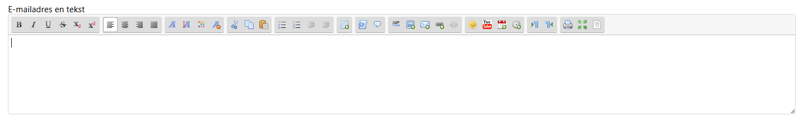

## Weergave van tekst editor met opmaak voor memo velden
Voor sommige toepassingen is het handig als de Agent een notitie veld kan invullen waarbij gebruik wordt gemaakt van opmaak. Als opmaak taal wordt dan meestal html gebruikt.

Dit kan eenvoudig worden gerealiseerd met de [SCEditor](https://www.sceditor.com/documentation/getting-started/) plugin. Voor het betreffende veld dient nu niet te worden gekozen voor `Memo`, maar voor `Html` om de opmaak zelf te configureren.

In dit voorbeeld gebruiken we SCEditor om een bericht op te maken voor het script veld `info_email_body`
```javascript
<!-- We halen SCEditor direct van het internet -->
<link rel="stylesheet" href="//cdn.jsdelivr.net/npm/sceditor@3/minified/themes/default.min.css" />
<script src="//cdn.jsdelivr.net/npm/sceditor@3/minified/sceditor.min.js"></script>

<textarea id="script_info_email_body" name="script_info_email_body" class="full-size" rows="10"></textarea>

<script>
sceditor.create(document.querySelector('#script_info_email_body'), 
{
	format: 'xhtml',
	style: '//cdn.jsdelivr.net/npm/sceditor@3/minified/themes/content/default.min.css',
	autoUpdate: true
});
</script>
```

Dit ziet er in het autoscript dan als volgt uit:
