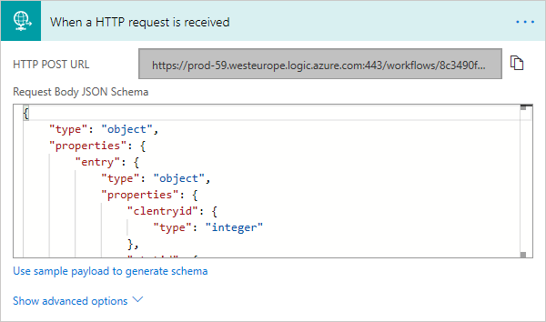

## Stuur belopdracht velden naar Excel via een Office 365 Flow

In dit voorbeeld laten we zien hoe scriptvelden via een Office 365 Flow direct naar een
Excel bestand kunnen worden opgeslagen. Met Office 365 Flows zijn nog veel meer acties mogelijk 
met de gegevens die je er naar toestuurt maar dat valt buiten de scope van deze quick-guide.

Voor deze quick-guide gaan we ervanuit dat de Flow reeds is gemaakt. 
In het office portal kun je voor de flow een HTTP request Url opvragen die zal worden gebruikt in 
deze code.

Met de url van de flow (hier gebruiken we https://prod-59.westeurope.logic.azure.com:443/workflows/1234) 

Het autoscript heeft ondersteuning voor angular en om de flow op te roepen gebruiken we een 
stuk "boilerplate" code die heel beperkt moet worden aangepast. Onderstaande code wordt in 
de `SCRIPT.HEADER` geplaatst. Vergeet niet de juiste Url te gebruiken.


``` javascript
<!--
 Adding services and controllers
-->
<script>
// add an API service to our app
app.service("PushResultToFlowService", function ($http, $log) {
    
    this.PushResultToFlow = function (data) {
		$http.post("https://prod-59.westeurope.logic.azure.com:443/workflows/1234", data)
.then(function(response) { 
  // success 
  // Nothing to do
}, function(response) { 
  // error 
  $log.error("PushResultToFlowService: Something went wrong while pushing the data!");
});

	}
})

// Add a new controller to our app
app.controller('PushResultToFlowController', function($scope, $log, PushResultToFlowService) {

    function CreateObjectFromCallPro() {
	    // Eerst halen we de scriptvelden op om een json object te maken
        // Omdat we verder geen angular gebruiken doen we dit hier los
        name_gender = getFieldValue("script_name_gender");
        name_first = getFieldValue("script_name_first");
        name_last = getFieldValue("script_name_last");
        name_telnr = getFieldValue("script_name_telnr");
        addr_street = getFieldValue("script_addr_street");
        addr_number = getFieldValue("script_addr_number");
        addr_zip = getFieldValue("script_addr_zip");
        addr_city = getFieldValue("script_addr_city");
        var loScript = goCallPro.GetScript();
        var oEntry = loScript.GetEntry();
        clentryid = oEntry.clentryid;
        telnr = oEntry.telnr;
        // Nu maken we het javascript object
        var data = {
          entry: {
          clentryid: clentryid,
          telnr: telnr      
          },
          script: {
          name_gender: name_gender,
          name_first: name_first,
          name_last: name_last,
          addr_street: addr_street,
          addr_number: addr_number,
          addr_zip: addr_zip,
          addr_city: addr_city,
          name_telnr: name_telnr
          }
        };
        return data;
    }
	$scope.PushResultToFlow = function() {
        var DataToPush = CreateObjectFromCallPro();
		var serviceCall = PushResultToFlowService.PushResultToFlow(DataToPush);
		serviceCall.then(function (data) {
            // success
			// Nothing to do
		}, function(error)
		{
            // error
			$log.error('PushResultToFlowController: Something went wrong while pushing the data!')
		})
	} 

});
</script>
```

Om dit voor eeen specifiek script werkend te maken moet de interne functie `CreateObjectFromCallPro` 
worden aangepast zodat alleen gegevens worden gebruikt die ook werkelijk verstuurd moeten worden. 
De velden die gestuurd worden zijn ook in de Flow gebruikt om een *schema* te maken.

Als voorbeeld gebruiken we een button om de actie uit te voeren, maar dit zou ook als onderdeel van 
het afcoderen kunnen worden opgeroepen in de `Custom_ValidationCheck(status)` function van het autoscript.

```
<div ng-controller="PushResultToFlowController">
<button ng-click="PushResultToFlow()">Click me to Push data to Office 365 Flow</button>
</div>
```

### Office 365 Flow instellingen

Maak een nieuwe Flow die een HTTP request accepteert en de gegevens die gestuurd worden overzet naar een 
Excel bestand dat in Onedrive staat.


In de eerste stap wordt de inkomende HTTP Request opgevangen. De velden die gebruikt kunnen worden (schema) 
zijn van te voren bepaald aan de hand van een voorbeeld json object.



Vervolgens wordt met een Excel actie een regel in Excel toegevoegd. De velden die beschikbaar zijn 
zijn de velden die in de Excel tabel zijn aangemaakt. Deze kunnen wordne gevuld met de velden uit 
de schema van de HTTP request.


Het eindresultaat is dat de Excel sheet telkens een extra regel krijgt.

