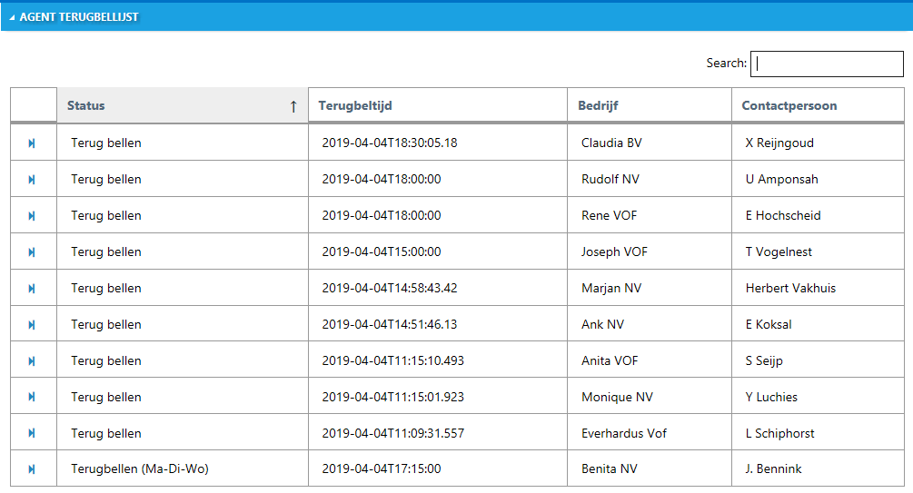

## Lijst met eigen terugbellers van vandaag

Met autoscript v4.3.2.103 is een api toegevoegd om een lijstje met de gerichte terugbellers voor een agent in een campagne op te vragen. Deze lijst kan vervolgens worden afgebeeld in het script.

In dit voorbeeld plaatsen we de lijst in een accordion die we in de `SCRIPT.INFO` variabele hebben gezet op de scriptdefinitie. We gebruiken een standaard tabel met de datatables plugin om de lijst sorteerbaar en doorzoekbaar te maken. Op het moment is de lijst beperkt to maximaal 50 resultaten.

Met de `data-on-frame-opened` zorgen we ervoor dat de resultaten pas wrode nopgehaald als de accordion wordt geopend. Op de server worden resultaten 30 minuten bewaard (gecached).

```
<div class="accordion" data-role="accordion" data-on-frame-opened="call_ace_refresh(frame)">
<div class="frame" id="ace-frame">
  <a href="#" class="heading">Agent terugbellijst
  	<span class="mif-loop2 place-right" style="cursor:pointer" onclick="aceRefreshData()"></span>
	</a>
  <div class="content">
	<div id="ace-controller">
		<table id="ace-table" class="table border bordered">
		<thead>
			<tr>
				<th></th>
				<th>Status</th>
				<th>Terugbeltijd</th>
				<th>Bedrijf</th>
				<th>Contactpersoon</th>
			</tr>
		</thead>
		<tbody>
		</tbody>
		</table>
	</div>
<script>
var aceInitialized = false;
var aceDataTable = null;
function call_ace_refresh(frame) {
	// Only refresh when we open the agent terugbellijst
	if(frame.attr('id') === 'ace-frame') {
		if(!aceInitialized) {
			var tick = new Date().getTime();
			$('#ace-table').DataTable({
				"ajax": { 
					"url": "/api/services/GetCallBackEntriesForAgentAndCampaign?agentid=%AGENT.RESID%" + "&campaignid=%CAMPAIGN.RESID%" + "&tick=" + tick, 
					"dataSrc": "" 
				},
				"columns": [
					{ "data": "EntryStatusResDescr" },
					{ "data": "StatDate" },
					{ "data": "CompanyName" },
					{ "data": "ProspectName" }
				],
				"pageLength": -1,
				"lengthMenu": [ [-1], ["All"] ],
				"dom": 'ft'
			});
		}
	}
}

function aceRefreshData() {
	if(aceDataTable!=null) {
		aceDataTable.ajax.url("/api/services/GetCallBackEntriesForAgentAndCampaign?agentid=%AGENT.RESID%" + "&campaignid=%CAMPAIGN.RESID%&nocache=true").load();
	}
}
</script>
  </div>
</div>

</div>
```

Het resultaat in het autoscript is als volgt:
