|                           | maart 2020          |
| --------------------------|--------------------:|
| CallPro gebruikertraining | Johan Bennink       |


Inhoudsopgave

[Inleiding](#Inleiding)

[CallPro modules](#CallPro-modules)

[TODO: Algemeen](#todo-algemeen)

[De Resource Explorer](#de-resource-explorer)

[Control panel](#control-panel)

[Belopdrachtstatussen](#belopdrachtstatussen)

[Scriptdefinitie](#scriptdefinitie)

[Importdefinitie](#importdefinitie)

[TODO: Exportdefinitie](#todo-exportdefinitie)

[Zoeken tools](#zoeken-tools)

[Campagne grid](#campagne-grid)

[Systeemconfiguratie](#systeemconfiguratie)

[Algemeen](#algemeen)

[Script-omgeving](#script-omgeving)

[TODO: Diagnose](#todo-diagnose)

[Bestandslokaties](#bestandslokaties)

[Systeem scriptvelden](#systeem-scriptvelden)

[Pauze types](#pauze-types)

[Geavanceerd](#geavanceerd)

[Resources](#resources)

[Agent](#agent)

[Call-list](#call-list)

[Calendar](#calendar)

[Seat](#seat)

[TODO: Groups](#todo-groups)

[Campaigns](#campaigns)

[Snelkoppelingen](#snelkoppelingen)

[TODO: Scriptmodule](#todo-scriptmodule)

[TODO: Agenda module](#todo-agenda-module)

[CallProPortal](#callproportal)

[Belangrijke conventies in CallPro](#belangrijke-conventies-in-callpro)

[Hoe biedt CallPro een belopdracht aan](#hoe-biedt-callpro-een-belopdracht-aan)

[Campagnebeheer voor supervisors](#_Toc6926168)

[Een campagne inrichten in CallPro](#een-campagne-inrichten-in-callpro)

[Meer over campagnes en campagne instellingen](#meer-over-campagnes-en-campagne-instellingen)

[Actieve resources in de campagne](#actieve-resources-in-de-campagne)

[Agenten op meerdere campagnes indelen](#agenten-op-meerdere-campagnes-indelen)

[Bellijsten in meerdere campagnes gebruiken](#bellijsten-in-meerdere-campagnes-gebruiken)

[Filters op bellijsten in de campagne](#filters-op-bellijsten-in-de-campagne)

[Prioriteiten op bellijsten in de campagne](#prioriteiten-op-bellijsten-in-de-campagne)

[Een nieuwe campagne maken](#een-nieuwe-campagne-maken)

[Maak het belscript](#maak-het-belscript)

[Maak de scriptdefinitie](#maak-de-scriptdefinitie)

[Test de nieuwe scriptdefinitie](#test-de-nieuwe-scriptdefinitie)

[Maak de nieuwe campagne](#maak-de-nieuwe-campagne)

[Maak een exportdefinitie](#maak-een-exportdefinitie)

[Maak de importdefinitie](#maak-de-importdefinitie)

[Importeren](#importeren)

[Waarom importeert mijn bestand niet?](#waarom-importeert-mijn-bestand-niet)

[Naamgeving kolommen](#naamgeving-kolommen)

[Telefoonummerkolom](#telefoonummerkolom)

[Alle velden op 1 regel](#alle-velden-op-1-regel)

[Excel voorbeelden](#excel-voorbeelden)

[Telefoonnummer mist voorloop nul](#telefoonnummer-mist-voorloop-nul)

[Netnummer en abonneenummer in twee velden](#netnummer-en-abonneenummer-in-twee-velden)

[Postcode en Plaats in een veld](#postcode-en-plaats-in-een-veld)

[Waarden in een kolom vervangen](#waarden-in-een-kolom-vervangen)

[Meldingen tijdens de import](#meldingen-tijdens-de-import)

[Importdefinitie hoort niet bij de bellijst](#importdefinitie-hoort-niet-bij-de-bellijst)

[Problemen met de lengte van velden of het datatype](#problemen-met-de-lengte-van-velden-of-het-datatype)

[Ander veldscheidingsteken bij importeren csv bestanden](#ander-veldscheidingsteken-bij-importeren-csv-bestanden)

[Excel driver niet goed ingesteld](#excel-driver-niet-goed-ingesteld)

[Dagelijkse werkzaamheden](#Dagelijkse-werkzaamheden)

[TODO: Wijzigen van belopdrachten](#todo-wijzigen-van-belopdrachten)

[Correctie afcoderen met verkeerde status door de Agent](#correctie-afcoderen-met-verkeerde-status-door-de-agent)

[Correctie afcoderen met verkeerde status door de Agent na doorbellen](#correctie-afcoderen-met-verkeerde-status-door-de-agent-na-doorbellen)

[Belscripts maken voor beginners](#Belscripts-maken-voor-beginners)

[Het autoscript](#het-autoscript)

[Toolbar](#toolbar)

[Belopdrachtstatussen](#belopdrachtstatussen-1)

[Scriptvelden](#scriptvelden)

[Belopdrachtnotitie](#belopdrachtnotitie)

[Pagina footer](#pagina-footer)

[Scriptdefinitie instellingen](#scriptdefinitie-instellingen)

[Extra autoscript instellingen](#extra-autoscript-instellingen)

[Globale campagne instellingen](#globale-campagne-instellingen)

[Agentgroup instellingen](#agentgroup-instellingen)

[Campagne instellingen](#campagne-instellingen)

[Status instellingen](#status-instellingen)

[Veld weergave](#veld-weergave)

[Textbox](#textbox)

[Textarea](#textarea)

[Radiobutton](#radiobutton)

[Checkbox](#checkbox)

[Combobox](#combobox)

[Label](#label)

[HTML](#html)

[Hidden](#hidden)

[Weergave opties](#weergave-opties)

[Datum velden](#datum-velden)

[Naam velden](#naam-velden)

[Overige functies](#overige-functies)

[Opmaak](#opmaak)

[Geavanceerde opmaak met het autoscript](#fulfilment-variabelen-voor-server-side-opmaak)

[Maatwerk opmaak voor invoervelden](#maatwerk-opmaak-voor-invoervelden)

[Plaats velden binnen een tabcontrol](#plaats-velden-binnen-een-tabcontrol)

[Belhistorie resultaten aanpassen met CSS opmaak](#belhistorie-resultaten-aanpassen-met-css-opmaak)

[Afcoderingen verbergen in de statuslijst met CSS opmaak](#afcoderingen-verbergen-in-de-statuslijst-met-css-opmaak)

[Custom validatie tijdens afcoderen](#custom-validatie-tijdens-afcoderen)

[Antwoordservice pagina](#antwoordservice-pagina)

[Scriptvelden](#scriptvelden-1)

[Contactpersonen (ContactID)](#contactpersonen-contactid)

[Acties (ContactAction)](#acties-contactaction)

[Contactpersoon berichten via (SendEmail, SendSMS)](#contactpersoon-berichten-via-sendemail-sendsms)

[Notitie voor contactpersoon (ContactNote)](#notitie-voor-contactpersoon-contactnote)

[Aanpassen scriptweergave](#aanpassen-scriptweergave)

[Weergave introductie tekst](#weergave-introductie-tekst)

[Pauze pagina](#pauze-pagina)

[Belscripts maken voor gevorderden](#Belscripts-maken-voor-gevorderden)

[Script systeemacties](#script-systeemacties)

[Terugbellenscherm](#terugbellenscherm)

[Verwerkscherm](#verwerkscherm)

[Niet-bereikt scherm](#niet-bereikt-scherm)

[Belopdracht afcoderen](#belopdracht-afcoderen)

[Starten windows applicatie](#starten-windows-applicatie)

[Herstellen/annuleren wijzigingen](#herstellenannuleren-wijzigingen)

[Aanmelden](#aanmelden)

[Pauze](#pauze)

[Uitloggen](#uitloggen)

[Telefoonnummer kiezen](#telefoonnummer-kiezen)

[Beëindig gesprek](#beëindig-gesprek)

[Doorschakelen naar Bel-me-niet IVR](#doorschakelen-naar-bel-me-niet-ivr)

[Beantwoord gesprek](#Beantwoord-gesprek)

[Dialing configuratie](#dialing-configuratie)

[Verander wachtwoord](#verander-wachtwoord)

[Nieuwe belopdracht](#nieuwe-belopdracht)

[Zoek belopdracht](#zoek-belopdracht)

[Terug navigeren](#terug-navigeren)

[Vooruit navigeren](#vooruit-navigeren)

[Belopdracht eigenschappen](#belopdracht-eigenschappen)

[Oproep agendamodul3](#oproep-agendamodule)

[Volgende belopdracht](#volgende-belopdracht)

[Call blending; overschakelen op andere dial mode](#call-blending-overschakelen-op-andere-dial-mode)

[Work modus van agent; het plaatsen van een agent in een work modus](#work-modus-van-agent-het-plaatsen-van-een-agent-in-een-work-modus)

[Cancel belopdracht; de belopdracht wordt beëindigd zonder te bewaren](#cancel-belopdracht-de-belopdracht-wordt-beëindigd-zonder-te-bewaren)

[Speciale hyperlink anchors](#speciale-hyperlink-anchors)

[Opnemen gesprek](#opnemen-gesprek)

[Gesprek direct doorschakelen (blind transfer)](#gesprek-direct-doorschakelen-blind-transfer)

[Gesprek met ruggespraak doorverbinden (attended transfer)](#gesprek-met-ruggespraak-doorverbinden-attended-transfer)

[Doorverbinden met ruggespraak annuleren](#doorverbinden-met-ruggespraak-annuleren)

[Doorverbinden met ruggespraak voltooien](#doorverbinden-met-ruggespraak-voltooien)

[Doorverbinden wissel gesprekken](#doorverbinden-wissel-gesprekken)

[Verstuur DTMF-tonen](#verstuur-dtmf-tonen)

[Zet een gesprek on hold](#zet-een-gesprek-on-hold)

[Belscript (querystring) parameters](#belscript-querystring-parameters)

[Belscript startpagina](#belscript-startpagina)

[Pauze pagina](#pauze-pagina-1)

[Inbound pagina](#inbound-pagina)

[Belscript systeemvelden (OBSOLETE)](#belscript-systeemvelden-deprecated)

[Object hiërarchische velden](#object-hiërarchische-velden)

[Basis eigenschappen](#basis-eigenschappen)

[oEntry](#oentry)

[oAttempt](#oattempt)

[oCallList](#ocalllist)

[oDialer](#odialer)

[oAgent](#oagent)

[oCallstatus](#ocallstatus)

[oAppointment](#oappointment)

[CallPro objectmodel](#callpro-objectmodel)

[Het autoscript](#Het-autoscript)

[TODO: Wallboard](#todo-wallboard)

[Rapportage](#Rapportage)

[Belhistoriestatistieken](#belhistoriestatistieken)

[Bellijst statistieken](#bellijst-statistieken)

[Bellijst eigenschappen](#bellijst-eigenschappen)

[Reportserver rapporten](#reportserver-rapporten)

[Exporteren](#exporteren)

[CallPro FAQ](#CallPro-FAQ)

[Programma meldingen](#programma-meldingen)

[Melding bij aanmelden](#melding-bij-aanmelden)

[Dubbel opstarten Scriptmodule](#dubbel-opstarten-scriptmodule)

[Ik krijg de melding “Belopdracht is al in gebruik” hoe kan dat?](#ik-krijg-de-melding-belopdracht-is-al-in-gebruik-hoe-kan-dat)

[Hoe voorkom ik dat de klok op de werkstations fout staan ingesteld](#hoe-voorkom-ik-dat-de-klok-op-de-werkstations-fout-staan-ingesteld)

[Optie “Processen opruimen” of “Markeer als crashed” werkt niet](#optie-processen-opruimen-of-markeer-als-crashed-werkt-niet)

[Terminalserver ondersteuning CallPro](#terminalserver-ondersteuning-callpro)

[Kan de agent zien in welke fase hij/zij zit?](#kan-de-agent-zien-in-welke-fase-hijzij-zit)

[Ik open een venster maar deze zie ik niet op de monitor verschijnen](#ik-open-een-venster-maar-deze-zie-ik-niet-op-de-monitor-verschijnen)

[Vensters met icoon in de linker bovenhoek](#vensters-met-icoon-in-de-linker-bovenhoek)

[Overige vensters](#overige-vensters)

# Inleiding

Deze handleiding is bedoeld als onderdeel van de cursus “Campagnebeheer
voor supervisors”. Tijdens de cursus worden verschillende taken
behandeld van supervisors die CallPro ondersteunt. De handleiding is ook
los van de cursus te gebruiken als naslagwerk van de mogelijkheden van
CallPro in de context van een supervisor.

# CallPro modules

Basisonderdelen CallPro

CallPro werkt met een aantal termen die door de hele applicatie zijn
doorgevoerd. Ook user-interface standaarden worden hier behandeld.

# TODO: Algemeen

# De Resource Explorer

De Resource Explorer is de centrale interface voor het beheer van
CallPro. Afhankelijk van de verantwoordelijkheden van de supervisor
kunnen meer of minder onderdelen worden gebruikt.

## Control panel

In het control panel zijn de diverse (systeem) instellingen van CallPro
verzameld.

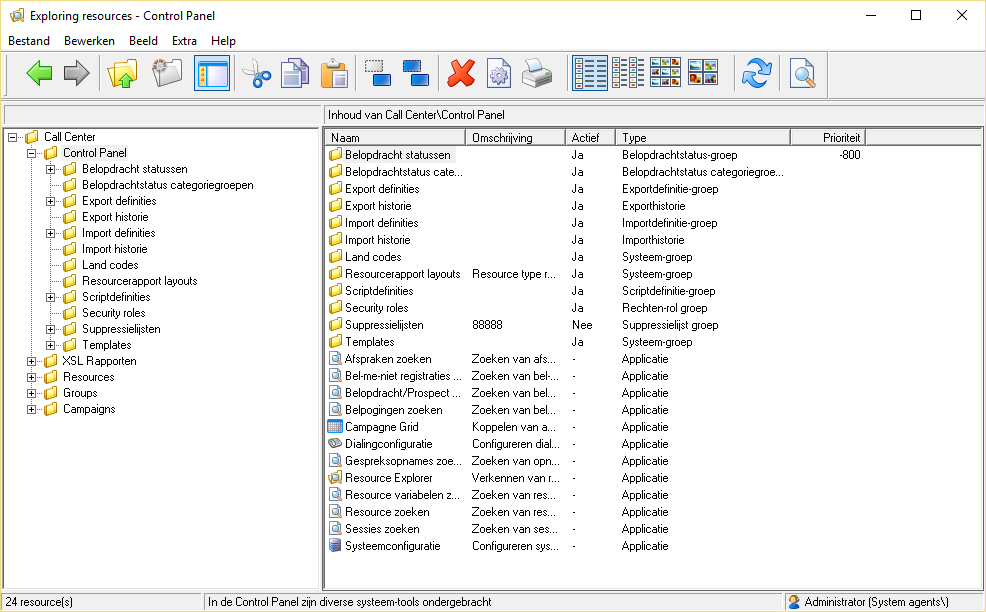

### Belopdrachtstatussen

In CallPro kunnen zeer eenvoudig belopdrachtstatussen worden aangemaakt.
Wij (Calway) adviseren om de belopdrachtstatussen een logische indeling
te geven qua naamgeving en gebruik. Onderstaande lijst is ons voorstel
voor de indeling van belopdrachtstatussen. Deze indeling is functioneel
en maakt o.a. het opstellen van rapportages eenvoudiger doordat
statussen gegroepeerd kunnen worden op basis van de code. Alle standaard
CallPro rapportages zijn gebaseerd op deze indeling.

Alle statussen worden verder op de standaard instellingen gezet van
CallPro en zijn zelf eenvoudig aan te passen als dit gewenst is.

Voor de code van een belopdrachtstatus gebruiken wij een 3-cijferige
codering. Het eerste cijfer geeft een globale indeling van de statussen.

<table>
<thead>
<tr class="header">
<th>Groep</th>
<th>Omschrijving</th>
</tr>
</thead>
<tbody>
<tr class="odd">
<td>0</td>
<td><p><strong>Systeem statussen</strong></p>
<p>Alle statussen uit deze categorie zijn systeem statussen die bij de installatie van CallPro reeds aanwezig zijn, en ook een speciale betekenis hebben. Het betreft hier voornamelijk statussen die te maken hebben met de telefonie, of begrenzingen danwel ontdubbelen etc...</p></td>
</tr>
<tr class="even">
<td>1</td>
<td><p><strong>Niet bereikt</strong></p>
<p>Alle statussen uit deze categorie dienen van het type niet bereikt te zijn en dienen ook functioneel als “Niet bereikt” te worden geïnterpreteerd.</p></td>
</tr>
<tr class="odd">
<td>2</td>
<td><p><strong>Uitval</strong></p>
<p>Alle statussen uit deze categorie dienen van het type verwerkt te zijn en dienen ook functioneel als “Uitval” te worden gezien. Deze status wordt voor de Agent (beller) als een niet negatieve status gezien omdat de Agent er niets aan kan doen.</p></td>
</tr>
<tr class="even">
<td>3</td>
<td><p><strong>Terugbellen</strong></p>
<p>Alle statussen uit deze categorie dienen van het type terugbellen te zijn en dienen ook functioneel als “Terugbellen” gezien te worden. Het is toegestaan om terugbelstatussen bij de positieve categorieën op te nemen als dit functioneel gezien duidelijker is.</p></td>
</tr>
<tr class="odd">
<td>4</td>
<td><p><strong>Geen interesse/Niet positief (telt niet voor agent)</strong></p>
<p>Alle statussen in deze categorie dienen van het type verwerkt te zijn en dienen ook functioneel als “Niet positief” gezien te worden. De status geldt voor de Agent niet als een negatief resultaat.</p></td>
</tr>
<tr class="even">
<td>5</td>
<td><p><strong>Geen interesse/Negatief (telt wel voor agent)</strong></p>
<p>Alle statussen in deze categorie dienen van het type verwerkt te zijn en dienen ook functioneel als “Negatief” gezien te worden. Het resultaat geldt ook als “Negatief” voor de Agent.</p></td>
</tr>
<tr class="odd">
<td>6</td>
<td><p><strong>Positief (niet voor Agent)</strong></p>
<p>Alle statussen in deze categorie gelden als “Positief” belresultaat voor het call center/de opdrachtgever maar gelden niet als “Positief” belresultaat voor de Agent.</p></td>
</tr>
<tr class="even">
<td>7</td>
<td><p><strong>Positief (ook voor Agent)</strong></p>
<p>Alle statussen in deze categorie gelden als “Positief” belresultaat voor zowel het call center/de opdrachtgever als de Agent.</p></td>
</tr>
<tr class="odd">
<td>8</td>
<td>Gereserveerd (telt niet voor Agent)</td>
</tr>
<tr class="even">
<td>9</td>
<td>Gereserveerd (telt wel voor Agent)</td>
</tr>
</tbody>
</table>

Hoewel bij de installatie veel van deze belopdrachtstatussen aanwezig
zullen zijn, zijn alleen de statussen die zijn gemarkeerd als
“Systeemstatus” altijd aanwezig. Hoewel het beter is om zoveel
mogelijk bij de richtlijn te blijven is er geen verplichting om
bijvoorbeeld de 7xx statussen altijd als verwerkt in te richten. Het kan
echter wel gebeuren dat in rapportages dan bepaalde tellingen
anders/verkeerd lopen. Als er echter een duidelijke, goede reden, voor
is is afwijken vanuit de software geen probleem.

<table>
<thead>
<tr class="header">
<th>Groep</th>
<th>Code</th>
<th>Omschrijving</th>
<th>Subgroep</th>
</tr>
</thead>
<tbody>
<tr class="odd">
<td>0</td>
<td><strong>Systeem statussen</strong></td>
<td></td>
<td></td>
</tr>
<tr class="even">
<td></td>
<td><strong>000</strong></td>
<td>Nieuwe belopdracht</td>
<td>Systeemstatus</td>
</tr>
<tr class="odd">
<td></td>
<td><strong>010</strong></td>
<td>Bel-me-niet uitsluiting</td>
<td>Systeemstatus. Deze status wordt gezet als de belopdracht op de Bel-me-niet suppressielijst voorkomt</td>
</tr>
<tr class="even">
<td></td>
<td><strong>011</strong></td>
<td>Bel-me-niet verlopen</td>
<td>Systeemstatus. Deze status kan worden gezet als een belopdracht een verlopen bel-me-niet belperiode heeft.</td>
</tr>
<tr class="odd">
<td></td>
<td><strong>012</strong></td>
<td>RVV afmelding</td>
<td>Systeemstatus. Deze status geeft aan dat deze belopdracht via de bel-me-niet IVR is afgemeld voor Recht-van-verzet.</td>
</tr>
<tr class="even">
<td></td>
<td><strong>060</strong></td>
<td>Abandoned call</td>
<td>Systeemstatus. In de Niet bereikt categorie</td>
</tr>
<tr class="odd">
<td></td>
<td><strong>061</strong></td>
<td>Verbinding verbroken tijdens kiezen</td>
<td>Systeemstatus. In de Niet bereikt categorie</td>
</tr>
<tr class="even">
<td></td>
<td><strong>062</strong></td>
<td>Verbinding geweigerd</td>
<td>Systeemstatus. In de Niet bereikt categorie</td>
</tr>
<tr class="odd">
<td></td>
<td><strong>063</strong></td>
<td>Call failure</td>
<td>Systeemstatus. In de Niet bereikt categorie</td>
</tr>
<tr class="even">
<td></td>
<td><strong>064</strong></td>
<td>Interupted by CTI layer</td>
<td>Systeemstatus. In de Niet bereikt categorie</td>
</tr>
<tr class="odd">
<td></td>
<td><strong>065</strong></td>
<td>Dailing timeout</td>
<td>Systeemstatus. In de Verwerkt categorie. Ook vaak geassocieerd met Geen gehoor, maar soms een tijdelijk probleem</td>
</tr>
<tr class="even">
<td></td>
<td><strong>066</strong></td>
<td>Transaction incomplete</td>
<td>Systeemstatus. In de Niet bereikt categorie</td>
</tr>
<tr class="odd">
<td></td>
<td><strong>067</strong></td>
<td>Fast Busy</td>
<td>Systeemstatus. In de Niet bereikt categorie</td>
</tr>
<tr class="even">
<td></td>
<td><strong>090</strong></td>
<td>Maximaal aantal belpogingen (Koude belopdracht)</td>
<td>Systeemstatus</td>
</tr>
<tr class="odd">
<td></td>
<td><strong>091</strong></td>
<td>Maximale belpogingduur (Koude belopdracht)</td>
<td>Systeemstatus</td>
</tr>
<tr class="even">
<td></td>
<td><strong>092</strong></td>
<td>Maximaal aantal belpogingen (Terugbelopdracht)</td>
<td>Systeemstatus</td>
</tr>
<tr class="odd">
<td></td>
<td><strong>093</strong></td>
<td>Maximale belpogingduur (Terugbelopdracht)</td>
<td>Systeemstatus</td>
</tr>
<tr class="even">
<td></td>
<td><strong>094</strong></td>
<td>Maximaal aantal terugbelpogingen</td>
<td>Systeemstatus</td>
</tr>
<tr class="odd">
<td></td>
<td><strong>095</strong></td>
<td>Maximale terugbelpogingduur</td>
<td>Systeemstatus</td>
</tr>
<tr class="even">
<td></td>
<td><strong>096</strong></td>
<td>Maximaal aantal belpogingen</td>
<td>Systeem status. Een absoluut maximum aan het aantal belpogingen ongeacht de categorie</td>
</tr>
<tr class="odd">
<td></td>
<td><strong>097</strong></td>
<td>Te vaak dezelfde status achter elkaar</td>
<td>Systeemstatus. Bij een status kan een aantal worden opgegeven. Als dit aantal wordt bereikt wordt deze code gebruikt.</td>
</tr>
<tr class="even">
<td></td>
<td><strong>098</strong></td>
<td>Live contact over ander nummer</td>
<td>Systeemstatus. Geeft aan dat een nieuwe belpoging is gestart voor een ander nummer. De actuele belpoging wordt dan afgecodeerd met dit resultaat. Treedt alleen op als er vaker naar nummers wordt gebeld tijdens de behandeling van 1 belopdracht.</td>
</tr>
<tr class="odd">
<td></td>
<td></td>
<td></td>
<td></td>
</tr>
<tr class="even">
<td>1</td>
<td><strong>Niet bereikt</strong></td>
<td></td>
<td></td>
</tr>
<tr class="odd">
<td></td>
<td><strong>120</strong></td>
<td>Geen gehoor</td>
<td>Systeemstatus</td>
</tr>
<tr class="even">
<td></td>
<td><strong>130</strong></td>
<td>In gesprek</td>
<td>Systeemstatus</td>
</tr>
<tr class="odd">
<td></td>
<td><strong>140</strong></td>
<td>Voicemail/antwoordapparaat</td>
<td>Systeemstatus</td>
</tr>
<tr class="even">
<td></td>
<td>150</td>
<td>Niet aanwezig/geen tijd</td>
<td></td>
</tr>
<tr class="odd">
<td></td>
<td>160</td>
<td>DMU afwezig/niet beschikbaar</td>
<td></td>
</tr>
<tr class="even">
<td>2</td>
<td><strong>Uitval</strong></td>
<td></td>
<td></td>
</tr>
<tr class="odd">
<td></td>
<td><strong>200</strong></td>
<td>Informatietoon</td>
<td>Systeemstatus</td>
</tr>
<tr class="even">
<td></td>
<td><strong>201</strong></td>
<td>Fax/Modem</td>
<td>Systeemstatus</td>
</tr>
<tr class="odd">
<td></td>
<td><strong>205</strong></td>
<td>Ruis</td>
<td>Systeemstatus Antwoordservicemodule</td>
</tr>
<tr class="even">
<td></td>
<td>210</td>
<td>Niet meer telefonisch benaderen (Bel-me-niet)</td>
<td>Zie ook 410 en 510</td>
</tr>
<tr class="odd">
<td></td>
<td>211</td>
<td>Overleden</td>
<td></td>
</tr>
<tr class="even">
<td></td>
<td>212</td>
<td>Geen bedrijf/failliet</td>
<td></td>
</tr>
<tr class="odd">
<td></td>
<td>220</td>
<td>Uitsluiting door klant</td>
<td>Als de klant na de import adressen aanlevert die niet gebeld moeten/mogen worden kan deze status worden toegekend. Dit gebeurd dan via een update import, of direct via de Resource Explorer</td>
</tr>
<tr class="even">
<td></td>
<td>225</td>
<td>Valt buiten doelgroep</td>
<td>Zie ook 525</td>
</tr>
<tr class="odd">
<td></td>
<td><strong>230</strong></td>
<td>Fout/ongeldig telefoonnummer</td>
<td>Systeemstatus. Deze status wordt gezet bij het importeren als een ongeldig telefoonnummer is gedetecteerd. Ook functioneel te gebruiken om aan te geven dat tijdens het bellen alsnog blijkt dat het nummer niet geldig is.</td>
</tr>
<tr class="even">
<td></td>
<td>231</td>
<td>Dubbel in bestand</td>
<td>Doorgebelde of Agent aangegeven.</td>
</tr>
<tr class="odd">
<td></td>
<td>290</td>
<td>Onbereikbaar in belperiode</td>
<td></td>
</tr>
<tr class="even">
<td></td>
<td>299</td>
<td>Niet bereikbaar</td>
<td>Functionele status voor slecht bereikbare adressen als geen gebruik wordt gemaakt van de belpogingbegrenzing. Deze status wordt via de Resource Explorer dan handmatig op de belodpracht ingesteld.</td>
</tr>
<tr class="odd">
<td>3</td>
<td><strong>Terugbellen</strong></td>
<td></td>
<td></td>
</tr>
<tr class="even">
<td></td>
<td><strong>300</strong></td>
<td>Terugbellen</td>
<td>Systeemstatus</td>
</tr>
<tr class="odd">
<td></td>
<td>310</td>
<td>Gerichte terugbelafspraak</td>
<td>Als 300, andere tekst (!)</td>
</tr>
<tr class="even">
<td></td>
<td>320</td>
<td>(zachte) terugbelafspraak</td>
<td>Als 300, willekeurige agent</td>
</tr>
<tr class="odd">
<td></td>
<td>330</td>
<td>Terugbellen op lange termijn</td>
<td>Technisch een “ Verwerkt” status.</td>
</tr>
<tr class="even">
<td>4</td>
<td><strong>Geen interesse/Niet Positief (telt niet voor agent)</strong></td>
<td></td>
<td></td>
</tr>
<tr class="odd">
<td></td>
<td>410</td>
<td>Niet meer telefonisch benaderen (Bel-me-niet)</td>
<td>Zie ook 210 en 510</td>
</tr>
<tr class="even">
<td></td>
<td>431</td>
<td>Weigert gesprek</td>
<td></td>
</tr>
<tr class="odd">
<td>5</td>
<td><strong>Geen interesse/Negatief (telt wel voor agent)</strong></td>
<td></td>
<td></td>
</tr>
<tr class="even">
<td></td>
<td><strong>500</strong></td>
<td>Negatief</td>
<td></td>
</tr>
<tr class="odd">
<td></td>
<td>501</td>
<td>Geen interesse</td>
<td></td>
</tr>
<tr class="even">
<td></td>
<td>510</td>
<td>Niet meer telefonisch benaderen (Bel-me-niet)</td>
<td>Zie ook 210 en 410</td>
</tr>
<tr class="odd">
<td></td>
<td>525</td>
<td>Valt buiten doelgroep</td>
<td>Zie ook 225</td>
</tr>
<tr class="even">
<td>6</td>
<td><strong>Positief (niet voor Agent)</strong></td>
<td></td>
<td></td>
</tr>
<tr class="odd">
<td></td>
<td>610</td>
<td>Informatie sturen per post</td>
<td></td>
</tr>
<tr class="even">
<td></td>
<td>611</td>
<td>Informatie sturen per email</td>
<td></td>
</tr>
<tr class="odd">
<td></td>
<td>612</td>
<td>Informatie sturen per post (+nabellen)</td>
<td></td>
</tr>
<tr class="even">
<td></td>
<td>613</td>
<td>Informatie sturen per email (+nabellen)</td>
<td></td>
</tr>
<tr class="odd">
<td>7</td>
<td><strong>Positief (ook voor Agent)</strong></td>
<td></td>
<td></td>
</tr>
<tr class="even">
<td></td>
<td><strong>700</strong></td>
<td>Positief</td>
<td></td>
</tr>
<tr class="odd">
<td></td>
<td><strong>705</strong></td>
<td>Aangenomen</td>
<td>Systeemstatus antwoordservicemodule</td>
</tr>
<tr class="even">
<td></td>
<td><strong>706</strong></td>
<td>Doorverbonden</td>
<td>Systeemstatus Antwoordservicemodule</td>
</tr>
<tr class="odd">
<td></td>
<td>710</td>
<td>Informatie sturen per post</td>
<td></td>
</tr>
<tr class="even">
<td></td>
<td>711</td>
<td>Informatie sturen per email</td>
<td></td>
</tr>
<tr class="odd">
<td></td>
<td>712</td>
<td>Informatie sturen per post (+nabellen)</td>
<td></td>
</tr>
<tr class="even">
<td></td>
<td>713</td>
<td>Informatie sturen per email (+nabellen)</td>
<td></td>
</tr>
<tr class="odd">
<td></td>
<td>715</td>
<td>Stuur bevestiging</td>
<td></td>
</tr>
<tr class="even">
<td></td>
<td><strong>780</strong></td>
<td>Afspraak</td>
<td>Systeemstatus. Een ingeplande adviseur afspraak</td>
</tr>
<tr class="odd">
<td></td>
<td>781</td>
<td>Afspraak (adviseur)</td>
<td>Eigen afspraak door een adviseur ingeboekt via CallProPortal</td>
</tr>
<tr class="even">
<td></td>
<td>782</td>
<td>Afspraak verzet</td>
<td>Een verzetting die via outbound is gedaan. Meestal nabeltrajecten. Alleen een functionele status, het belscript moet dit zelf regelen!</td>
</tr>
<tr class="odd">
<td></td>
<td>783</td>
<td>Afspraak geannuleerd</td>
<td><p>Een annulering die via outbound is gedaan. Meestal nabeltrajecten.</p>
<p>Alleen een functionele status, het belscript moet dit zelf regelen!</p></td>
</tr>
<tr class="even">
<td></td>
<td>785</td>
<td>Afspraak (+nabellen)</td>
<td>Voor CallPro een terugbellen code</td>
</tr>
<tr class="odd">
<td>8</td>
<td><strong>Gereserveerd (niet voor de Agent)</strong></td>
<td></td>
<td></td>
</tr>
<tr class="even">
<td></td>
<td></td>
<td></td>
<td></td>
</tr>
<tr class="odd">
<td>9</td>
<td><strong>Gereserveerd (ook voor de Agent)</strong></td>
<td></td>
<td></td>
</tr>
<tr class="even">
<td></td>
<td></td>
<td></td>
<td></td>
</tr>
</tbody>
</table>

### Scriptdefinitie

Een scriptdefinitie beschrijft de scriptvelden, en belopdrachtstatussen
die kunnen worden gebruikt in een belscript of callflow. Een bellijst
wordt aangemaakt op basis van een scriptdefinitie. Bij het aanmaken van
een nieuwe scriptdefinitie kunnen de instellingen van een bestaande
scriptdefinitie worden overgenomen.

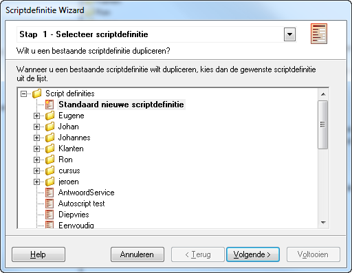

In de scriptdefinitie wordt alleen de startpagina van het belscript
vastgelegd. Als het belscript op een webserver (http) staat kan deze
niet via de “Bladeren…” knop worden gekozen maar moet de volledige url
worden ingetypt.


In stap3 worden alle velden die in het belscript worden gebruikt, en/of
die moeten worden geimporteerd vastgelegd. Soms worden velden via het
importbestand aangeleverd die later terug moeten worden geleverd aan de
opdrachtgever, maar tijdens het bellen niet van belang zijn. Deze velden
worden dan wel in de scriptdefinitie (en ook de importdefinitie)
opgenomen. De scriptdefinitie bevat ook velden die niet in het
importbestand staan, maar wel nodig zijn in het belscript (gegevens
verrijking). Ook kan het zijn dat er stuurvelden worden opgenomen in de
scriptdefinitie die worden gevuld afhankelijk van de wijze waarop het
belscript/de callflow wordt doorlopen.

Per scriptveld wordt in ieder geval vastgelegd wat de naam, het datatype
en de lengte is. Aanvullend kunnen voor de autoscript omgeving nog een
Vraag, en de weergave van het scriptveld worden vastgelegd. Deze
informatie wordt alleen gebruikt i.c.m. de autoscript functie van
CallPro.

 

In de scriptdefinitie wordt aangegeven welke velden een telefoonnummer
bevatten. Dit is belangrijk zodat CallPro de telefonie kan aansturen en
telefoonnummers automatisch kan bellen. Een andere belangrijke
instelling zijn de ontdubbelvelden. Door een of meer velden aan te
vinken kan worden vastgelegd dat alleen belopdrachten mogen worden
geïmporteerd die een unieke waarde bevatten voor deze velden. Meestal
wordt hiervoor het telefoonnummer gebruikt.

 

De scriptdefinitie legt ook vast welke belopdrachtstatussen gebruikt
kunnen worden (stap 6). Tijdens het bellen kunnen Agents alleen de hier
geselecteerde belopdrachtstatussen gebruiken om gesprekken af te
coderen.

 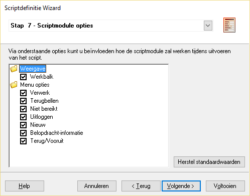


Nu is de scriptdefinitie klaar, en kan een bellijst worden gemaakt
gebaseerd op deze scriptdefinitie.

### Importdefinitie

In CallPro wordt een importdefinitie gebruikt om adressen te importeren
in een bellijst. Op basis van het aangeleverde importbestand, en de
bellijst, wordt met de importdefinitie bepaald welke velden in de
bellijst worden gevuld met de gegevens uit het importbestand. Een
importdefinitie kan worden gemaakt aan het einde van de Bellijst wizard,
of direct vanuit het control panel.

Vanuit de Importdefinitie folder kan met right-click
Nieuwe\\Importdefinitie... een nieuwe importdefinitie worden aangemaakt.

 
 

Afhankelijk van het gekozen bestandstype moeten verschillende
instellingen worden gedaan. De meest voorkomende bestanden die worden
aangeleverd zijn “CSV (Comma delimited)” of “MS Excel”. Bij de eerste
moet worden gelet op het veldscheidingsteken, en of de velden worden
gemarkeerd met quotes. Ook herkend CallPro dan het telefoonnummer
meestal als numeriek veld, terwijl dit in CallPro een karakter veld is.
Bij Excel bestanden worden vaak het veldtypes (stap 6) op karakter 255
gezet. Ook kan het zijn dat de lijst met Gegevens bronnen verschilt per
computer als zowel de Nederlandstalige Excel als de Engelstalige Excel
binnen het call center wordt gebruikt.

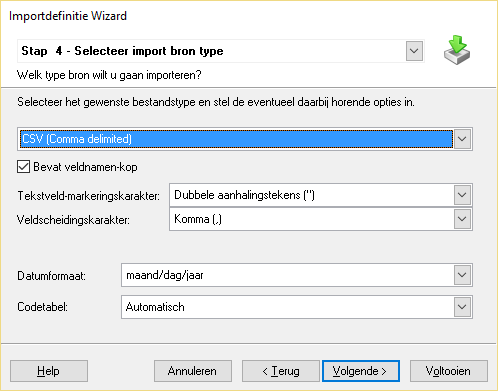 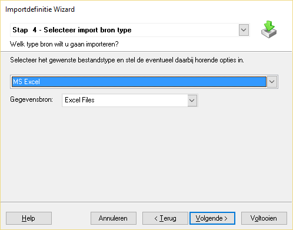

 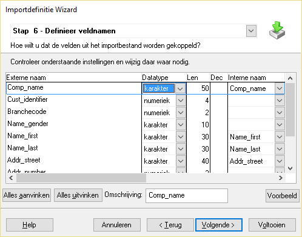

Sommige Excel sheets bevatten tabbladen met namen die niet geldig zijn
in CallPro. Als in stap 5 na de selectie van het Excel bestand en het
tabblad ene foutmelding volgt als onderstaande

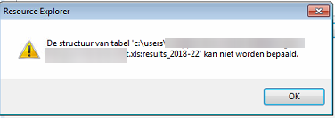

Dan bevat het tabblad in Excel mogelijk tekens die niet geldig zijn.
Tekens die niet altijd werken zijn \*%\!\\/-

In stap 6 worden de velden uit het importbestand (Externe naam)
gekoppeld aan de velden uit de bellijst (Interne naam). Velden die niet
nodig zijn hoeven ook niet te worden geïmporteerd, vul dan geen veld in
bij Interne naam. Velden kunnen alleen gekoppeld worden als het datatype
overeenkomt, en ook de lengte van het Interne veld groter of gelijk aan
de lengte van het Externe veld, dit om gegevensverlies te voorkomen.
Soms herkend CallPro een veld als numeriek (omdat er alleen cijfers in
het veld staan) terwijl die bijvoorbeeld karakter moet zijn. Corrigeer
dan het datatype om het veld te kunnen koppelen.

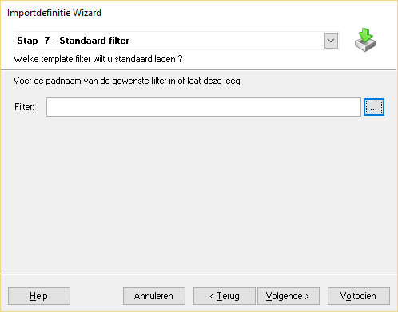 
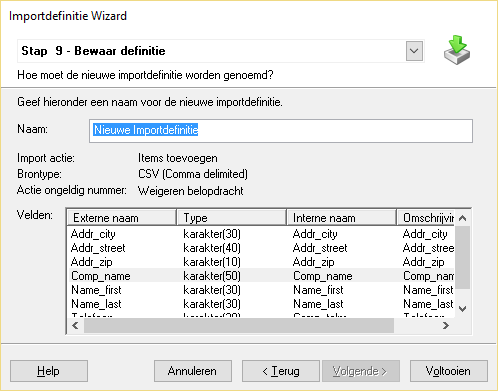

In stap 7 kan een standaard filter worden ingesteld op de
importdefinitie die bij elke import automatisch wordt ingevuld. In de
meeste gevallen moeten alle records uit het importbestand worden
ingelezen en zal dit leeg blijven. In Stap 8 wordt aangegeven wat er
moet gebeuren met ongeldige telefoonnummers tijdens de import, weigeren
(niet importeren) of importeren met een speciale systeemstatus.

Tot slot krijgt de import definitie in de laatste stap een naam.

### TODO: Exportdefinitie

TODO

### Zoeken tools

Voor supervisie staan hier een aantal handige zoek tools zoals de
Belopdracht/Prospect zoeken, Belpogingen zoeken, Afspraken zoeken,
Resources zoeken, Sessies zoeken en bel-me-niet registraties zoeken.

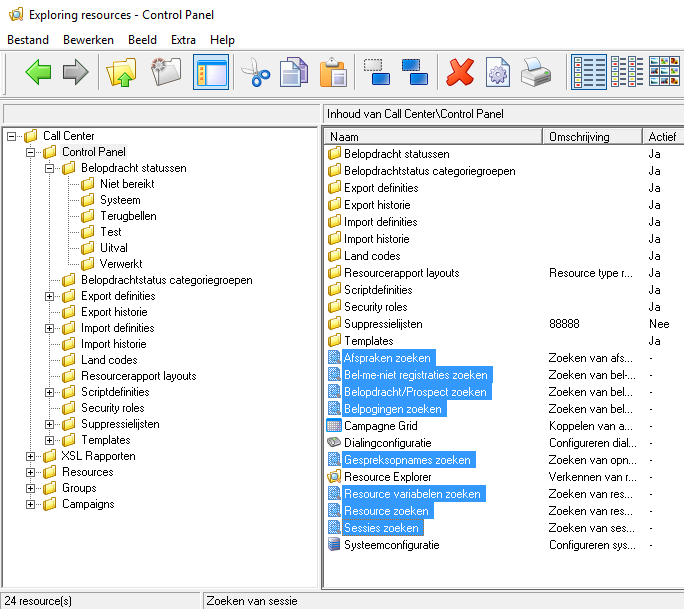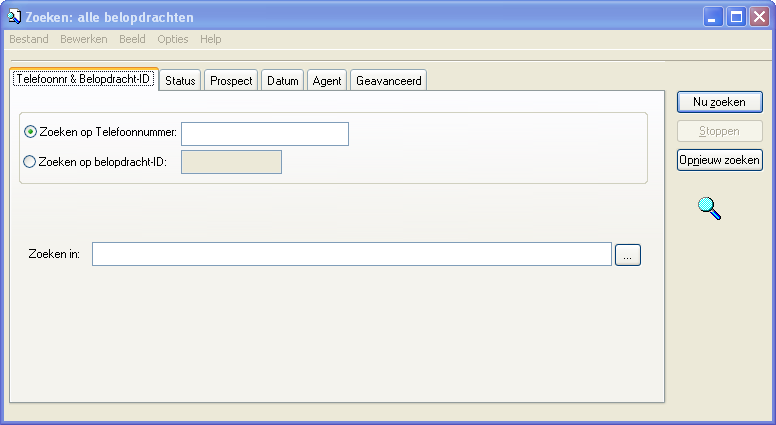
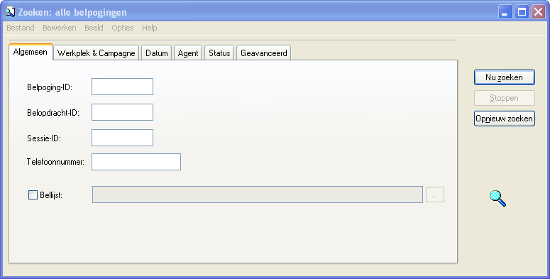
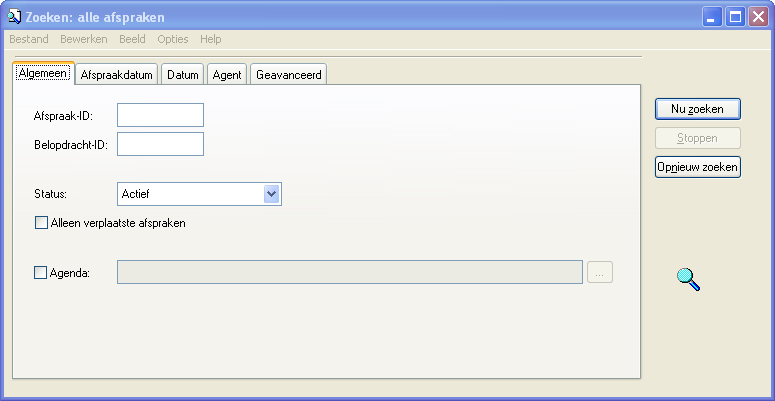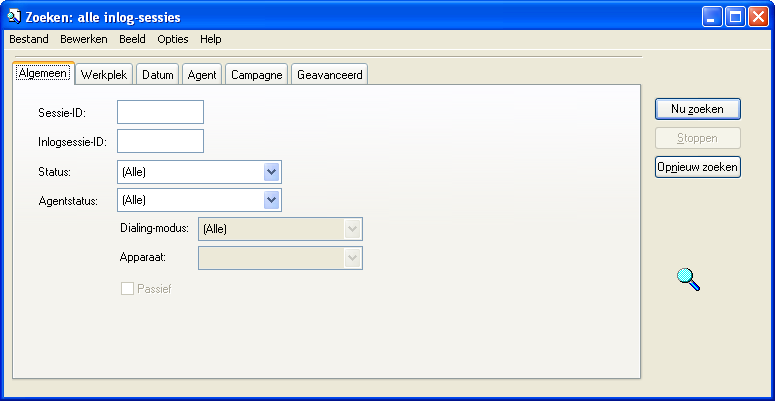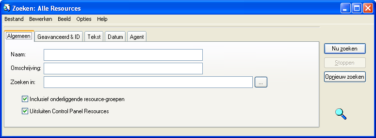

### Campagne grid

Ook het Campagne Grid is een handige tool om agents snel op andere
campagnes in te delen, of om overzicht te houden over de campagnes en
agents die hieraan zijn toegekend.

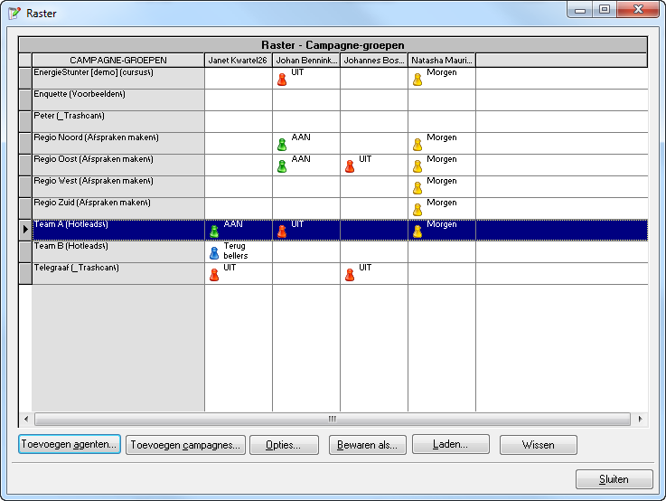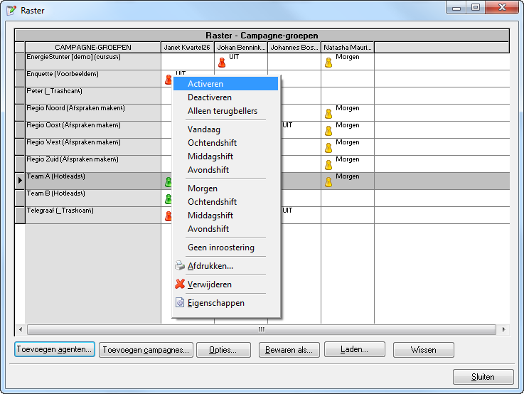

Via het context-menu kunnen speciale acties worden ingesteld zoals
“alleen terugbellers” of “morgen”. Via dubbelklikken kan snel een
Agent aan of uit worden gezet voor een specifieke campagne.

De speciale opties Vandaag en Morgen stellen de campagne koppeling zo in
dat de Agent alleen vandaag, of morgen actief is voor de betreffende
campagne. Ook kunnen alle koppeling voor 1 campagne, of alle koppeling
van 1 agent in een keer worden ingesteld. Activeer hiervoor het
context-menu op resp. de campagne of de agent naam.

Meerder campagne grid instellingen kunnen als template worden bewaarde.
Bijvoorbeeld om meerdere teams overzichtelijk in hun eigen overzicht te
gebruiken.

## Systeemconfiguratie

#### Algemeen

Hier kunnen enkele losse instellingen worden gedaan zoals het
verversingsinterval voor de Quota. Deze staat standaard op 2 minuten.
Door dit op een langer interval te zetten worden de quota’s minder vaak
herberekend, dit ontlast de SQL server. Het nadeel hiervan is dat de
quota’s meer over de grens heen gaan omdat de controle minder vaak wordt
gedaan.

Standaard geeft CallPro voorrang aan terugbelopdrachten over alle
campagnes waar een Agent op belt. Dus zelfs al een campagne met een
lagere prioriteit (hogere prioriteit waarde) is gekoppeld zal een
terugbeller in die campagne toch voorrang krijgen. Als dit niet gewenst
is, maar puur op Prioriteitsvolgorde gestuurd moet worden dan dient het
vinkje bij deze instelling uitgeschakeld te worden.

De passieve tijdregistratie instelling bepaald of CallPro indien een
Agent enige tijd (instelbaar) niets doet met zijn muis of toetsenbord
een passief sessie record start. CallPro werkt met pauze en aangemelde
sessie records die kunnen worden gebruikt voor een eenvoudige inlog-
uitlog tijdsregistratie. Om misbruik van de wrapup fase te voorkomen kan
deze instelling worden geactiveerd. CallPro markeert de tijd dat een
Agent niets doet dan als “Passief” die apart in de sessie rapportage
zichtbaar wordt.

CallPro is een Nederlands programma en de taal staat dan ook standaard
in het Nederlands. Overschakelen op Engels is ook mogelijk, maar de
derde taal (Frans) is niet vertaald.

Met de instelling serverbelasting kan de impact van een import op de SQL
Server worden beperkt. Zeker als er meer dan 20 Agenten zijn ingelogd is
het verstandig om deze instelling te verlagen. Standaard staat deze op
100%, de maximale importsnelheid. Een lagere waarde resulteert in een
iets lagere importsnelheid. Maar de lopende campagnes hebben er minder
last van.

Wij raden aan om deze instelling voor call center met 20 simultane
gebruikers op 60% te zetten en bij meer dan 60 ingelogde agenten op 20%
als tijdens het bellen ook een import wordt uitgevoerd.

#### Script-omgeving

Deze instelling bepaald de standaard pagina’s voor Pauze en inbound. Op
werkplek (Seat) niveau kunnen deze pagina’s anders worden ingesteld.


#### TODO: Diagnose 

#### Bestandslokaties

CallPro plaatst logbestanden in de Windows folder voor tijdelijke
bestanden (zie variabele TEMP). Dit is meestal de folder
C:\\WINDOWS\\TEMP of de Temp folder in de gebruikers profiel folder
c:\\documents and settings\\\<gebruiker\>\\temp.

Door hier een netwerkfolder te gebruiken worden alle logbestanden van
CallPro en alle error informatie bestanden naar die centrale plaats
geschreven. Zorg ervoor dat alle ingelogde gebruikers schrijfrechten
hebben op deze folder anders kunnen de logbestanden niet worden
aangemaakt.

#### Systeem scriptvelden

CallPro heeft weinig kennis van de velden die in bellijsten worden
gebruikt. Om toch bij bijvoorbeeld het zoeken een optie te kunnen geven
om op “Achternaam” te zoeken zijn een aantal systeemvelden aanwezig.
Extra velden kunnen worden toegevoegd die als “Zoekveld” zijn gemarkeerd
en door CallPro dan bij de optie “Zoeken belopdrachten” worden gebruikt.
Als een veld in de bellijst niet aanwezig is wordt het zoekveld grijs.

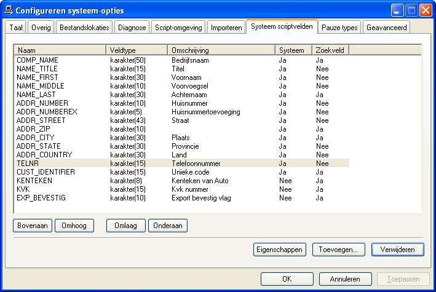
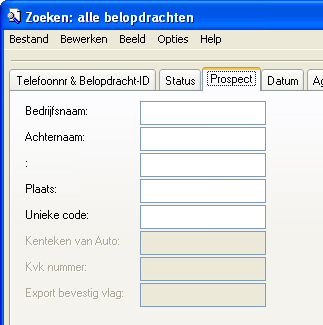

#### Pauze types

CallPro houdt de pauzetijd van Agenten bij. Telkens als wordt ingelogd
komt de Agent in pauze. Ook tijdens het bellen kan de Agent aangeven na
het huidige gesprek naar pauze te willen gaan. Met Pauze types kunnen
verschillende soorten pauze worden vastgelegd. Pauze types kunnen worden
gekoppeld aan een campagne zodat ook de pauzetijd aan een campagne kan
worden gerelateerd in (maatwerk) rapportages.


Alleen het Pauze type “Pauze” is standaard aanwezig. De keuze optie is
ook alleen zichtbaar als het vinkje bij “Gebruiker kan de volgende
(actieve) pauze types kiezen” is gezet.

Ook wordt hier ingesteld in welk pauze type CallPro begint na het
inloggen, en na het expliciet afmelden van de Agent en na het geforceerd
afmelden door CallPro.

#### Geavanceerd

Dit is een verzameling van specifieke instellingen die hier verder niet
worden behandeld. Pas deze instellingen alleen aan indien hier expliciet
door Calway om wordt gevraagd.

## Resources

De centrale plaats waar agents, call-lists (bellijsten) en Calendars
(agenda’s) worden aangemaakt en beheerd. Voor het overzicht kunnen
sub-folders worden gemaakt om agenten te groeperen per team of
vestiging, bellijsten te groeperen per opdrachtgever of campagne en
Agenda’s per opdrachtgever of regio. De indeling kan volledig op de
eigen werkwijze worden afgestemd.

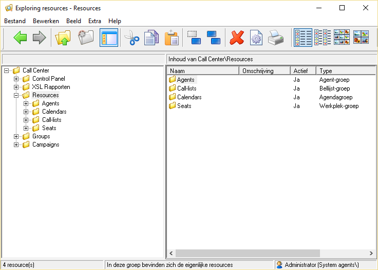

Elke resource heeft een unieke code (ID) die op het eigenschappen scherm
wordt weergegeven. Daarnaast heeft een resource een Naam, een
omschrijving en een type. Ven een resource is te zien wie deze heeft
aangemaakt, en wanneer en door wie deze voor het laatst is gewijzigd.
Een resource kan actief zijn, of inactief waarmee het gebruik ervan kan
worden uitgesloten.

Afhankelijk van het type resource zijn er extra eigenschappen die kunnen
worden vastgelegd.

### Agent

Een Agent resource representeert een gebruiker, of account. Dit kan een
beller (telemarketeer) zijn, of een supervisor, een buitendienst
medewerker, of zelfs een externe klant. Bijna alle activiteiten worden
gekoppeld aan de gebruiker die deze activiteit uitvoert.

Een Agent heeft ook een account en password om mee in te loggen in de
diverse onderdelen van CallPro. Op basis van het account en de daaraan
gekoppeld Rollen wordt bepaald welke onderdelen van CallPro beschikbaar
zijn voor deze gebruiker. Voor een beller kan worden vastgelegd of de
gesprekken die hij/zij doet via de scriptmodule worden opgenomen of niet
(dit werkt alleen als de benodigde telefonie hardware aanwezig is en
geconfigureerd). Daarnaast kan van de Agent nog enige persoonlijke
gegevens worden vastgelegd:

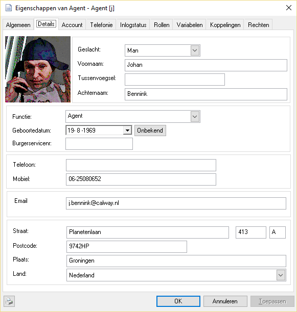 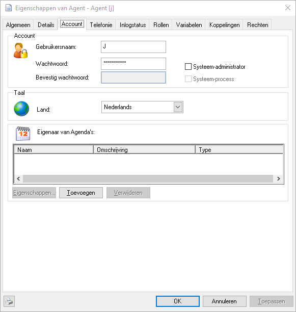

Deze gegevens worden grotendeels in CallPro verder niet gebruikt en zijn
puur voor de administratieve vastlegging. Andere gegevens zijn alleen
voor bepaalde gebruikers van belang. Voor een buitendienst medewerker
die via CallPro Portal kan inloggen is de “Eigenaar van Agenda’s”
koppeling essentieel om zijn agenda te kunnen bekijken.

### Call-list

Een bellijst is een resource waar een lijst met belopdrachten aan is
gekoppeld. Ook belpogingen zijn gekoppeld aan de bellijst. Een bellijst
wordt gemaakt op basis van een scriptdefinitie en wordt gevuld door
bestanden te importeren met een importdefinitie. Bij het aanmaken van de
bellijst kan worden vastgelegd of de belopdrachten tijdens de import
moeten worden ontdubbeld op ene bepaald veld, of veldcombinatie.

De bellijst heeft diverse extra instellingen zoals de koppeling van
terugbelopdrachten aan de agenten, belpoging begrenzing instellingen en
actieve prioritietscategorieën. Deze instellingen worden deels via de
scriptdefinitie overgenomen, en deels ingesteld tijdens het aanmaken van
de bellijst. Veel van deze instellingen kunnen ook achteraf worden
gewijzigd, maar van sommige kan dat niet. Later in dit handboek gaan we
dieper in op deze instellingen.

 
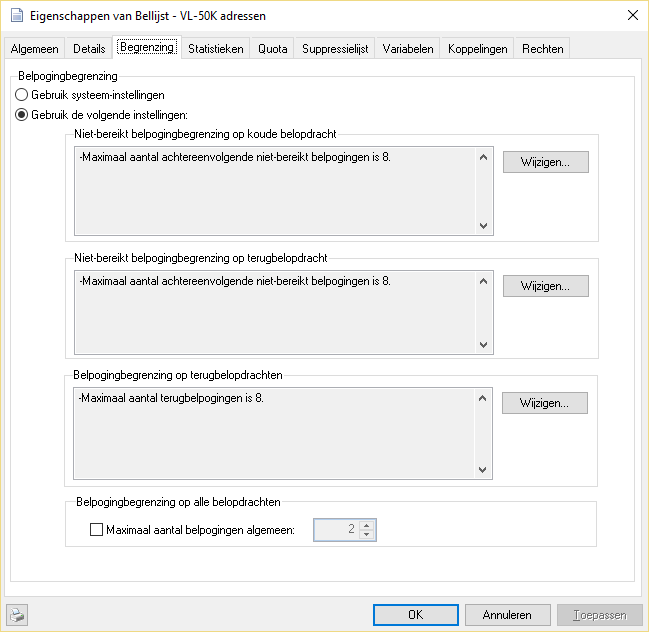

Van elke bellijst is te zien hoeveel adressen deze bevat en welke
belopdrachtstatus deze belopdrachten op dit moment hebben. Ook wordt
hier onderscheid gemaakt tussen actieve en inactief belopdrachten.
Inactieve belopdrachten staan wel in de bellijst, maar worden door
CallPro niet aangeboden voor outbound bellen.

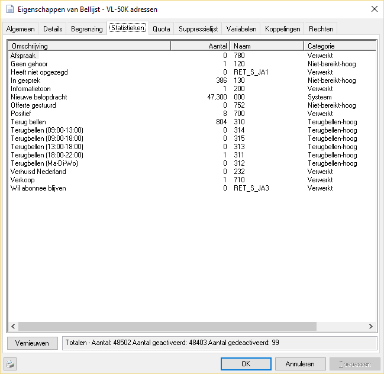 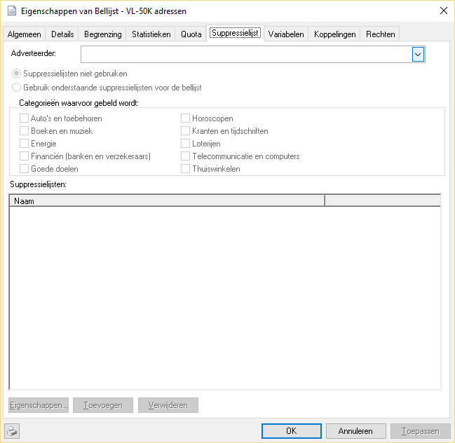

Bij de bellijst worden ook de suppressielijst instellingen bewaard die
worden gebruikt voor bel-me-niet.

### Calendar

De Calendar resource wordt gebruikt voor het inplannen van
bezoekafspraken voor een adviseur of buitendienst medewerker. Voor de
weergave van de agenda kunnen enkele instellingen worden gedaan w.o.
kleurinstellingen. Ook instellingen over het gebruikt zoals de
inboekperiode in de toekomst, en de afspraakduur en reistijdberekening
zijn hier te vinden.

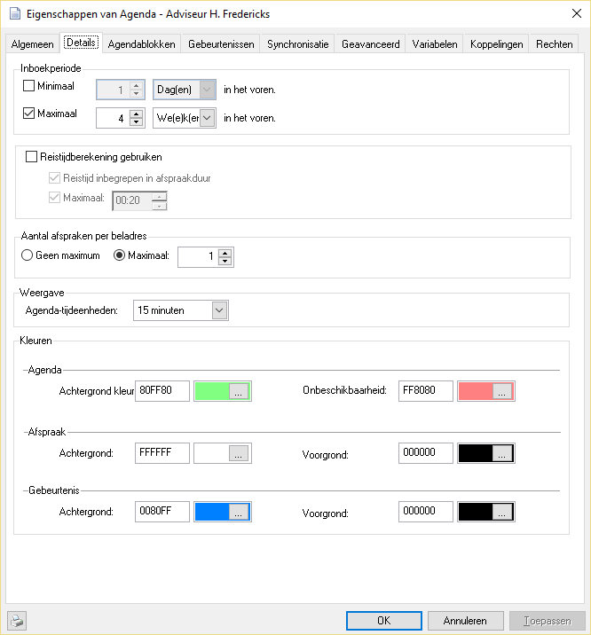 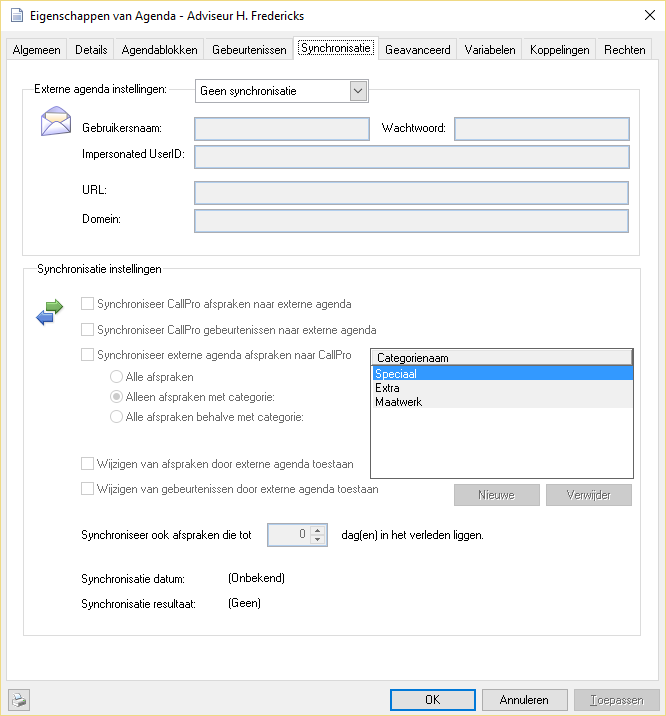

Voor het inplannen van afspraken zijn in de Agenda “agendablokken”
vastgelegd. Afspraken kunnen alleen worden ingepland op de tijden van
deze agendablokken.

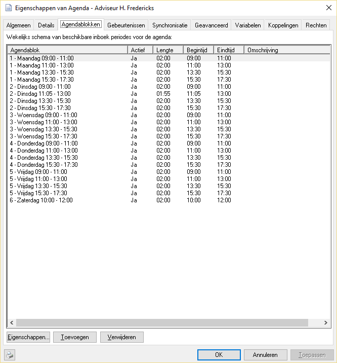 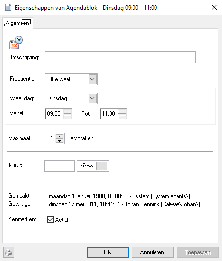

Ook voor algemene gebeurtenissen is een voorziening. Hiermee kunnen
vaste rayon meetings, vakantie of andere afspraken worden vastgelegd
zodat op deze tijdstippen geen afspraken worden ingepland.

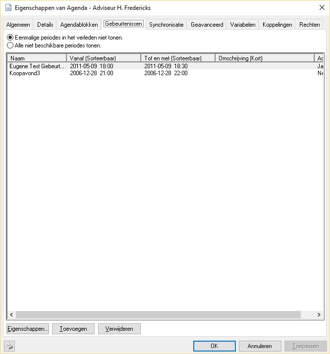 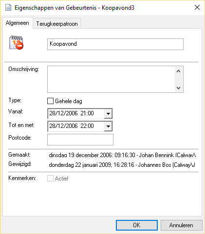

### Seat

De Seats (werkplek) wordt hoofdzakelijk gebruikt voor telefonie
instellingen. Door de werkplek op inactief te zetten kan worden
voorkomen dat iemand inlogt met de script module om te gaan bellen. Dit
kan bijvoorbeeld worden gebruikt voor stille hoekjes in het callcenter
die niet altijd beschikbaar moeten zijn.

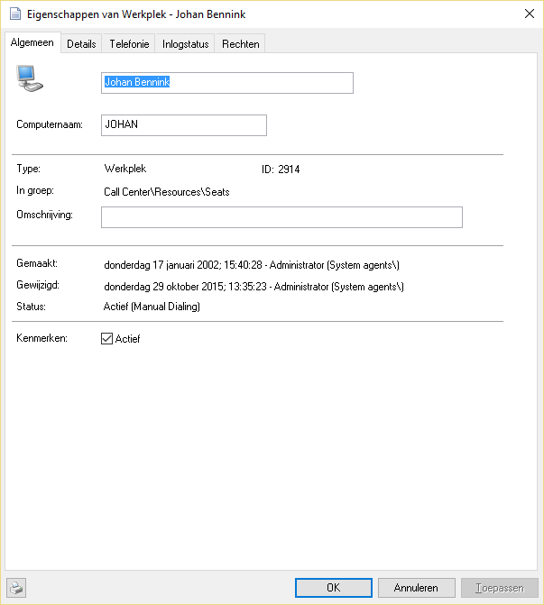 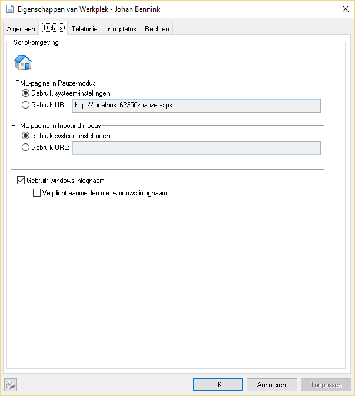
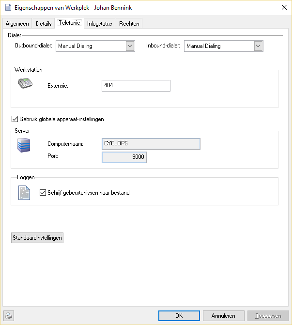 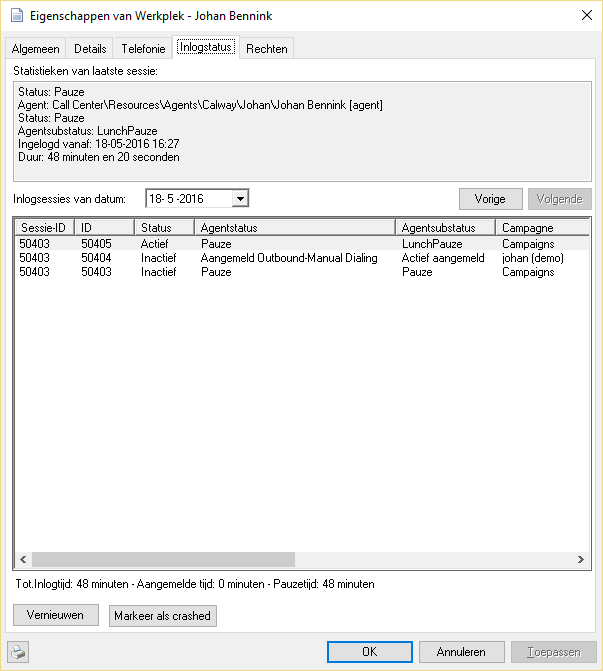

## TODO: Groups

TODO:

## Campaigns

Ook de campagnes hebben hun eigen plaats en ook hier geldt dat de
indeling volledig kan worden afgestemd op de werkwijze van het call
center, of de opdrachtgevers.

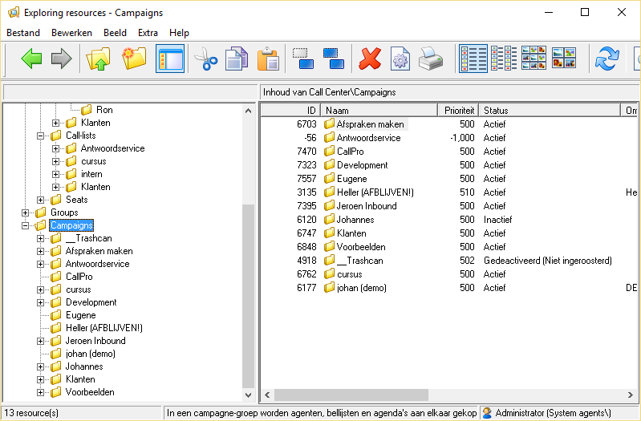

Campagnes worden gemaakt onder de “Campaigns” folder. Alleen actieve
campagnes worden door CallPro gebruikt. Ook de prioriteit van een
campagne kan hier worden ingesteld.

Op de campagne worden de telefonie (dialer) instellingen gedaan op het
dialer tabblad. Voor outbound wordt de dialing mode gekozen en bij
inbound kan een wachtrij worden gekozen. Ook wordt hier aangegeven of
gespreksopnames moeten worden gemaakt.

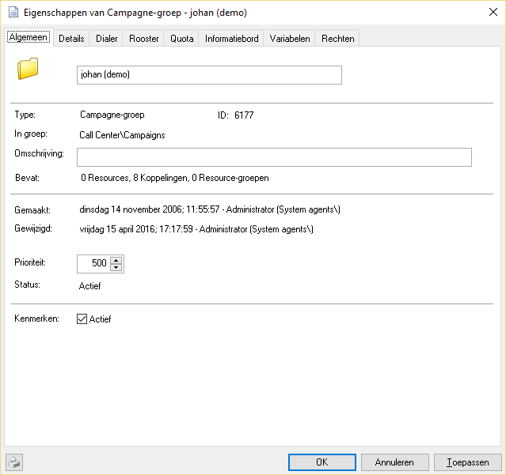
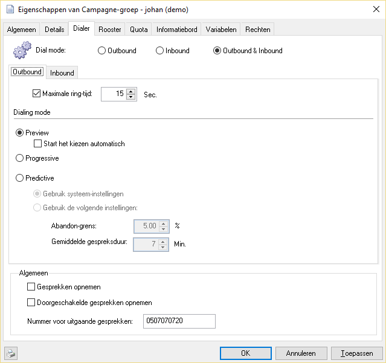

## Snelkoppelingen

Nu we hebben gekeken naar resources en de campagne folder is het
belangrijk om duidelijk te maken dat resources worden gekoppeld in de
campagne folder via een “koppeling”. Dit verschil is belangrijk en is
ook zichtbaar in de Resource Explorer. Dit zijn koppelingen:


En dit zijn (agent) resources:


Bij een koppeling opent via right-click “Eigenschappen” het
eigenschappen venster van de koppeling. Om de Resource eigenschappen te
openen van een koppeling moet in het right-click menu worden gekozen
voor de optie “Eigenschappen \<resource type\>”. Als een koppeling wordt
weggegooid blijft de onderliggende resource bestaan en wordt alleen de
koppeling verwijderd in de betreffende folder. Als de onderliggende
resource wordt weggegooid dan worden ook alle koppelingen naar deze
resource weggegooid\! Afhankelijk van het resource type wordt ook alle
bijbehorende informatie verwijderd.

# TODO: Scriptmodule

TODO

## TODO: Agenda module

TODO

# CallProPortal

Zie de CallproPortal handleiding.

# Belangrijke conventies in CallPro

## Hoe biedt CallPro een belopdracht aan

CallPro doorloopt meerdere fasen bij het ophalen van een nieuwe
belopdracht. Deze stappen beschrijven het gedrag zoals dit standaard
ingesteld staat. Diverse instellingen kunnen deze volgorde beïnvloeden.

1.  Kijk over alle gekoppelde campagnes en actieve bellijsten in deze
    campagnes naar belopdrachten in de terugbellen categorie
    (terugbellen hoog) die moeten worden aangeboden. Biedt de eerste
    belopdracht aan die op basis van prioriteit binnen de terugbellen
    categorie, en terugbeltijd moet worden gebeld.

2.  Kijk over alle gekoppelde campagnes en actieve bellijsten in deze
    campagnes naar belopdrachten in de terugbellen categorie
    (terugbellen laag) die moeten worden aangeboden. Biedt de eerste
    belopdracht aan die op basis van prioriteit binnen de terugbellen
    categorie, en terugbeltijd moet worden gebeld.

3.  Kijk over gekoppelde campagnes en actieve bellijsten in deze
    campagnes op volgorde van campagne prioriteit en daarbinnen bellijst
    prioriteit naar de belopdrachten in de resterende categorieën (niet
    bereikt hoog, systeem en niet bereikt laag). Biedt de eerste
    belopdracht aan die op basis van de prioriteit binnen deze
    categorieën, en terugbeltijd moet worden gebeld.

# Campagnebeheer voor supervisors

Een campagne bestaat uit de samenvoeging van resources van het type
agent, bellijst en agenda. Door deze resources samen te brengen in een
campagne folder ontstaat een campagne.

De bellijsten in de campagne bepalen op welke belopdrachten wordt
gebeld. De agenten bepalen wie de belopdrachten uit de gekoppelde
bellijsten belt. Agenda’s bepalen in welke agenda’s afspraken worden
gemaakt voor de belopdrachten.

# Een campagne inrichten in CallPro

De Supervisor beheert de campagnes en deelt Agents in op de
verschillende actieve campagnes. Een campagne bestaat uit een aantal
onderdelen, maar begint met het de campagne folder.

Campagnes kunnen op verschillende manieren zijn ingedeeld. Een campagne
kan bestaan uit 1 campagne folder, bijvoorbeeld voor het nabellen van
een mailing, of uit meerdere sub-campagnes, bijvoorbeeld voor het maken
van afspraken voor meerdere adviseurs of regio’s.

Campagnes worden gemaakt in de “Campaigns” folder met de Resource
Explorer. Ga naar de folder waar de campagne moet worden gemaakt,
right-click en kies “Nieuw\\Campagne-groep...

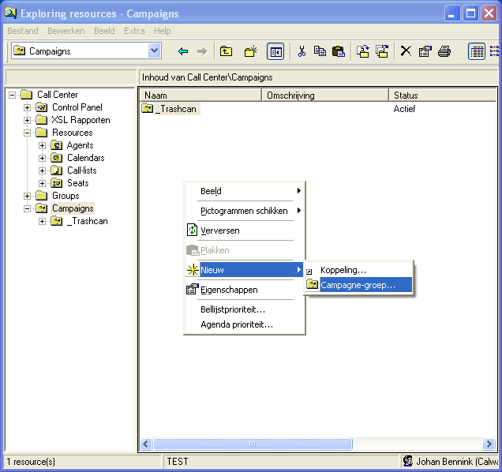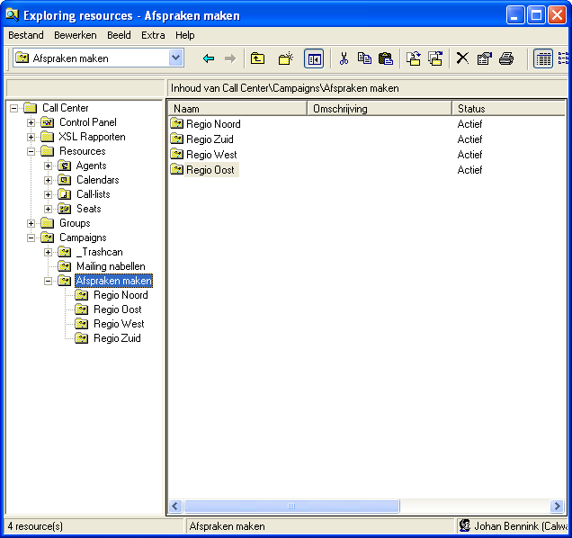

In de campagne folder worden de resources geplaatst die nodig zijn. Dit
kunnen Agent, Call-list en Calendar resources zijn. Deze resources
worden uit de folders binnen de “Resources” folder gehaald. Ga hiervoor
naar de betreffende folder, selecteer de resource(s), bijvoorbeeld de
Agents en sleep ze naar de campagne folder. Het is ook mogelijk om
resources via het clipboard te kopiëren en plakken.

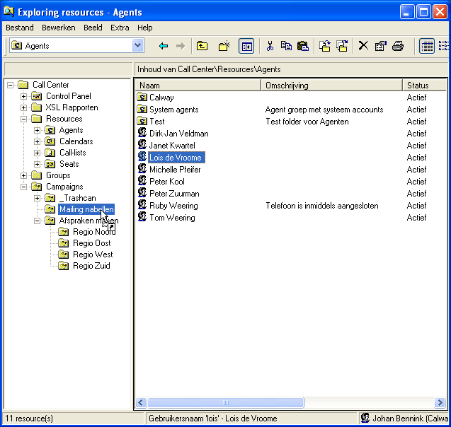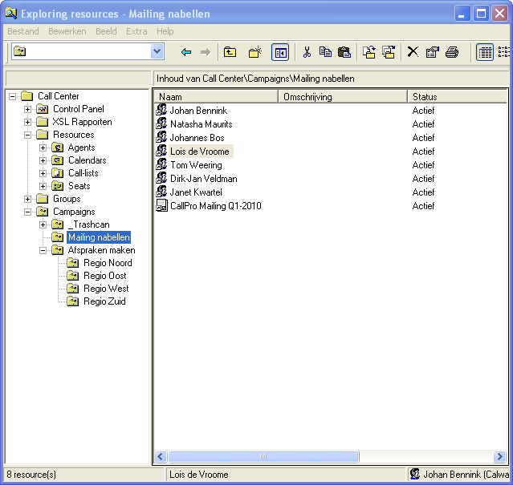

Een Agent krijgt alleen belopdrachten uit een campagne aangeboden als
hij/zij is gekoppeld in de campagne, en actief is. Binnen de campagne
worden alleen belopdrachten aangeboden uit een bellijst als de
betreffende bellijst in de campagne folder staat en actief is.

# Meer over campagnes en campagne instellingen

In de basis is een campagne niets meer dan een folder met daarin de
bellijst(en), Agent(en) en agenda’s. In de praktijk wordt echter vaak
meer gevraagd van een campagne. Welke mogelijkheden biedt CallPro voor
die situaties

## Actieve resources in de campagne

Alleen resources die in de campagne folder staan worden gebruikt voor de
campagne. Door een agent uit de campagne folder te halen worden geen
belopdrachten van deze campagne meer aangeboden bij de betreffende
agent. Het zelfde geldt voor bellijsten en agenda’s. Als het om een
tijdelijke actie gaat kan ook de betreffende resource op inactief worden
gezet. Zo blijft de resource visueel gekoppeld, maar zal CallPro deze
toch niet gebruiken voor de campagne. Zeker als filters, en ander
instellingen zijn gedaan op de koppeling is het deactiveren eenvoudiger
omdat bij het verwijderen ook alle instellingen verloren gaan.

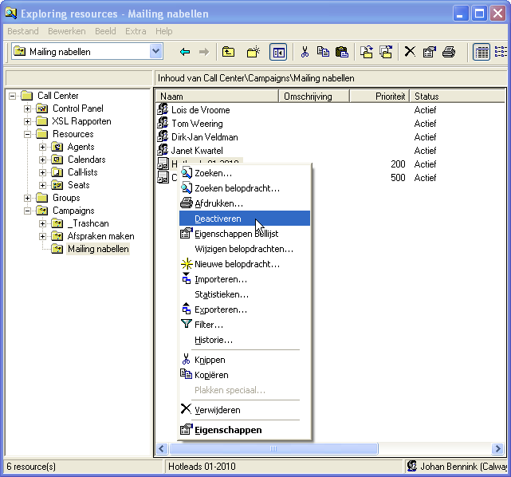 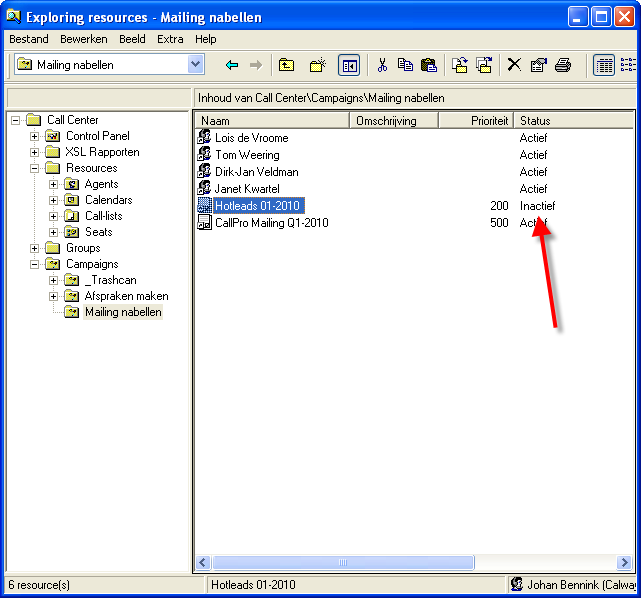

## Agenten op meerdere campagnes indelen

Het is vaak genoeg om een agent op 1 campagne in te delen. Toch zijn er
genoeg situaties waar dit niet voldoende is. CallPro biedt dan ook de
mogelijkheid om een agent in meerdere campagnes tegelijkertijd te
koppelen. Voor het bellen bepaald CallPro telkens uit welke campagne, en
bellijst de belopdracht die gebeld moet worden moet komen. Het aanbieden
gebeurd uniform random over de bellijsten uit alle campagnes waar de
agent is gekoppeld. Belopdrachten worden op prioriteit volgorde
aangeboden zodra ze weer gebeld mogen worden.

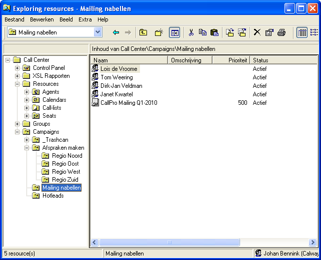 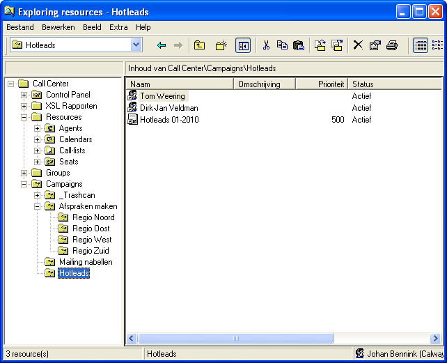

In de bellijsten uit de bovenstaande campagnes staan een aantal
belopdrachten klaar zoals in deze tabel aangegeven.

| Bellijst Hotleads 01-2010 | Bellijst CallPro Mailing Q1-2010 |                           |          |        |                    |          |          |
| ------------------------- | -------------------------------- | ------------------------- | -------- | ------ | ------------------ | -------- | -------- |
| ID                        | **Status**                       | **Tijd**                  | **Prio** | **ID** | **Status**         | **Tijd** | **Prio** |
| A1                        | Terugbellen                      | om 11:00                  | 25       | **B1** | Terugbellen        | om 10:05 | 25       |
| A2                        | Geen gehoor                      | opnieuw proberen om 10:00 | 76       | **B2** | Nieuwe belopdracht |          | 150      |
| A3                        | Nieuwe belopdracht               |                           | 150      | **B3** | Nieuwe belopdracht |          | 150      |

Agent Tom die is ingelogd op beide campagnes zal om 10:05 de belopdracht
B1 aangeboden krijgen. Dit is van de belbare adressen de belopdracht met
de hoogste prioriteit, en eerste terugbeltijd. Als hij om 10:15 klaar is
voor zijn volgende gesprek krijgt hij belopdracht A2. Als het dan nog
geen 11:00 is zal hij daarna een van de nieuwe belopdrachten krijgen.

Als Tom met zijn eerste gesprek tot na 11:00 bezig zou zijn geweest dan
was niet belopdracht A2 de volgende belopdracht geweest, maar
belopdracht A1 omdat deze belopdracht een hogere prioriteit heeft.
Daarna volgt dan A2 en dan een van de nieuwe belopdrachten.

CallPro kijkt altijd naar de tijd waarop een belopdracht mag worden
aangeboden, die moet in het verleden liggen, en dan wordt het eerst de
oudste belopdracht met de hoogste prioriteit aangeboden.

## Bellijsten in meerdere campagnes gebruiken

Niet alleen agents kunnen in meerdere campagnes tegelijkertijd worden
gezet, ook bellijsten kunnen in meerdere campagnes worden gezet. CallPro
biedt dezelfde belopdracht slechts 1 keer aan, dus een belopdracht die
is afgehandeld in campagne “Team A” is ook voor campagne “Team B”
afgehandeld. In de rapportage is wel te zien dat de belopdracht in
campagne “Team A” is afgehandeld en niet in campagne “Team B”. Op deze
manier kan heel gemakkelijk worden gewerkt met teams. Door ieder team
zijn eigen sub-campagne folder te geven is in de score te verdelen over
de teams.

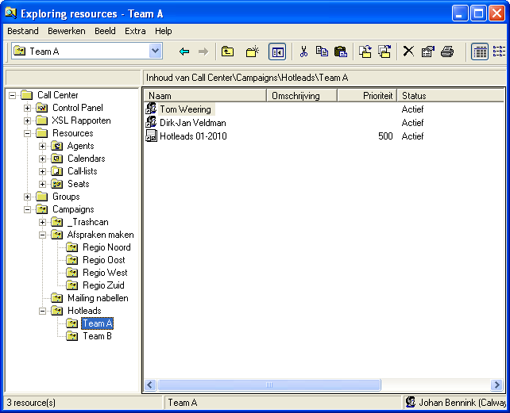 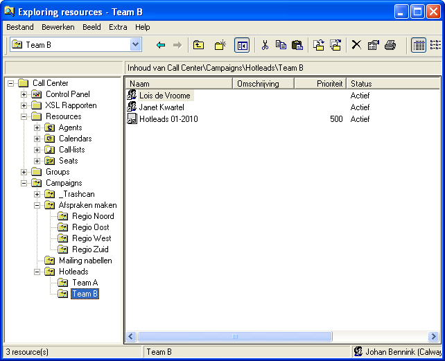

## Filters op bellijsten in de campagne

Door filters te zetten op de bellijst die in een campagne is geplaatst
kan een restrictie worden gezet op de belopdrachten die binnen deze
campagne uit de bellijst worden aangeboden. Het filter kan gebruik maken
van alle systeemvelden, en alle scriptvelden in de bellijst.

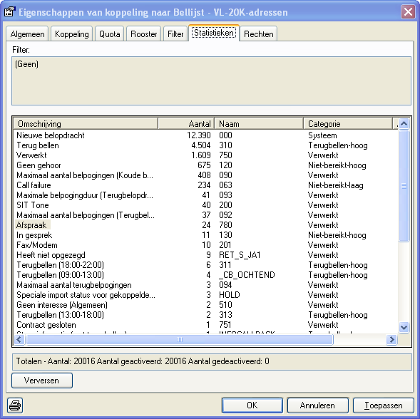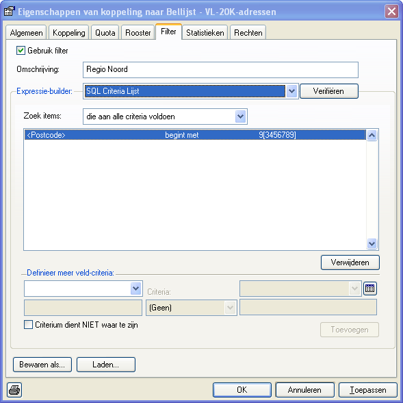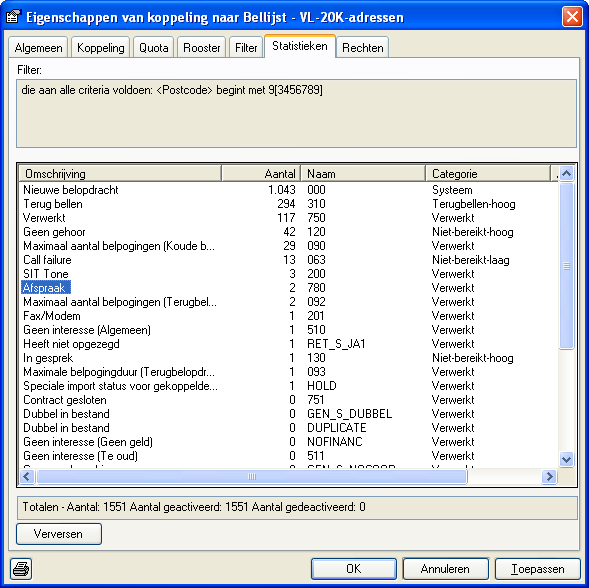Een
filter kan zo worden gebruikt om alleen belopdrachten aan te bieden uit
een bepaalde postcode, met een bepaald geslacht, of elk ander kenmerk
dat in een scriptveld is vastgelegd.

De meest voorkomende toepassing is het verdelen van de belopdrachten op
basis van regio, of gespreksfase. Door een filter op postcode te
plaatsen, of een adviseur/regio kenmerk, is deze regio indeling
eenvoudig te realiseren.

Ook als een gesprek na het eerste contact een andere fase in gaat en
door andere agents moet worden opgevolgd biedt een filter uitkomst.
Dezelfde bellijst wordt gebruikt in meerdere sub-campagnes waarbij een
filter wordt gezet op een scriptveld “BELFASE” dat wordt veranderd al
naar gelang de voortgang van het gesprek.

## Prioriteiten op bellijsten in de campagne

Als binnen een campagne meerdere bellijsten worden gebruikt kan de
volgorde van aanbieden worden bestuurd door de prioriteit van de
bellijst in de campagne aan te passen. Standaard staan de prioriteiten
van koppelingen in campagnes op 500. Door een bellijst (Hotleads
01-2010) op prioriteit 200 te zetten en een tweede bellijst (CallPro
Mailing Q1-2010) op prioriteit 500 zal CallPro binnen de campagne altijd
de voorkeur geven aan bellijst “Hotleads 01-2010” voor Niet bereikt en
nieuwe belopdrachten. Voor de belopdrachten met een status in de
terugbellen categorie blijft de prioriteit van de belopdracht bepalend
ongeacht de prioriteit van de bellijsten.


# Een nieuwe campagne maken

Voor een nieuwe opdracht moet een campagne worden ingericht. De
opdrachtgever heeft een bestand aangeleverd en een briefing document met
daarin de propositie, een callflow, tegenargumenten voor de bezwaren van
de prospect, informatie over de aangeleverde adressen en informatie over
de terug levering van de belresultaten.

De stappen die moeten worden doorlopen kunnen in de praktijk variëren
afhankelijk van of er al eerder voor de klant gebeld is, of dat de
campagne sterke overeenkomsten vertoond met ander campagnes die al zijn
gemaakt. Globaal worden deze stappen doorlopen.

### Maak het belscript

Op basis van het briefing document en de callflow beschrijving kan
worden gestart met het maken van de verschillende html pagina’s van de
callflow. In veel gevallen kan hiervoor gebruik worden gemaakt van
eerder gemaakte belscripts. Hergebruik van belscript onderdelen biedt
ook een meer uniforme look-and-feel voor de verschillende campagnes.
Uitleg over het maken van html pagina’s valt buiten de scope van dit
hoofdstuk.

### Maak de scriptdefinitie

Als het belscript vordert kan worden gestart met het maken van de
scriptdefinitie. Neem alle velden die in het belscript worden gebruikt,
en/of die zullen worden ingelezen uit het importbestand op in de
scriptdefinitie. Kies de benodigde belopdrachtstatussen uit de lijst.

### Test de nieuwe scriptdefinitie

Maak met de scriptdefinitie een test bellijst. Om duidelijk te maken dat
dit een test bellijst is kan het woord “\_test” achter de naam van de
bellijst worden toegevoegd. Voeg daarna een aantal belopdrachten toe aan
de bellijst via right-click “Nieuwe belopdracht...”.

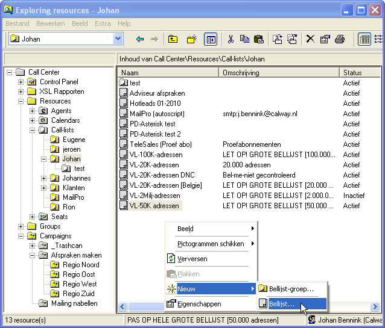 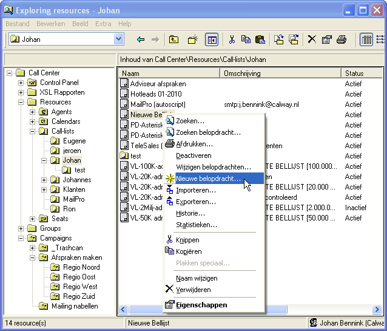

Meestal is het voldoende om alleen het telefoonnummer in te vullen, maar
afhankelijk van het belscript kan het nodig zijn om speciale
scriptvelden ook te voorzien van een geldige waarde. Vul dan via het
scriptvelden tabblad ook deze velden.

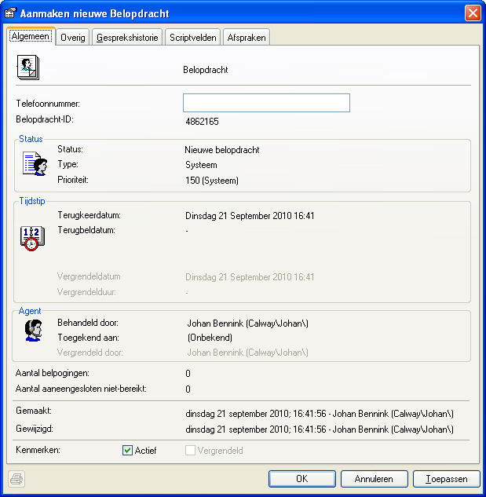 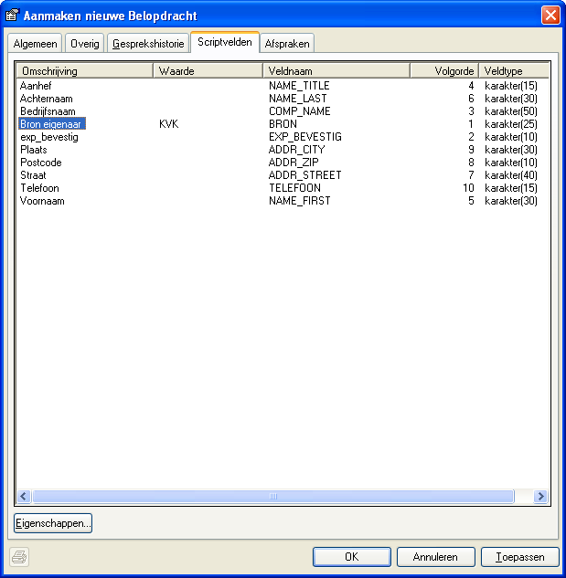

Met deze belopdrachten kan de werking van het belscript goed getest
worden.

### Maak de nieuwe campagne

Maak nu de campagne folder zoals eerder uitgelegd bij \<REF\>. Plaats
vervolgens eerst alleen de test bellijst in de campagne en koppel een
test gebruiker, of de eigen supervisor account. Start de script module
en login op de nieuwe campagne. Met de eerder aangemaakte belopdrachten
kan de callflow nu worden getest. Eventuele problemen kunnen in het
belscript worden opgelost. Probeer alle callflow paden in het belscript
en test in ieder geval de belangrijkste belopdrachtstatussen minimaal 1
keer.

### Maak een exportdefinitie

Afhankelijk van wat met de opdrachtgever is afgesproken moet een
exportdefinitie worden gemaakt. Afhankelijk van de werkwijze kan een
template exportdefinitie worden gekopieerd om hier vervolgens de extra
velde aan toe te voegen, of kan een nieuwe exportdefinitie worden
gemaakt.

 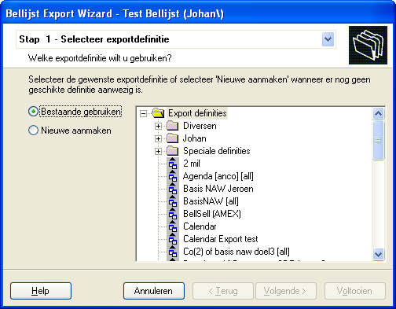

Neem in ieder geval alle aangeleverde scriptvelden, en voeg de extra
verrijkingsvelden ook toe. Soms bevat het belscript ook enkele
scriptvelden die voor de callflow zijn toegevoegd, maar niet naar de
opdrachtgever terug geleverde hoeven te worden, neem deze dan ook niet
op in de exportdefinitie. Ook de systeemvelden van CallPro hoeven niet
allemaal te worden terug geleverd. Het belresultaat (sys\_callstatusname
of sys\_callstatuscode), de bellijstnaam (sys\_calllistname) en de
unieke interne code van CallPro (sys\_clentryid) zijn altijd handig om
op te nemen. Andere systeemvelden kunnen naar behoefte worden
toegevoegd.

Test nu met de test bellijst deze export definitie. Stuur het
exportbestand eventueel naar de opdrachtgever om te controleren of de
inhoud bruikbaar is.

### Maak de importdefinitie 

Gebruik het aangeleverde importbestand om een importdefinitie te maken
voor de nieuwe test bellijst.

 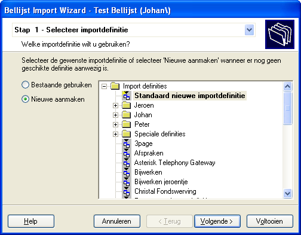

Het wordt een importdefinitie voor het toevoegen van belopdrachten. Kies
het bestandstype van het aangeleverde bestand, meestal CSV of MS Excel.
Wijs het aangeleverde bestand aan. Controleer voor de zekerheid of het
bestand goed kon worden ingelezen door op de knop “Voorbeeld” te
drukken. CallPro laat dan de eerste 100 regels uit het importbestand
zien.

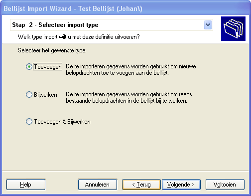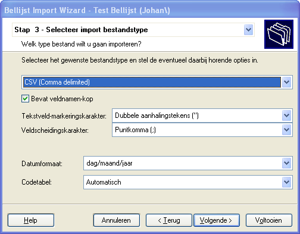
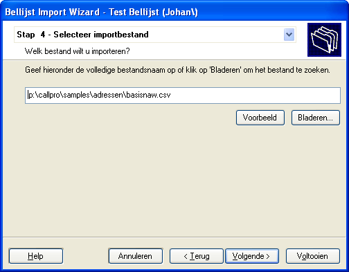 

Koppel nu een voor een de velden uit het importbestand aan de velden van
de bellijst. Door het vinkje bij “Imp” leeg te maken worden de
betreffende velden uit het importbestand niet geïmporteerd.

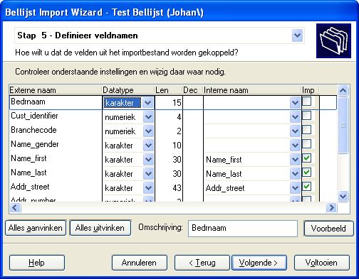 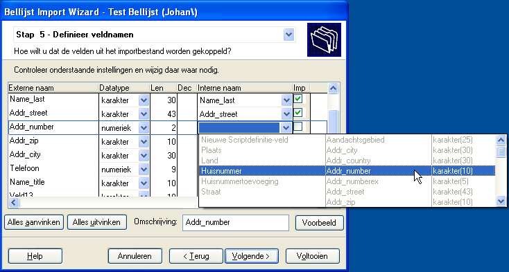

In sommige gevallen heeft CallPro standaard een verkeerde keuze gemaakt
voor het Datatype. Voor het Addr\_number veld in het bovenstaande
screenshot heeft CallPro gezien dat er alleen cijfers in het veld staan
en aangenomen dat het veld numeriek(2) moet zijn. De standaard velden
van CallPro gebruiken het karakter(10) type voor het huisnummer en het
veld kan dan ook niet gekoppeld worden (wordt grijs weergegeven). Nu
moet eerst het Datatype naar Karakter worden gezet voordat dit veld
gekoppeld kan worden.

 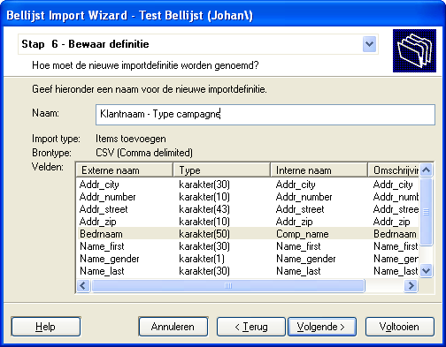

Als alle velden zijn gekoppeld kan de importdefinitie worden bewaard.
Het is goed om een duidelijke naamgevingstrategie te hanteren.

De import vervolgd, doorloop deze stappen ook en importeer het bestand
in de test bellijst ter controle.

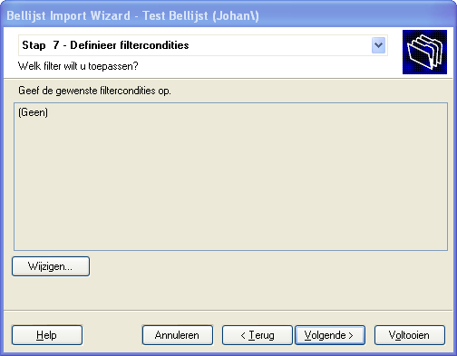 


Doorloop nu het belscript ter controle nog een keer met deze
belopdrachten om te controleren dat alles er goed uit ziet. Als hier
niets meer uit naar voren komt kan het importbestand worden gebruikt
voor de productie bellijst. Verwijder de test bellijst en markeer de
productie bellijst en de agents als actief. De campagne is nu klaar voor
gebruik.

# Importeren

Voor het importeren van adressen in een bellijst is een importbestand en
een importdefinitie nodig. Hoewel deze taak in een ideale wereld niet
veel hoeft voor te stellen is de praktijk vaak anders. De
importbestanden die worden aangeleverd zijn vaak niet direct bruikbaar.
Oorzaken hiervan kunnen zijn, naamgeving van de kolommen, missende
kolommen, gegevens die over meerder kolommen zijn verspreid, of juist
informatie die in 1 kolom zit in plaats van in meerdere. Zelfs als al
eerder een bestand is aangeleverd is dit geen garantie dat het nieuwe
bestand in hetzelfde formaat is. Een visuele inspectie van het
importbestand is dan ook belangrijk.

In dit hoofdstuk worden een aantal voorbeelden behandeld van
aanpassingen die in de importbestanden kunnen worden gedaan om het
importeren te vereenvoudigen. We gebruiken hiervoor een importbestand in
Excel formaat.

## Waarom importeert mijn bestand niet?

CallPro heeft een aantal voorwaarden waar rekening mee moet worden
gehouden om bestanden eenvoudig te importeren.

### Naamgeving kolommen

Elke kolom in het importbestand moet een naam hebben. Een lege naam mag
niet. Ook zijn bepaalde tekens niet toegestaan in de kolomnaam. Vermijd
het gebruik van de speciale tekens, behalve de underscore, die op een
toetsenbord zijn te vinden zoals \!@\#$%^&\*+=-\~\`:;”’\[\]}{\<\>,./?\\|
Het gebruik van spatie’s wordt afgeraden, maar CallPro zal deze
vervangen door een underscore (\_) teken.

Kolomnamen moeten uniek zijn. Het is niet toegestaan om een kolomnaam
twee keer te gebruiken voor verschillende kolommen. Ook mogen bepaalde
namen zoals “ID” of “CLENTRYID” niet gebruikt worden, dit zijn
gereserveerde namen.

### Telefoonummerkolom

Het telefoonnummer moet in 1 kolom staan. Sommige adres leveranciers, of
software werkt met aparte velden voor landcode, netnummer en
abonneenummer. Deze velden zullen eerst moeten worden samengevoegd, en
de resulterende kolom kan dan gebruikt worden in CallPro. CallPro
herkend de volgende waarden als geldige ‘Nederlandse’ telefoonnummers.

| Waarde          | Herkend als telefoonnummer |
| --------------- | -------------------------- |
| 0507070720      | Ja                         |
| 050-7070720     | Ja                         |
| 507070720       | Ja                         |
| \+31 0507070720 | Ja                         |
| 0031 0507070720 | Ja                         |
| \+31 507070720  | Ja                         |
| 0031 507070720  | Ja                         |
| 0507 07 0 72 0  | Ja                         |
| 50-70 70 720    | Ja                         |
| 31 507070720    | Nee                        |
| 00507070720     | Nee                        |

### Alle velden op 1 regel

CallPro importeert alle velden die op 1 regel staan in een belopdracht.
Het is niet geldig om de velden over meerdere regels onder elkaar in het
bestand als 1 belopdracht te zien.

## Excel voorbeelden

In de voorbeelden wordt gebruik gemaakt van een Engelse Excel. Bij de
Nederlandse versie van Excel zijn de functies ook in het Nederlands
omgezet, zo wordt LEFT dan LINKS en LEN wordt LENGTE. Sommige
Nederlandse namen zijn niet triviaal zoals MID wordt DEEL.STRING

### Telefoonnummer mist voorloop nul

Het kan gebeuren dat de kolom met het telefoonnummer in Excel wordt
weergegeven zonder voorloop nul. Hier hoeft niets aan te worden gedaan
omdat CallPro automatisch bij de telefoonnummer kolom als het veld 9
cijfers bevat en het eerste cijfer is geen nul de ontbrekende nul
toevoegt.


### Netnummer en abonneenummer in twee velden 

Voor CallPro is het belangrijk dat het telefoonnummer in zijn geheel in
1 veld/kolom staat, maar in twee velden met netnummer en abonneenummer
apart. Dit is in Excel eenvoudig op te lossen.

1.  Voeg een nieuwe kolom toe direct na de beide velden en geef deze de
    naam van de telefoonnummer kolom.

2.  Zet in de eerste lege cel de formule =K2\&L2 en kopieer de formule
    naar de overige cellen door het hele gebied M2 t/m M14 te selecteren
    en dan CTRL-D


Deze methode kan ook worden toegepast om een postcode waarbij de cijfers
en letter in twee aparte kolommen zijn aangeleverd samen te voegen.

### Postcode en Plaats in een veld

Sommige adressen leveranciers plaatsen de postcode en plaats in 1 kolom.
Als er verder niks met de gegevens gedaan hoeft te worden raden wij aan
om de waarde in het “addr\_city” veld te importeren. Is het echter de
bedoeling dat het adres wel kan worden aangepast, of moet het adres
gebruikt worde nicm de reistijdcontrole van CallPro dan dienen postcode
een plaats te worden gescheiden. Door het nette formaat van de
Nederlandse postcodes is dit niet erg ingewikkeld.


In dit voorbeeld staat geen spatie tussen de cijfers en letter van de
postcode dus kunnen we voor de postcode de linkse 6 tekens pakken. In
dit voorbeeld staan altijd 2 spaties tussen postcode en plaats dus
beginnen we vanaf positie 9 tot positie 99 (in ieder geval genoeg) voor
de plaats.

### Waarden in een kolom vervangen

Soms moeten warden in een kolom worden vervangen. Als voorbeeld een
geslacht kolom met “Man” en “Vrouw” in plaats van “M” en “V”. Selecteer
eerst de hele kolom door op de kolom kop te klikken (hier kolom A). Kies
nu CTRL+H (Replace...) en vul de zoeken en vervangen waarden in, kies
dan voor “Replace all”.

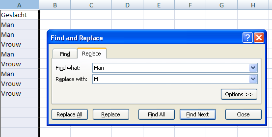

## Meldingen tijdens de import

### Importdefinitie hoort niet bij de bellijst

Als een importdefinitie wordt gekozen voor de import die niet bij de
bellijst hoort waar de import op moet worden gedaan volgt vaak een
melding als deze:


CallPro geeft aan dat er een verschil is tussen de velden die in de
importdefinitie worden benoemd en de velden die in de bellijst aanwezig
zijn. Kies een andere importdefinitie, maak een nieuwe importdefinitie
of pas de bestaande importdefinitie aan..

### Problemen met de lengte van velden of het datatype

Als in de importdefinitie de lengte van een veld langer is als de lengte
van hetzelfde veld in de bellijst zal CallPro deze melding geven.


Controleer nu of de lengte in de importdefinitie wel correct is. Is dit
zo, dan kan de importdefinitie niet worden gebruikt. De oorzaak zou ook
nog kunnen zijn dat de lengte die in de scriptdefinitie van de bellijst
is gekozen te klein was. Pas de importdefinitie aan, of pas de bellijst
(scriptdefinitie) aan.

Als het veld in de importdefinitie kleiner is als de lengte van het veld
in de bellijst levert dat geen probleem op. De melding wordt alleen
gegeven als doorgaan voor mogelijk verlies van informatie (veld inhoud)
zo zorgen bij de import.

### Ander veldscheidingsteken bij importeren csv bestanden

Bij het importeren van csv-bestanden waarbij in de importdefinitie is
aangegeven dat veldkoppen worden gebruikt en dat de velden zijn
gescheiden met het karakter comma (,) terwijl in het importbestand als
veldscheidingsteken een punt-comma (;) wordt gebruikt volgt meestal een
foutmelding. Afhankelijk van de aard van het probleem zal dit een van
deze meldingen zijn:


Een oplossing zou kunnen zijn om in de importdefinitie het
veldscheidingsteken aan te passen naar het teken dat in het
importbestand wordt gebruikt. Voordat het importbestand wordt gebruikt
is het altijd goed om het importbestand te openen om een visuele
inspectie te doen.

### Excel driver niet goed ingesteld

Callpro is een 32-bits Windows applicatie. Omdat Windows in 32-bits en
64-bits versies wordt geleverd en ook Office in 32-bits en 64-bits
versies kan het zijn dat de standard instellingen die Office tijdens de
installatie heft gedaan niet direct samenwerken met Callpro.

Voor de Excel koppeling wordt gebruik gemaakt van een Excel ODBC driver.
Office maakt er standaard een aan met naam “Excel Files” of ”Excel
bestanden” al naar gelang een Nederlandstalige of Engelstalige Office is
geïnstalleerd.

Open om de ODBC instellingen te controleren de ODBC Data Source
Administrator (ook deze naam in bij een Nederlandstalige Windows anders)
door het programma: c:\\windows\\system32\\odbcadm.exe te starten.

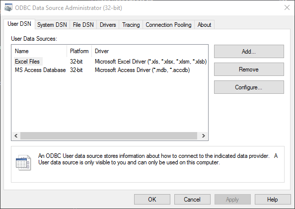

In dit geval is er een “Excel Files” Excel ODBC driver voor de 32-bits
versie, dat is goed. Omdat bij sommige bedrijven ook met verschillende
versies op verschillende computers gewerkt wordt raden wij aan om een
nieuwe ODBC koppeling te maken onder het System DSN tab met naam “Excel
CallPro”. Op die manier kan op alle computers dezelfde naam worden
gebruikt.

Ga hiervoor naar het System DSN tabblad en druk op “Add…”

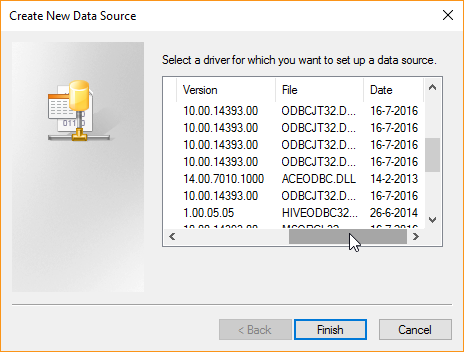

Kies hier vervolgens de “Microsoft Excel Driver” die ook de \*.xlsx
extensie weergeeft. In ons geval hebben we Office 2016 geïnstalleerd en
gebruiken we versie 14.00.7010.1000, maar dat is afhankelijk van de
updates die zijn geïnstalleerd.


Geef de nieuwe ODBC koppeling de naam “Excel CallPro” en druk op OK. In
de lijst bij System DSN staat nu ook de nieuwe ODBC koppeling die
vervolgens in CallPro bij importdefinities voor Excel bestanden gebruikt
kan worden.


# Dagelijkse werkzaamheden

In dit hoofdstuk staan een aantal dagelijkse taken die je als supervisor
doet.

## TODO: Wijzigen van belopdrachten

Deze handeling kan worden gebruikt met meerdere doelen.

TODO: Importeren

Verwijs ook naar de importeren sectie

TODO: Exporteren

## Correctie afcoderen met verkeerde status door de Agent

Als een agent een belopdracht met de verkeerde status heeft afgesloten
kan de Supervisor op basis van enige gegevens over de belopdrachten deze
opzoeken en corrigeren. Als de unieke ID van elke belopdracht in het
belscript zichtbaar wordt gemaakt kan deze worden gebruikt, maar in veel
gevallen is het telefoonnummer ook makkelijk.

Als helemaal niks bekend is dan kan altijd nog worden gezicht naar de
meest recente gesprekken van de Agent via het zoeken van belpogingen.

In dit voorbeeld gaan we ervanuit dat de agent de status “Positief”
heeft gebruikt, terwijl dit de status “Negatief” had moeten zijn. Nadat
we de belopdracht hebben opgezocht en gevonden kan de status eenvoudig
worden aangepast door op de belopdracht right-click te geven en in het
contact-menu te kiezen voor “Wijzigen status…”


Het Belopdrachtstatus scherm komt omhoog. We willen de “Negatief” status
kiezen, dat is een status uit de categorie “Verwerkt”. Omdat we ook in
de rapportages de “Positief” status niet meer willen laten meetellen
laten we alles verder zo staan, inclusief de onderste optie “Wijzig
eveneens status van de belpoging”.


Als we een terugbellen status zouden kiezen kunnen we de terugbeltijd en
zelfs de agent die de call ontvangt kiezen. In dit geval, bij een
verwerkt status heeft dit geen effect.

Na deze wijziging is de status van de belopdracht, en de laatste
belpoging nu omgezet naar “Negatief”. Ook is bij de belopdracht de
gewijzigd datum en gebruiker ingesteld op de huidige datum/tijd en de
gebruiker die deze actie heeft uitgevoerd.

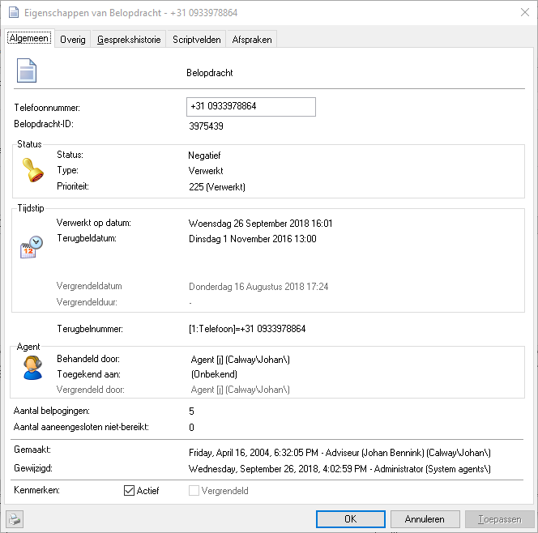

## Correctie afcoderen met verkeerde status door de Agent na doorbellen

In hele uitzonderlijke gevallen kan het zijn dat de dialer al extra
belpogingen heeft gedaan op een belopdracht voordat de status kon worden
aangepast. Zoals in voorgaande scenario is uitgelegd wordt standaard de
laatste belpoging bijgewerkt. Via het scherm kan echter ook een eerdere
belpoging worden aangepast zodat het belresultaat dat wordt gezet gaat
gelden voor de agent die die belpoging heeft gedaan, en niet op “naam
van” de dialer komt te staan. Het betreft in die gevallen altijd het
omboeken van een negatieve naar een positief belresultaat. De procedure
is identiek aan voorgaande voorbeeld, alleen wordt nu in het scherm met
de … knop ene eerdere belpoging gekozen.

 

Hier zetten we de status “Positief” op de belopdracht en op belpoging 2.

*LET OP\! Met deze wijziging wordt het Positieve resultaat in de
statistieken meegeteld voor de datum 1-5-2018. De belopdracht staat nu
op Positief, terwijl de laatste belpoging op 16-08-2018 op naam van
Agent(j) als Negatief telt in de historie.*

# Belscripts maken voor beginners

CallPro wordt geleverd met een autoscript. Met het autoscript wordt een
eenvoudige callflow op basis van de velden in de scriptdefinitie
gemaakt. Hiermee kan een basis campagne zeer snel worden opgestart. Dit
hoofdstuk hoort bij de cursus “Belscript maken voor beginners”.

# Het autoscript

Het autoscript bestaat uit een aantal vaste onderdelen zoals in
onderstaand afbeelding weergegeven.


## Toolbar

In de toolbar wordt campagne en belopdracht informatie afgebeeld.
Helemaal links staat het logo dat is ingesteld op de scriptdefinitie. Op
deze manier kan per opdracht(gever) een eigen identiteit aan de campagne
gegeven worden. Zorg ervoor dat een afbeelding met formaat 310x150 wordt
gebruikt, of een verhouding die hieraan gelijk is.


De tweede tile geeft informatie over de laatste belpoging weer. Daarna
komt een optionele tile om de agendamodule te openen. Deze tile wordt
alleen afgebeeld als er een afspraak status wordt gebruik in de lijst
met belopdrachtstatussen.

Daar weer naast staan 4 tiles voor het bellen, ophangen, doorschakelen
en optioneel een bel-me-niet tile. Helemaal rechts staat de Pauze tile.

Als gebruikt wordt gemaakt van een CTI-koppeling kan met de “Bel nummer”
knop (groen) het gesprek worden gestart, met “Ophangen” (rood) kan het
telefoongesprek worden beëindigd. De doorverbinden tile toont een popup
met doorverbinden met of zonder ruggespraak.

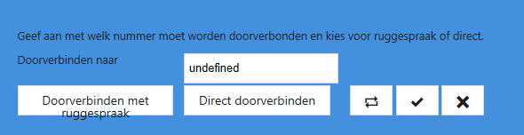

De “Bel-me-niet” tile (hier niet afgebeeld) kan indien beschikbaar het
gesprek worden doorgezet naar de bel-me-niet IVR.

Aanvullend kan ook Campagne informatie worden afgebeeld die in het
informatiebord bij de campagne staat ingesteld (weergeven in belscript).
Als extra kan ook een variabele SCRIPT.INFO worden gebruikt om
informatie hier te plaatsen.


Voor de weergave wordt gebruik gemaakt van een accordion.

## Belopdrachtstatussen

De voor de scriptdefinitie geactiveerde belopdrachtstatussen worden
links in de groepen waarin ze binnen CallPro zijn gedefinieerd
afgebeeld. Voor de groepering wordt gebruik gemaakt van de status groep
waar de betreffende statussen in zijn
aangemaakt. Subgroepen met zelfde naam worden samengevoegd. De volgorde
van de statussen kan worden bepaald met de Resource Explorer. Ga op de
groep “Belopdracht statussen” staan en right-click. Kies “Volgorde
groepen…” om de weergave volgorde van de groepen te bepalen, en
“Volgorde…”om de volgorde van de statussen te bepalen binnen deze
groepen.

 

## Scriptvelden

Alle velden uit de scriptdefinitie worden in een standaard opmaak
afgebeeld. Vanaf V4.30 wordt het onderscheid tussen een blok met NAW en
BODY afgeschaft. Alle velden komen in 1 blok te staan in de volgorde
zoals ze in de scriptdefinitie staan. Hoewel de SCRIPT.NAW en
SCRIPT.BODY variabelen in de huidige versie nodig wel werken worden die
in de toekomst verwijderd en adviseren wij om nu al het gebruik af te
bouwen.

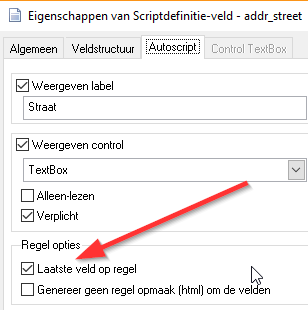De scriptvelden worden standaard in de volgorde
uit de scriptdefinitie met 1 veld per regel weergegeven. Met de optie
“Laatste veld op de regel” wordt bepaald op het volgende veld op een
nieuwe regel komt, door dit bij een veld uit te zetten komt het volgende
veld ook op dezelfde horizontale regel.


Of weergave op 1 regel met de velden achter elkaar:

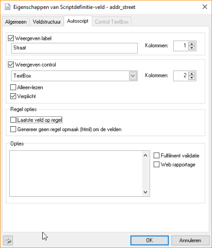


## Belopdrachtnotitie

Hier kan een notitie worden vastgelegd door de telemarketeer. Tevens
wordt eronder een lijst afgebeeld met voorgaande belpogingen, alleen de
laatste is zichtbaar, de overige kunnen worden getoond door de blauwe
knoppen te gebruiken. In het grijze vlak staat de huidige notitie. In
het lege veld kan een nieuwe notitie worden gezet. Via knippen en
plakken kan ook informatie uit de vorige notitie worden overgenomen.


## Pagina footer

In de pagina footer wordt het versienummer van het autoscript afgebeeld
en staat tussen haakjes \[ \] de naam van de scriptdefinitie afgebeeld.
Helemaal rechts is een knop om snel naar boven te springen.


Met het hyperlink symbool gevolgd door een cijfer wordt aangegeven of
deprecated opties of ander problemen zijn herkend met de gebruikte
autoscript opties. Klik op dit item om een venster te openen met de
details.

## Scriptdefinitie instellingen

Met behulp van enkele variabelen die kunnen worden gedefinieerd bij de
campagne, of de scriptdefinitie kan het gedrag van het autoscript worden
beïnvloed. Hoewel elke schrijfwijze met hoofd- en kleine letters werkt
raden wij aan om de schrijfwijze uit deze handleiding aan te houden.

<table>
<thead>
<tr class="header">
<th>Variabele</th>
<th>Type</th>
<th>Betekenis</th>
</tr>
</thead>
<tbody>
<tr class="odd">
<td>SCRIPT.TITLE</td>
<td>Memo</td>
<td><strong>(Alleen voor intern gebruik)</strong></td>
</tr>
<tr class="even">
<td>SCRIPT.TOOLBAR</td>
<td>Bool</td>
<td><strong>True</strong>/False Bepaald of de toolbar in het autoscript wordt weergegeven.</td>
</tr>
<tr class="odd">
<td>SCRIPT.TOOLBAR.LOGO</td>
<td>Bool</td>
<td><strong>True</strong>/False Moet de Logo Tile worden afgebeeld.</td>
</tr>
<tr class="even">
<td>SCRIPT.TOOLBAR.LOGO.WIDE</td>
<td>Bool</td>
<td><strong>True</strong>/False Geeft aan of de Logo tile groot moet zijn.</td>
</tr>
<tr class="odd">
<td>SCRIPT.TOOLBAR.CALLHISTORY</td>
<td>Bool</td>
<td><strong>True</strong>/False Moet de Callhistory Tile worden afgebeeld</td>
</tr>
<tr class="even">
<td>SCRIPT.TOOLBAR.CUSTOMTILE1</td>
<td>Memo</td>
<td><strong>(Expert)</strong> Met deze variabele is het mogelijk om rechts van de Callhistory tile extra tiles in te voegen met eigen custom gedrag. Er is geen beperking op wat hier ingevoegd kan worden dus let op dat de toolbar opmaak niet wordt verstoord.</td>
</tr>
<tr class="odd">
<td>SCRIPT.TOOLBAR.DIAL</td>
<td>Bool</td>
<td><strong>True</strong>/False Moet de Dial Tile worden afgebeeld.</td>
</tr>
<tr class="even">
<td>SCRIPT.TOOLBAR.DIAL.SMALL</td>
<td>Bool</td>
<td>True/<strong>False</strong> Geeft aan of de Dial knop klein moet zijn</td>
</tr>
<tr class="odd">
<td>SCRIPT.TOOLBAR.DIAL.AUTOSELECTSTAT</td>
<td>Bool</td>
<td>True/<strong>False</strong> Geeft aan of de Dial knop in de toolbar bij automatisch bellen CTI resultaten automatisch afcodeert of alleen een melding geeft.<br />
Alle overige bellen knoppen in het script laten alleen zien wat het resultaat is maar coderen de belopdracht niet af. Op deze manier kunnen meerdere bekende nummers geprobeerd worden.</td>
</tr>
<tr class="even">
<td>SCRIPT.TOOLBAR.HANGUP</td>
<td>Bool</td>
<td><strong>True</strong>/False Moet de Hangup Tile worden afgebeeld</td>
</tr>
<tr class="odd">
<td>SCRIPT.TOOLBAR.HANGUP.SMALL</td>
<td>Bool</td>
<td>True/<strong>False</strong> Geeft aan of de Hangup knop klein moet zijn</td>
</tr>
<tr class="even">
<td>SCRIPT.TOOLBAR.INBOUND</td>
<td>Bool</td>
<td><strong>True</strong>/False Deze variabele bepaald of bij inbound/call blending campagnes de tiles voor zoeken, nieuw en annulerenvan een belopdracht worden getoond.</td>
</tr>
<tr class="odd">
<td>SCRIPT.TOOLBAR.CALLPARK</td>
<td>Bool</td>
<td>True/<strong>False</strong> Geeft aan of de Parkeren knop zichtbaar is. Met deze knop kan een actief gesprek worden geparkeerd zodat de klant je niet hoort. De klant krijgt music on hold.</td>
</tr>
<tr class="even">
<td>SCRIPT.TOOLBAR.CALLPARK.SMALL</td>
<td>Bool</td>
<td>True/<strong>False</strong> Geef de parkeren knop weer als kleine tile</td>
</tr>
<tr class="odd">
<td>SCRIPT.TOOLBAR.CALLTRANSFER</td>
<td>Bool</td>
<td>True/<strong>False</strong> Geeft aan of de doorschakelen knoppen zichtbaar moeten zijn</td>
</tr>
<tr class="even">
<td>SCRIPT.TOOLBAR.CALLTRANSFER.SMALL</td>
<td>Boolt</td>
<td>True/<strong>False</strong> Geef de doorschakelen knoppen weer met kleine tiles</td>
</tr>
<tr class="odd">
<td>SCRIPT.TOOLBAR.CUSTOMTILE2</td>
<td>Memo</td>
<td><strong>(Expert)</strong> Met deze variabele is het mogelijk om links van de Break tile extra tiles in te voegen met eigen custom gedrag. Er is geen beperking op wat hier ingevoegd kan worden dus let op dat de toolbar opmaak niet wordt verstoord.</td>
</tr>
<tr class="even">
<td>SCRIPT.TOOLBAR.BREAK.SMALL</td>
<td>Bool</td>
<td>True/<strong>False</strong> Geeft aan of de Break tile klein moet zijn.</td>
</tr>
<tr class="odd">
<td>SCRIPT.AGENTMOOD</td>
<td>Bool</td>
<td>True/<strong>False</strong> Geeft aan of voor het afcoderen altijd een AgentMood moet worden gekozen door de agent</td>
</tr>
<tr class="even">
<td>SCRIPT.HEADER</td>
<td>Memo</td>
<td><p>De inhoud van deze variabele wordt direct aan het begin van de pagina geplaatst, voor de opmaak. Als eerste wordt bij de campagne gekeken, daarna bij de scriptdefinitie.</p>
<p><strong>V4.3.3:</strong> Als deze variabele niet is gedefinieerd op de resource dan wordt in de folder hiërarchie omhoog gezocht naar een variabele met deze naam.</p>
<p>Deze variabele is vooral bedoeld om de Custom_ValdiationCheck() functie in de pagina te zetten die wordt opgeroepen als onderdeel van het afcoderen. Hiermee kunnen extra validaties worden uitgevoerd voor bepaalde statussen die het afcoderen afbreken.</p></td>
</tr>
<tr class="odd">
<td>SCRIPT.INFO</td>
<td>Memo</td>
<td><p>De inhoud van deze variabele wordt binnen het hoofd script blok geplaatst, direct onder de toolbar, maar rechts van de statussen. Als eerste wordt bij de campagne gekeken, daarna bij de scriptdefinitie.</p>
<p><strong>V4.3.3:</strong> Als deze variabele niet is gedefinieerd op de resource dan wordt in de folder hiërarchie omhoog gezocht naar een variabele met deze naam.</p>
<p>Voor informatieve inhoud is het beter om gebruik te maken van het Informatiebord en daar aan te geven, “weergeven in belscript”.</p>
<p>Voor speciale maatwerk wensen kijk bij de sectie “Geavanceerde opmaak met het autoscript”.</p></td>
</tr>
<tr class="even">
<td>SCRIPT.CAMPAIGNNOTES</td>
<td>Bool</td>
<td>True/<strong>False</strong> Bepaald of de campagne notities in het belscript boven de scriptvelden als accordion worden weergegeven.</td>
</tr>
<tr class="odd">
<td>SCRIPT.BODY</td>
<td>Memo</td>
<td><strong>(Alleen voor intern gebruik)</strong> De HTML opmaak code die hier wordt geplaatst komt in de plaats van de gegenereerde lijst met scriptvelden.</td>
</tr>
<tr class="even">
<td>SCRIPT.NOTES</td>
<td>Memo</td>
<td><strong>(Alleen voor intern gebruik)</strong> De HTML opmaak code die hier wordt geplaatst komt in de plaats van de weergave van Notitie en opmerkingen.</td>
</tr>
<tr class="odd">
<td>SCRIPT.NOTES.LOCATION</td>
<td>Karakter</td>
<td>TOP/<strong>BOTTOM</strong>/BOTH Met deze waarde wordt bepaald waar het Notitie &amp; Opmerkingen blok wordt geplaatst.</td>
</tr>
<tr class="even">
<td>SCRIPT.NOTES.CALLHISTORY</td>
<td>Bool</td>
<td><strong>True</strong>/False Moet de belhistorie worden afgebeeld onderaan de pagina</td>
</tr>
<tr class="odd">
<td>SCRIPT.STATUS</td>
<td>Memo</td>
<td><strong>(Alleen voor intern gebruik)</strong> Met deze variabele kan het complete status block worden vervangen met een eigen html opmaak voor de weergave van statussen.</td>
</tr>
<tr class="even">
<td>SCRIPT.FOOTER</td>
<td>Memo</td>
<td>De inhoud van deze variabele wordt direct boven de pagina footer afgebeeld (in het blauwe deel) over de gehele breedte van het scherm.</td>
</tr>
<tr class="odd">
<td>FEATURE.CSS</td>
<td>Memo</td>
<td><strong>(Alleen voor intern gebruik)</strong> Deze variabele voegt extra css features toe die nog niet standaard door CallPro worden ondersteunt. In de toekomst komt hiervoor misschien een optie in de scriptdefinitie.<br />
Hier kunnen CSS opmaak codes worden geplaatst die bestaande opmaak overschrijven, of extra opmaak die in eigen html/css wordt gebruikt.</td>
</tr>
<tr class="even">
<td>ANTWOORDSERVICE.CONTACT.MULTISELECT</td>
<td>Bool</td>
<td><p>True/<strong>False</strong> Met deze optie wordt aangegeven of het mogelijk is om in de contact lijst meerdere contactpersonen aan te vinken of slechts 1 die op de hoogte wordt gesteld van de notitie.</p>
<p><strong>Alleen in het antwoordservice script!</strong></p></td>
</tr>
</tbody>
</table>

## Extra autoscript instellingen

Er zijn ook enkele instellingen die met het autoscript mogelijk zijn die
betrekking hebben op andere onderdelen zoals de pauze pagina.

### Globale campagne instellingen

Instellingen die op de “Campaigns” root-folder kunnen worden gezet als
globale instellingen.

| Variabele                      | Type     | Betekenis                                                                                                                                                                                                                                                      |
| ------------------------------ | -------- | -------------------------------------------------------------------------------------------------------------------------------------------------------------------------------------------------------------------------------------------------------------- |
| BREAK.ShowHighscoreTile        | Bool     | True/**False** Geeft aan of de Highscore tile moet worden weergegeven.                                                                                                                                                                                         |
| BREAK.Highscore.Period         | Karakter | Vul hier DAY | WEEK | MONTH in om aan te geven dat de HighScore tile berekening over de betreffende periode moet lopen.                                                                                                                                        |
| BREAK.ShowScoreTiles           | Bool     | True/**False** Bepaald of de ScoreTiles worden weergegeven.                                                                                                                                                                                                    |
| BREAK.ScoreTiles.Category      | Karakter | Bepaald welke Belopdrachtstatuscategorie die wordt gebruikt als Score resultaat.                                                                                                                                                                               |
| BREAK.ShowLeaderboard          | Bool     | True/**False** Bepaald of het middelste tab “leaderboard” van de Engage Gamification wordt weergegeven.                                                                                                                                                        |
| BREAK.DisableCampaignSelection | Bool     | True/**False** Bepaald of agenten in het pauzescherm de campagne toekenning zelf kunnen aanpassen. Standaard staat dit aan, maar door deze variabele op True te zetten wordt het uitgeschakeld. Op Campagne niveau kan deze instelling worden aangepast.       |
| BREAK.MaxBreakHoursPerDay      | Decimal  | Het maximale aantal pauze minuten per dag voor agenten. Alleen pauze types die als agent werktijd worden geteld. Als dit aantal wordt overschreden wordt de Pauze tile rood                                                                                    |
| BREAK.INFO                     | Memo     | Hier kan extra informatie op de pauze pagina worden gezet in het rechter pagina deel.                                                                                                                                                                          |
| BREAK.TOOLBAR.CUSTOMTILE1      | Memo     | **(Expert)** Met deze variabele is het mogelijk om op de pauze pagina rechts van de Logo tile extra tiles in te voegen met eigen custom gedrag. Er is geen beperking op wat hier ingevoegd kan worden dus let op dat de toolbar opmaak niet wordt verstoord.   |
| BREAK.TOOLBAR.CUSTOMTILE2      | Memo     | **(Expert)** Met deze variabele is het mogelijk om op de pauze pagina links van de Break tile extra tiles in te voegen met eigen custom gedrag. Er is geen beperking op wat hier ingevoegd kan worden dus let op dat de toolbar opmaak niet wordt verstoord.   |
| INBOUND.INFO                   | Memo     | Hier kan extra informatie op de inbound pagina worden gezet in het rechter pagina deel.                                                                                                                                                                        |
| INBOUND.TOOLBAR.CUSTOMTILE1    | Memo     | **(Expert)** Met deze variabele is het mogelijk om op de inbound pagina rechts van de Logo tile extra tiles in te voegen met eigen custom gedrag. Er is geen beperking op wat hier ingevoegd kan worden dus let op dat de toolbar opmaak niet wordt verstoord. |
| INBOUND.TOOLBAR.CUSTOMTILE2    | Memo     | **(Expert)** Met deze variabele is het mogelijk om op de inbound pagina links van de Break tile extra tiles in te voegen met eigen custom gedrag. Er is geen beperking op wat hier ingevoegd kan worden dus let op dat de toolbar opmaak niet wordt verstoord. |

### Agentgroup instellingen

Instellingen die op een Agent group folder kunnen worden ingesteld.

| Variabele                | Type     | Betekenis                                                                                                                                                                          |
| ------------------------ | -------- | ---------------------------------------------------------------------------------------------------------------------------------------------------------------------------------- |
| Leaderboard.TeamColor    | Karakter | Een kleur MetroUI kleur class code die gebruikt wordt als achtergrond kleur voor de Agent tiles op het leaderboard (http://autoscript/MetroUI/leaderboard)                         |
| Weektargets.ScorePerHour | Numeriek | Weektargets is een optionele pagina met 4 tiles met informatie. Hiermee wordt de te behalen conversie voor de weektargets Tile ingesteld. (http://autoscript/services/weektargets) |

### Campagne instellingen

Instellingen op de Campagne folders van individuele projecten.

Bij de instellingen staat \<Score\> voor de waarde die is ingesteld bij
Break.ScoreTiles.Category

<table>
<thead>
<tr class="header">
<th>Variabele</th>
<th>Type</th>
<th>Betekenis</th>
</tr>
</thead>
<tbody>
<tr class="odd">
<td>&lt;Score&gt;.Type</td>
<td>Karakter</td>
<td><p>Geeft aan op welke manier de ScoreTile moet worden berekend.</p>
<p>Mogelijke waarden:</p>
<p>C – Conversie</p>
<p>U – Uren</p>
<p>S – Score</p></td>
</tr>
<tr class="even">
<td>&lt;Score&gt;.Conversion</td>
<td>Numeriek</td>
<td>De conversie als score/uur die moet worden gehaald voor de campagne</td>
</tr>
<tr class="odd">
<td>&lt;Score&gt;.Value</td>
<td>Numeriek</td>
<td>Wordt gebruikt bij type U en S om vast te leggen wat het absolute aantal uren of score resp. dat moet worden gehaald.</td>
</tr>
<tr class="even">
<td>&lt;Score&gt;.Price</td>
<td>Numeriek</td>
<td><p>De prijs per score (omzet) die wordt gehaald.</p>
<p>Deze parameter wordt op dit moment nog niet gebruikt!</p></td>
</tr>
<tr class="odd">
<td>BREAK.DisableCampaignSelection</td>
<td>Bool</td>
<td>True/<strong>False</strong> Bepaald of agenten in het pauzescherm de campagne toekenning zelf kunnen aanpassen. Standaard staat dit aan, maar door deze variabele op True te zetten wordt het uitgeschakeld.</td>
</tr>
</tbody>
</table>

Voor campagnes met sub-projecten kunnen de \<Score\> instellingen ook op
de bovenliggende campagne-folder worden ingesteld. Dit heeft de
betekenis dat de instellingen gelden voor alle direct er onder liggende
(1-niveau) campagnes.

### Status instellingen

Voor de belopdrachtstatus is een speciale autoscript optie beschikbaar

| Variabele       | Type | Betekenis                                                                                                                                                                                                     |
| --------------- | ---- | ------------------------------------------------------------------------------------------------------------------------------------------------------------------------------------------------------------- |
| STATUS.COLLAPSE | Bool | True/**False** Met deze variabele kan worden aangegeven dat deze status in een dropdown control moet worden weergegeven. Opvolgende statussen die allemaal deze instelling hebben komen in dezelfde dropdown. |

## Veld weergave

Het autoscript maakt gebruik van de informatie uit het tabblad
“Autoscript: invoertype” voor het afbeelden van de scriptvelden. De
volgende invoertypes worden ondersteund.

### Textbox

Dit maakt een invoerveld met 1 regel waar vrije tekst van een beperkte
lengte in kan worden ingevoerd. Zie als voorbeeld de **bedrijfsnaam**,
**voornaam**, **achternaam** en **plaats** velden.

### Textarea

Dit invoertype wordt gebruikt voor velden waar meer, en meerdere regels
aan vrije tekst worden ingevuld. In bovenstaande schermvoorbeeld is het
veld Q2 een goed voorbeeld. CallPro maakt zelf voor de belopdracht
notitie ook gebruik van die invoertype.

### Radiobutton

Een radiobutton geeft meerdere keuzes (minimaal 2) waarbij slechts 1
keuze gemaakt kan worden. Het veld Q1 is een voorbeeld van een
radiobutton. Meestal gaat het om Ja/Nee, of Groen/Geel/Rood keuzes
waarbij altijd 1 antwoord/keuze de juiste is.

### Checkbox

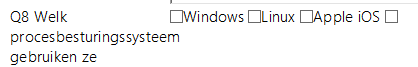De checkbox geeft de mogelijkheid om 1 of meer
keuzes waarbij het mogelijk is om, anders dan bij de radiobutton, ook
meerdere keuze te selecteren. Meestal gaat het om vragen over
kennisgebieden zoals “welke merken kent u”.

### Combobox

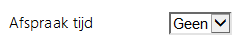Een combobox werkt op dezelfde manier als een
radiobutton, er is slechts 1 keuze mogelijk. Qua weergave biedt de
combobox een compacte weergave indien de lijst met opties erg lang is.

### Label

Inde de inhoud van het scriptveld alleen hoeft te worden afgebeeld, maar
het niet nodig is om de waarde te wijzigen kan gebruik worden gemaakt
van een label. Het autoscript gebruikt in de Pagina header bijvoorbeeld
labels voor het weergaven van de waarden.

### HTML

Voor situaties waarbij een complexe of samengestelde weergave wenselijk
is die niet met de voorgenoemde invoertypes mogelijk is kan Custom HTML
worden gebruikt. Met dit type moet de scriptbouwer zelf de HTML opmaak
invullen voor weergave van een scriptveld.

### Hidden

Als het veld wel gebruikt wordt in javascript dan kan het type hidden
worden gebruikt. Hiermee wordt het veld onzichtbaar op de pagina gezet.

## Weergave opties

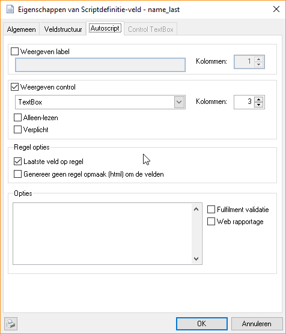

Het autoscript ondersteund speciale opties die de weergave beïnvloeden.
Deze worden opgegeven in het Opties veld. In dit veld kan een json object worden geplaatst met custom instellingen.

De opmaak is als volgt:
```
{  
“Version”: “1.0”,  
“DisplayFormat”: “\<format-strings\>”  
}
```
Voor \<format-strings\> kunnen vervolgens de volgende functies worden
gebruikt.

### Datum velden

Als een scriptveld van het datatype “Datum” is wordt bij het betreden
van het veld automatisch een kalender weergegeven. Voor bijvoorbeeld
karakter velden kan deze weergave worden geforceerd door bij de opties
de code @F(Date) in te vullen.

### Naam velden

Voor de weergave van namen zijn de volgende speciale format-strings
beschikbaar. Hiermee wordt de veldinhoud opgemaakt conform weergave
opties voor namen.

| Functie      | Werking                                                                                                  |
| ------------ | -------------------------------------------------------------------------------------------------------- |
| @F(Initials) | Weergave van initialen in hoofdletters met puntjes tussen de letters.                                    |
| @F(First)    | Weergave van de voornaam waarbij elke 1<sup>e</sup> letter van de naam in hoofdletters wordt gezet.      |
| @F(Middle)   | Weergave van tussenvoegsel in kleine letters.                                                            |
| @F(Last)     | Weergave van de Achternaam waarbij elke 1<sup>e</sup> letter van de naam in hoofdletters wordt gezet.    |
| @F(Lower)    | Weergave van tekst in kleine letters                                                                     |
| @F(Upper)    | Weergave van tekst in hoofdletters                                                                       |
| @F(Proper)   | Weergave van tekst met 1<sup>e</sup> letter van elk woord in hoofdletters, en de rest in kleine letters. |
| @F(TelNr)    | Forceer dat er een dialer knopje achter het veld wordt gezet                                             |
| @F(TelNr,M)  | Als voorgaande, maar nu met een mobiel icoon                                                             |

### Overige functies

Voor enkele andere velden zijn ook speciale format-strings beschikbaar.

<table>
<thead>
<tr class="header">
<th>Functie</th>
<th>Werking</th>
</tr>
</thead>
<tbody>
<tr class="odd">
<td>@F(Url)</td>
<td>Weergave van een wereldbol icoon knop achter het veld. Deze knop opent de website uit het veld in een popup venster.</td>
</tr>
<tr class="even">
<td>@F(Email)</td>
<td>Opmaak en controle van email adres invoer.</td>
</tr>
<tr class="odd">
<td>@F(IBAN)</td>
<td>Doe een IBAN check op een ingevoerd rekeningnummer. Dit is nog geen garantie dat het nummer correct is, of van de persoon die het nummer opgeeft!</td>
</tr>
<tr class="even">
<td>@F(ADDRESSPRO)</td>
<td><p>Voeg een knop achter het veld toe dat de systeem adres velden gebruikt voor een controle via de addresspro validatie service (hiervoor is een aparte licentie nodig).</p>
<p>Voor de validatie wordt het addr_zip en addr_number veld gebruikt om de addr_street en addr_city op te zoeken.</p></td>
</tr>
</tbody>
</table>

## Opmaak

De scriptvelden maken gebruik van een simpele opmaak. Elke scriptveld
wordt in een kolom gezet met een **Vraag** gevolgd door een **control**.
De Vraag komt uit het betreffende veld van het tabblad “Autoscript:
algemeen”. De control maakt gebruik van het op het tabblad “Autoscript:
invoertype” ingestelde invoertype.


De tekst uit het Vraag veld kan worden opgemaakt met standaard html
opmaak. De gebruikte MetroUI stijl die wordt gebruikt biedt een aantal
speciale opmaakcodes. Voor nu wordt enkel verwezen naar de webpagina van
het Metro UI project: <https://metroui.org.ua/v3/typography.html>

## Fulfilment variabelen voor server-side opmaak

Ook in het autoscript zijn enkele fulfilment variabelen beschikbaar die
op de server worden uitgevoerd en in de pagina worden gezet. Deze velden
kunnen op de meeste plaatsen waar html of tekst kan worden geplaatst
worden gebruikt.

<table>
<thead>
<tr class="header">
<th>Veld</th>
<th>Waarde</th>
</tr>
</thead>
<tbody>
<tr class="odd">
<td>%AGENT.RESID%</td>
<td></td>
</tr>
<tr class="even">
<td>%AGENT.RESNAME%</td>
<td></td>
</tr>
<tr class="odd">
<td>%AGENT.RESDESCR%</td>
<td></td>
</tr>
<tr class="even">
<td>%AGENT.PARENTID%</td>
<td></td>
</tr>
<tr class="odd">
<td>%AGENT.ACCOUNT%</td>
<td></td>
</tr>
<tr class="even">
<td>%AGENT.EMAIL%</td>
<td></td>
</tr>
<tr class="odd">
<td>%AGENT.GENDER%</td>
<td></td>
</tr>
<tr class="even">
<td>%AGENT.MOBILETELNR%</td>
<td></td>
</tr>
<tr class="odd">
<td>%AGENT.HOMETELNR%</td>
<td></td>
</tr>
<tr class="even">
<td>%AGENT._____%</td>
<td>Aanvullend worden alle variabelen die bij de agent zijn vastgelegd ook opgenomen.<br />
<strong>LET OP! Indien een variabele naam overeenkomt met een van de bovenstaande velden wordt deze waarde overschreven!</strong></td>
</tr>
</tbody>
</table>

| Veld                | Waarde |
| ------------------- | ------ |
| %CAMPAIGN.RESID%    |        |
| %CAMPAIGN.RESNAME%  |        |
| %CAMPAIGN.RESDESCR% |        |
| %CAMPAIGN.PARENTID% |        |

| Veld                | Waarde |
| ------------------- | ------ |
| %CALLLIST.RESID%    |        |
| %CALLLIST.RESNAME%  |        |
| %CALLLIST.RESDESCR% |        |
| %CALLLIST.PARENTID% |        |
| %CALLLIST.SCRIPTID% |        |

| Veld                 | Waarde |
| -------------------- | ------ |
| %ENTRY.CLENTRYID%    |        |
| %ENTRY.STATID%       |        |
| %ENTRY.STATPRIORITY% |        |
| %ENTRY.TELNR%        |        |
| %ENTRY.TELNRID%      |        |
| %ENTRY.NOTES%        |        |

| Veld                  | Waarde |
| --------------------- | ------ |
| %STATUS.STATID%       |        |
| %STATUS.STATCODE%     |        |
| %STATUS.RESNAME%      |        |
| %STATUS.STATPRIORITY% |        |

| Veld                | Waarde                                                   |
| ------------------- | -------------------------------------------------------- |
| %SCRIPT.\_\_\_\_\_% | Voor elk veld uit de scriptdefinitie is er een variabele |

<table>
<thead>
<tr class="header">
<th>Veld</th>
<th>Waarde</th>
</tr>
</thead>
<tbody>
<tr class="odd">
<td>%VARIABLE._____%</td>
<td>Voor elke variabele dis is gedefinieerd op de scriptdefinitie is er een waarde. Daarna worden de variabelen op de campagne opgenomen.<br />
<strong>LET OP! Als op de campagne variabelen met dezelfde naam als op de scriptdefinitie zijn gedefinieerd dan worden deze waarden overschreven en blijft de waarde die is gedefinieerd bij de campagne over.</strong></td>
</tr>
</tbody>
</table>

## Geavanceerde opmaak met het autoscript

Met het autoscript kan een belscript in enkele minuten worden
klaargemaakt. Toch zijn er situaties waar de eenvoud van het autoscript
net niet voldoende is en je als scriptbouwer de weergave of validatie
van velden meer wilt controleren. Hiervoor kan de HTML weergave worden
gebruikt.

Het autoscript maakt standaard regels kolommen aan. Hierdoor worden ook
de custom velden altijd weergegeven binnen een opmaakt voor 1 regel
zoals:


Hierbij staat de html opmaak binnen de binnenste div. Door de optie
“Genereer geen regel opmaak (html) om de velden” aan te vinken
genereert het autoscript geen regels en kolommen maar moet alle opmaak,
compatible met de tabel opmaak van de MetroUI stijl zelf worden
geplaatst in het HTML blok.


Het is goed te weten dat bij verkeerd gebruik van de html opmaak de
weergave in de war kan raken. Zorg altijd dat de weergave goed
gecontroleerd wordt bij het maken van het script tenzij wordt gewerkt
met maatwerk code die niet zichtbaar is zoals \<script\> blokken.

### Maatwerk opmaak voor invoervelden

Via de control weergave Html kan de gehele opmaak van het veld, of een
samenstel van meerdere velden worden gemaakt. Om deze regel te maken is
de onderstaande html nodig.


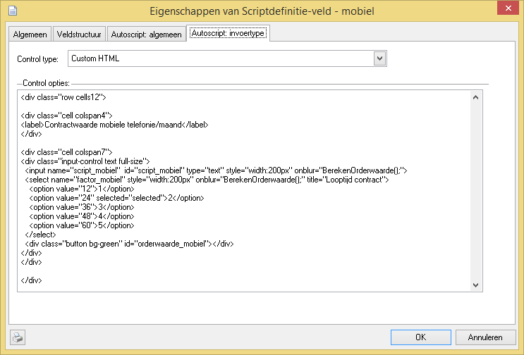

Kijk voor inspiratie en mogelijkheden van de MetroUI stijl op de website
<https://metroui.org.ua/v3> Controleer wel altijd de juiste werking
binnen CallPro omdat sommige controls via jQuery worden gemaakt en
hierdoor het in de opmaakcode gedefinieerde input veld niet wordt
gebruikt voor de opslag van de veldwaarde. CallPro kijkt altijd alleen
naar de originele input tag met de naam script\_\<veldnaam\> Als jQuery
onder water in het DOM model nieuwe velden aanmaakt zijn deze niet
gekoppeld tenzij ze ook de script\_\<veldnaam\> naam krijgen.

### Plaats velden binnen een tabcontrol

Om velden in het autoscript in een tabcontrol te plaatsen zijn 2 extra
scriptvelden nodig. De velden worden verder niet gebruikt dus het beste
kan het veldtype op karakter(1) worden gezet. De TAB01\_BEGIN wordt
boven het eerste veld geplaatst dat in de tabcontrol moet komen en
TAB01\_END wordt na het laatste veld geplaatst. Bij beide velden wordt
de optie “Genereer geen regel opmaak (html) om de velden” aangegeven en
ook “Laatste veld op regel”. Het voorgaande veld moet ook de optie
“Laatste veld op regel” aan hebben staan zodat de tabcontrol op een
nieuw regel begint.

 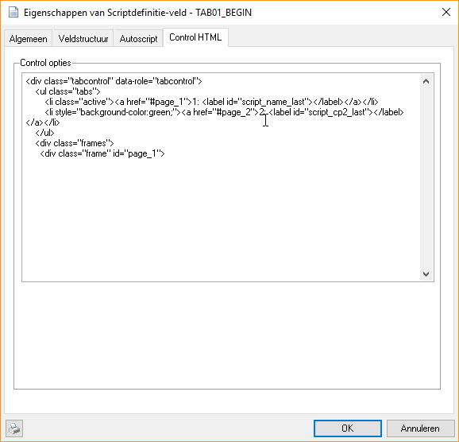

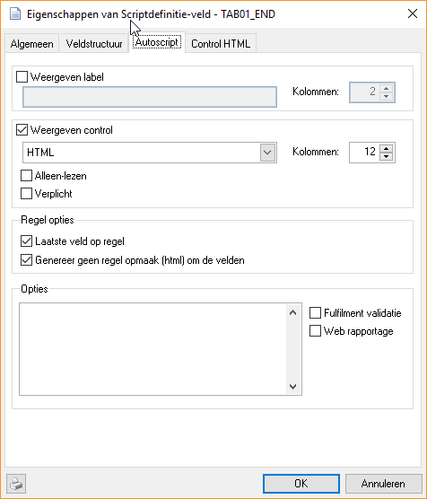 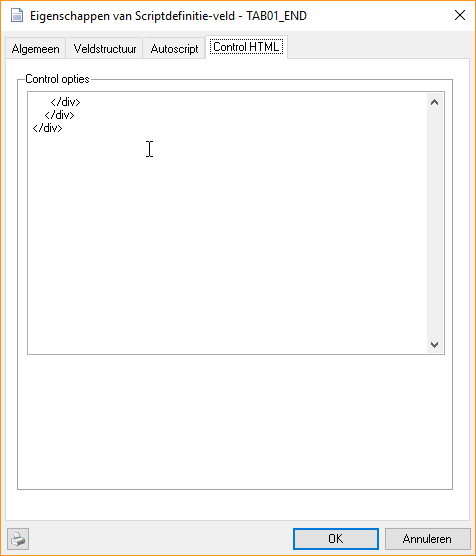

In het autoscript ziet die er als volgt uit.


Om extra tabs te maken kan deze opmaak ook weer in een extra veld worden
geplaatst.

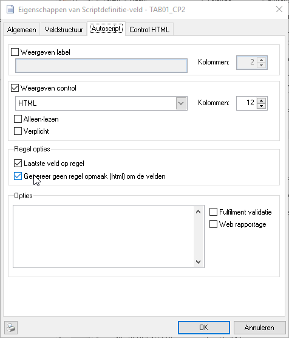 

### Belhistorie resultaten aanpassen met CSS opmaak

Als de belhistorie wordt afgebeeld komen alle eerdere belpogingen in de
lijst. Soms wil je bepaalde belresultaten niet weergeven, of juist
markeren in de belhistorie. Dit is mogelijk door gebruik te maken van de
variabele FEATURE.CSS en hier enkele CSS opmaak regels op te nemen.

Door de volgende stijl regel op te nemen kan een belpoging die is
afgecodeert met een belopdrachtstatus worden onzichtbaar gemaakt. In dit
voorbeeld wordt de “Geen gehoor” (120) belopdrachtstatus onzichtbaar
gemaakt.


Door meerdere van deze regels op te nemen met telkens de statuscode (120
in het voorbeeld) kunnen meer belpogingen onzichtbaar worden gemaakt. De
opbouw van elke belpoging is als volgt.


Met deze informatie kunnen ook individuele onderdelen worden aangepast
via CSS opmaak. Bekijk de structuur van de autoscript html pagina eens
vanuit de browser en gebruik de “Inspect element” of “View source”
optie. Via CSS zijn diverse andere onderdelen ook cosmetisch aan te
passen.

### Afcoderingen verbergen in de statuslijst met CSS opmaak

Ook de afcoderingen in de linkerbalk kunnen worden weggehaald met CSS
opmaak. Hoewel er bij de status vanaf v4.30 kan worden opgegeven of deze
in het belscript zichtbaar moet zijn, is die instelling voor alle
belscripts (globaal over CallPro). Om een bepaalde (systeem) status weg
te laten uit 1 belscript, of zelfs voor 1 situatie kan de volgende CSS
opmaak worden gebruikt.

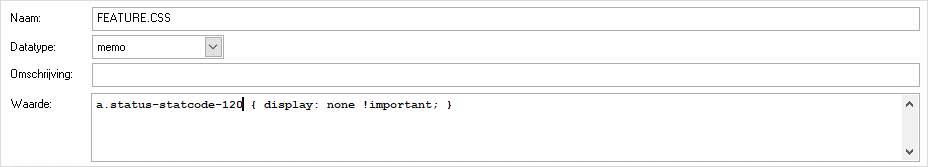

Met bovenstaande CSS opmaak wordt de Geen gehoor systeemstatus
onzichtbaar gemaakt in het autoscript.

### Custom validatie tijdens afcoderen

Tijdens het afcoderen roept het autoscript een functie
“Custom\_ValidationCheck” uitgevoerd. Als paramater wordt een
javascript object met de status code die is geklikt doorgegeven. Als
resultaat geeft deze functie een boolean terug die aangeeft of het
afcoderen door mag gaan of niet.

Deze functie oproep wordt vooral gebruikt om extra veld controles te
laten uitvoeren op basis van de afcodering die is gekozen. Bijvoorbeeld
om bij een nieuwe afspraak te controleren dat de NAW gegevens wel
compleet zijn ingevuld, of dat er een email adres voor de lead is
ingevuld. Doorgaan wordt deze functie in de variabele SCRIPT.HEADER
geplaatst.

```
function Custom\_ValidationCheck(status) {
var validationResult = true;
switch(status.code)
{
    case "780":
        // Basic gedrag.
        setFieldValue("script\_app\_email\_to",
        getFieldValue("script\_name\_email"));
        setFieldValue("script\_exp\_app","");
        break;
    case "710":
        if(getFieldValue("script\_info")=="")
        {
        status.errors.add("Kies eerst een informatiepakket");
        validationResult = false;
        }
        if(getFieldValue("script\_info\_email\_to")=="")
        {
        status.errors.add("Kies een email adres voor de verzending");
        validationResult = false;
        }
        if(\!checkValidEmail("script\_info\_email\_to"))
        {
        status.errors.add("Het opgegeven email adres is niet geldig");
        validationResult = false;
        }
        if(validationResult)
        {
        // Last check still valid
        setFieldValue("script\_exp\_info","");
        }
        break;
}
return validationResult;
}
```

In deze voorbeeld functie wordt bijvoorbeeld voor het versturen van
informatie (code 710) gecontroleerd ode diverse verplichte velden wel
zijn gevuld. Zo niet dan wordt de errors collectie van het status object
gevuld met een melding die vervolgens door het autoscript wordt
afgebeeld.

Het interne status object heeft de volgende velden die kunnen worden
uitgelezen en gebruikt.

<table>
<thead>
<tr class="header">
<th>Veld</th>
<th>Werking</th>
</tr>
</thead>
<tbody>
<tr class="odd">
<td>code</td>
<td>Dit is de code van de belopdrachtstatus die de agent heeft geklikt om af te coderen. Wij hanteren een 3-cijferige code</td>
</tr>
<tr class="even">
<td>logicalcategory</td>
<td><p>Dit is het type veld van de belopdrachtstatus zoals ingesteld op het tabblad “Type en Tijd”. Mogelijk waarden zijn:</p>
<p>1 – Niet bereikt</p>
<p>2 – Terugbellen</p>
<p>3 – Verwerkt</p></td>
</tr>
<tr class="odd">
<td>prioritycategory</td>
<td><p>Dit is de prioriteitscategory van de belopdrachtstatus. Mogelijke waarden:<br />
1 – Niet bereikt hoog</p>
<p>2 – Terugbellen laag</p>
<p>3 – Verwerkt</p>
<p>4 – Systeem</p>
<p>5 – Niet bereikt laag</p>
<p>6 – Terugbellen hoog</p></td>
</tr>
<tr class="even">
<td>errors</td>
<td>Een collectie met fouten. Via de Add functie kunnen aan de errors collectie extra meldingen worden toegevoegd (zie ook het voorbeeld)</td>
</tr>
<tr class="odd">
<td>callbackexpr</td>
<td>Hiermee kan tijdens het afcoderen het standaard gedrag van de belopdrachtstatus worden overschreven voor wat betreft de terugbeltijd expressie.</td>
</tr>
<tr class="even">
<td>callbackagent</td>
<td>Volledige pad+naam van de agent die als terugbelagent moet worden ingesteld.</td>
</tr>
<tr class="odd">
<td>mincallbackexpr</td>
<td>Als callbackexpr maar nu voor de betrefende parameter</td>
</tr>
<tr class="even">
<td>maxcallbackexpr</td>
<td>Als callbackexpr maar nu voor de betrefende parameter</td>
</tr>
<tr class="odd">
<td>autoselect</td>
<td>Een boolean veld dat aangeeft dat CallPro direct moet afcoderen en <strong>niet</strong> eerst het popupvenster van CallPro moet afbeelden.</td>
</tr>
<tr class="even">
<td>entrynote</td>
<td>Door dit veld te vullen kan het notitieveld worden gezet met de betreffende waarde. Deze waarde heeft voorrang boven een waarde die de agent in een veld in het belscript heeft ingevuld.</td>
</tr>
</tbody>
</table>

# Antwoordservice pagina

De antwoordservice module maakt gebruik van enkele extra velden die
nodig zijn in de scriptdefinitie. Verder is deze pagina grotendeels
gelijk aan de standaard autoscript pagina en kunnen de opties die
genoemd zijn ook worden toegepast.

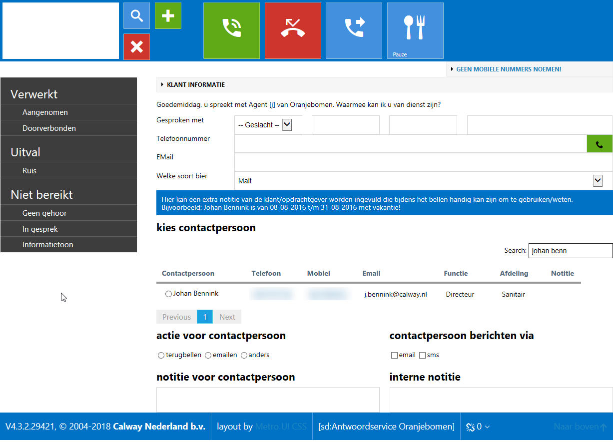

## Scriptvelden

De scriptdefinitie voor de antwoordservice bevat enkele verplichte
velden. Voor v4.3.2 was de opmaak vast met alle scriptvelden boven de
contactpersonen lijst en enkele vaste systeemvelden eronder. Vanaf
v4.3.2 is de opmaak gestuurd door de scriptdefinitie velden en kan
hierdoor ook worden aangepast.


De velden die verplicht zijn voor de antwoordservice zijn: ContactID,
ContactName, ContactAction, SendEmail, SendSMS, ContactNote. De velden
ResponseAction en ResponseNote worden gebruikt vanuit de Customer Portal
login van de klant en worden niet weergegeven in het belscript. Ook de
drie EXP\_EMAIL, EXP\_SMS, EXP\_RAPPORT velden zijn verplicht en worden
door de fulfilment procedure gebruikt.

### Contactpersonen (ContactID)

Bij de antwoordservice wordt voor een klant een lijst met
contactpersonen vastgelegd waarvoor notities kunnen worden aangenomen.
De geselecteerde contactpersoon wordt vastgelegd in het ContactID
scriptveld. Vanaf v4.3.2 wordt de contactpersonen lijst afgebeeld via
dit scriptveld. Hiervoor moet de standaard opmaak als volgt zijn
ingesteld, maar deze mag worden aangepast. Belangrijk blijft om
ContactID en ContactName te vullen met de gekozen contactpersoon.

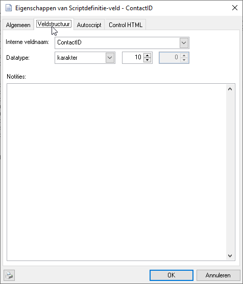


In het Control HTML veld staat de volgende standaard opmaak voor v4.3.2:
```
<div class="grid">
    <input type="hidden" name="script_contactname" />
    <input type="hidden" name="service_contactemail" />
    <input type="hidden" name="service_contactmobile" />

    <div class="row cells12">
        <div class="cell colspan12 fg-white" style="padding: 10px; background-color:\#0072c6;">
            %CURRENTCUSTOMER.SCRIPTTEXT2%
        </div>
    </div>
    <div class="row cells12">
        <div class="cell colspan12">
            <h2>kies contactpersoon</h2>
        </div>
    </div>
    <div class="cell colspan12">
        <div class="cell">
            <table id="ContactList" class="dataTable striped" data-ordering="false"
            data-info="false">
            <thead>
            <tr>
            <th></th>
            <th>Contactpersoon</th>
            <th>Telefoon</th>
            <th>Mobiel</th>
            <th>Email</th>
            <th>Functie</th>
            <th>Afdeling</th>
            <th>Notitie</th>
            </tr>
            </thead>
            <tbody>
            <!-- placeholder-->
            </tbody>
            </table>
        </div>
    </div>
</div>
<script>
var table;
$(document).ready(function() {
table = $('#ContactList').DataTable({
    "processing": true,
    "serverSide": true,
    "ajax": {
        "url":
        "/api/services/GetCustomerContacts?customerid=%CURRENTCUSTOMER.RESID%",
        "type": "GET",
    },
    "dom": "ftp",
    "columns": [
        { "data": "ResID" },
        { "data": "FullName" },
        { "data": "PhoneNumber" },
        { "data": "MobileNumber" },
        { "data": "Email" },
        { "data": "JobFunction" },
        { "data": "Department" },
        { "data": "Notes" },
    ],
    "columnDefs": [
        {
            "visible": false,
            "targets": [0]
        },
        {
            "render": function (data, type, row) {
                return "<input type='radio' class='DefaultRadioInput'
                name='script_contactid' value='" + row.ResID + "'
                onclick='setContactExtra("+row.ResID+")' />" + data
            },
            "targets": 1
        },
        {
            "render": function (data,type,row){
                return "<a href='\#' class='telnr' title='Gesprek doorverbinden'
                onclick='CallTransferBegin(" + '"' + data + '"' + ")'>" + data +
                "</a>";
            },
            "targets": [2,3]
        },
        {
            "render": function (data, type, row) {
                if(data==null || data=="")
                return "";
                else
                return "<a href='#' title='" + data + "'>Notitie</a>";
            },
            "targets": 7
        }
    ],
    "lengthMenu": [[10, 25], [10, 25]]
    } );
} );
</script>
```
In deze HTML opmaak is ook te zien dat gebruik wordt gemaakt van
server-side variabelen in de vorm van %CURRENTCUSTOMER.SCRIPTTEXT2% Deze
variabelen zijn op de server bekend ten tijde van het opmaken van de
pagina en zijn in de Fulfilment “merge-syntax”.

### Acties (ContactAction)

De actie voor de gekozen contactpersoon wordt bepaald via dit
scriptveld. Ook hier kan de standaard invullen worden aangepast. De
gekozen actie wordt direct overgenomen in de notificatie.

 
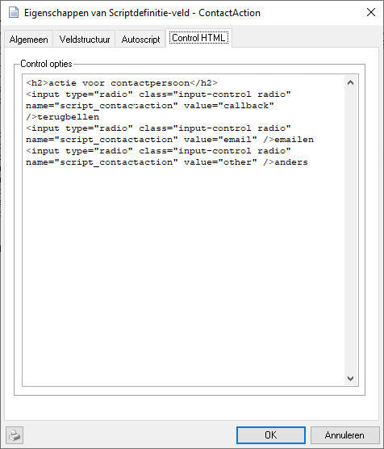

Ook hier wordt de opmaak gemaakt met een Control HTML blok:
```
<h2>actie voor contactpersoon</h2>

<input type="radio" class="input-control radio" name="script_contactaction" value="callback" />terugbellen

<input type="radio" class="input-control radio" name="script_contactaction" value="email" />emailen

<input type="radio" class="input-control radio" name="script_contactaction" value="other" />anders
```
Extra keuzemogelijkheden kunnen worden toegevoegd door meer radio regels
op te nemen.

### Contactpersoon berichten via (SendEmail, SendSMS)

De volgende twee velden bepalen op welke manier de notificatie wordt
verstuurd. Ook hier kunnen nieuwe methodes worden toegevoegd.

 
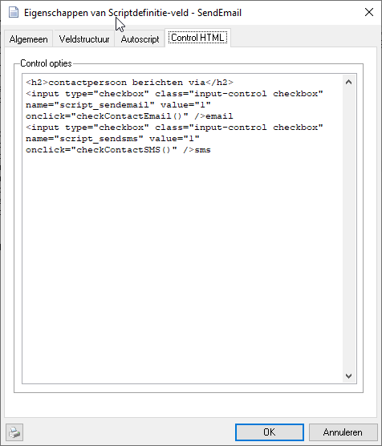

De opmaak wordt gemaakt met het SendEmail veld, bij het SendSMS veld
staat de optie “Weergeven control” uit.
```
<h2>contactpersoon berichten via</h2>

<input type="checkbox" class="input-control checkbox" name="script_sendemail" value="1" onclick="checkContactEmail()" />email

<input type="checkbox" class="input-control checkbox" name="script_sendsms" value="1" onclick="checkContactSMS()" />sms
```

### Notitie voor contactpersoon (ContactNote)

Bij de notificatie wordt een notitie meegestuurd. Daarnaast kan de agent
een interne notitie (entrynote) invullen. Voor de entrynote wordt niet
de standaard weergave gebruikt maar een compacte weergave voor de
antwoordservice.

 
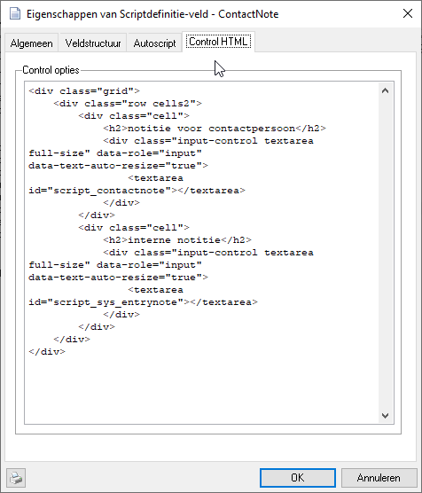

Ook hier wordt een Control HTML opmaak gebruikt:
```
<div class="grid">
    <div class="row cells2">
        <div class="cell">
            <h2>notitie voor contactpersoon</h2>
            <div class="input-control textarea full-size" data-role="input" data-text-auto-resize="true">
            <textarea id="script_contactnote"></textarea>
            </div>
        </div>
        <div class="cell">
            <h2>interne notitie</h2>
            <div class="input-control textarea full-size" data-role="input" data-text-auto-resize="true">
            <textarea id="script_sys_entrynote"></textarea>
            </div>
        </div>
    </div>
</div>
```
## Aanpassen scriptweergave

Hoewel de genoemde verplichte velden niet kunnen worden verwijderd uit
de scriptdefinitie kunnen velden wel onzichtbaar worden gemaakt. Ook kan
de volgorde van weergave en gebruik worden aangepast.

### Weergave introductie tekst

Bij de antwoordservice klant kunnen enkele velden worden vastgelegd die
in het belscript worden afgebeeld. De Introductietekst, of openingszin
is hier een van die in het belscript als volgt via de variabele
SCRIPT.INFO kan worden opgenomen in het belscript:

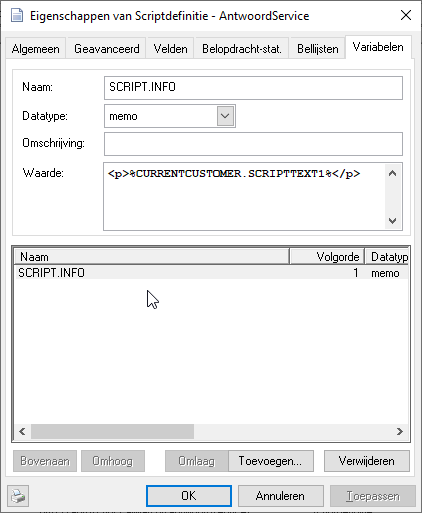

# Pauze pagina

Als een agent inlogt in de scriptmodule wordt als eerste de pauzepagina
getoond. Initieel worden de call center notities getoond, de
campagnelijst geeft een overzicht van de aan de agent gekoppelde
campagnes.


Enkele informatie tiles geven inzicht in de scores van de agent per
campagne en de gewerkte uren.

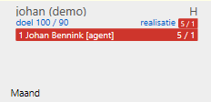

De score tile geeft per campagne een leaderboard top 5 met agenten op
basis van de instellingen op de campagne, en de globale variabele
BREAK.ScoreTiles.Category. De weergave van deze tiles kan worden
aangestuurd via de BREAK.ShowScoreTiles boolean variabele.

| Variabele                 | Type     | Betekenis                                                                                              |
| ------------------------- | -------- | ------------------------------------------------------------------------------------------------------ |
| BREAK.ScoreTiles.Category | Karakter | Geeft aan welke Belopdrachtstatus categoriegroep wordt gebruikt voor de Score Tiles. (Default = Score) |
| BREAK.ShowScoreTiles      | Bool     | True/**False** Bepaald of de Score Tiles worden weergegeven.                                           |

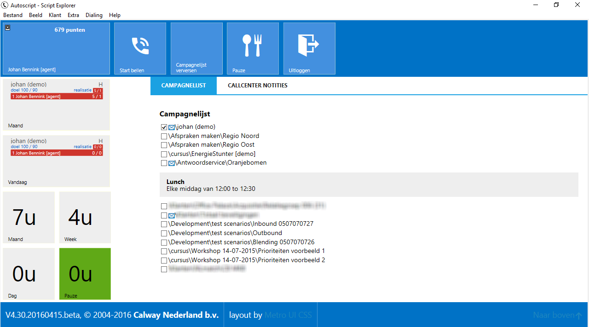

In de campagnelijst staan alle campagnes die aan de agent zijn
gekoppeld. Een blauwe enveloppe geeft aan dat er een notitie beschikbaar
is. Door op deze enveloppe te klikken wordt de informatie getoond. De
mogelijk voor de agent om zelf campagnes aan/uit te schakelen kan worden
beperkt op globaal niveau of per campagne worden ingesteld met de
variabele BREAK.DisableCampaignSelection.

| Variabele                      | Type | Betekenis                                                                                                                                                                                                                                                                        |
| ------------------------------ | ---- | -------------------------------------------------------------------------------------------------------------------------------------------------------------------------------------------------------------------------------------------------------------------------------- |
| BREAK.DisableCampaignSelection | Bool | True/**False** Bepaald of agenten in het pauzescherm zelf de campagnes aan/uit kunnen vinken waar ze aan zijn gekoppeld. Dit is een globale switch, op campagne. Als deze False is kan op campagne niveau met een zelfde variabele per campagne dit gedrag aan/uit worden gezet. |

# Belscripts maken voor gevorderden

Een belscript in CallPro kan ook met behulp van HTML worden gemaakt. De
gehele look-and-feel is dan vrij in te vullen met behulp van standaard
html pagina’s, of ASP.NET of php. Deze manier van belscripts maken biedt
meer vrijheid, maar vergt ook meer tijd en werk om een compleet
belscript te maken.

In situaties waar met meerdere pagina’s in het belscript gewerkt gaat
worden, of complexe beslissingsbomen (callflows) in het belscript
verwerkt moeten worden, of selectief belopdrachtstatussen beschikbaar
worden gemaakt per situatie (plek in het belscript) is het handmatig
opbouwen van het belscript de beste methode.

De scriptdefinitie wijst dan enkel naar de startpagina.

TODO Verder uitwerken.

# Script systeemacties

In het belscript kunnen diverse commando’s worden gebruikt om functies
van CallPro op te roepen via een hyperlink of vanuit javascript.

Bij het gebruik van de hyperlink methode wordt de systeemactie in het
href attribuut van de hyperlink gebruikt \<a
href=”**{systeemactie}**”\>{label}\</a\>. Een andere methode is om
vanuit javascript een document.location=”**{systeemactie}**” uit te
voeren.

In deze paragraaf worden deze systeemacties behandeld die telkens als
URL in een hyperlink worden gebruikt.

### Terugbellenscherm

Met deze systeemactie wordt het terugbellen scherm geactiveerd. De Agent
is vrij om een van de terugbel belopdrachtstatussen te kiezen uit de
keuzelijst.

\#SCRIPT\_SELECTSTAT?STATCAT=CALLBACK

### Verwerkscherm

Met deze systeemactie wordt het verwerk scherm geactiveerd. De agent is
vrij om een van de verwerkt belopdrachtstatussen te kiezen uit de
keuzelijst.

\#SCRIPT\_SELECTSTAT?STATCAT=PROCESS

### Niet-bereikt scherm

Met deze systeemactie wordt het Niet bereikt scherm geactiveerd. De
agent is vrij om een van de Niet bereikt belopdrachtstatussen te kiezen
uit de keuzelijst.

\#SCRIPT\_SELECTSTAT?STATCAT=NOREACH

### Belopdracht afcoderen

Activeert afhankelijk van de categorie van de StatCode-parameter het
terugbellenscherm, het verwerkscherm of het niet-bereiktscherm. In het
betreffende scherm is de belopdrachtstatus geselecteerd en kan niet
gewijzigd worden.

\#SCRIPT\_SELECTSTAT?STATCODE=\<status-code\>\[\&AUTOSELECT\]\[\&CALLBACKEXPR=\<callback-expr\>\]\[\&CALLBACKAGENT=\<agent-pad\>\[\&PRIORITY=\<number\>\]\[\&MOVEENTRY=\<bellijst-pad\>\]\[\&CHANGENOTE={
ON | OFF }\]\[\&CHANGETELNR={ ON | OFF }\]

Een aantal paramaters is optioneel. Deze parameters bepalen enkele extra
instellingen bij de status.

| Optionele paramater | Betekenis en gebruik                                                                                                                                                                                                            |
| ------------------- | ------------------------------------------------------------------------------------------------------------------------------------------------------------------------------------------------------------------------------- |
| \&AUTOSELECT        | Door deze parameter op te nemen wordt de weergave van het popupvenster onderdrukt en wordt direct afgecodeerd.                                                                                                                  |
| \&CALLBACKEXPR      | Met deze parameter kan de standaard terugbeltijd die voor de betreffende belopdrachtstatus geldt worden aangepast.                                                                                                              |
| \&CALLBACKAGENT     | Met deze parameter kan de standaard ingestelde (terugbel-)agent worden aangepast. Vul hier het volledige pad naar de Agent resource in.                                                                                         |
| \&PRIORITY          | Met deze parameter kan de standaard prioriteit van de betreffende belopdrachtstatus worden aangepast. De prioriteit moet wel liggen binnen de range die voor het type status (niet bereikt, terugbellen of verwerkt) geldig is. |
| \&MOVEENTRY         | Met deze parameter kan de belopdracht tijdens het afcoderen fysiek worden verplaatst naar een andere bellijst. De bellijst moet compatibel zijn qua velden en belopdrachtstatus met de bellijst waar de belopdracht uit komt.   |
| \&CHANGENOTE        | Geeft aan of de Agent in het CallPro popupvenster het notitieveld mag bewerken.                                                                                                                                                 |
| \&CHANGETELNR       | Geeft aan of de Agent in het CallPro popupvenster het ingestelde telefoonummerveld dat wordt gebruikt voor het terugbellen mag wijzigen.                                                                                        |

### Starten windows applicatie

Met deze systeemactie kan een externe windows applicatie worden geopend.
Geef het complete pad op naar de .EXE of .BAT/.CMD van het programma
gestart moet worden.

\#SCRIPT\_WINEXEC?FILE=\<bestandsnaam\>

### Herstellen/annuleren wijzigingen

Met deze systeemactie kunnen de veldwaarden in de actuele belscript
pagina worden teruggezet naar de waarden zoals ze waren toen de pagina
werd geladen. Let op\! Dit geldt alleen voor de velden die op deze
pagina staan.

\#SCRIPT\_RESTOREINPUT

### Aanmelden

Met deze systeemactie kan de agent zich aanmelden. Hij zal direct de
eerstvolgende belopdracht ontvangen. De AUTOSELECT-parameter zorgt
ervoor dat het dialoogvenster dat normaal wel wordt getoond niet wordt
getoond. Zonder AUTOSELECT wordt de meegegeven keuze (als die er is) als
standaardkeuze gebruikt.

\#SCRIPT\_SUBSCRIBE?\[DIALMODE={OUTBOUND | INBOUND | CALLBLENDING
}\[\&AUTOSELECT\]

### Pauze

Met deze systeemactie kan de agent aangeven dat hij na het huidige
gesprek naar de pauze-stand wil overgaan. CallPro zorgt ervoor dat de
agent na beëindiging van het huidige gesprek door een afcodeer
systeemactie automatisch overgaat in de pauze-stand.

Indien de NOCONFIRM-parameter wordt meegegeven wordt er overgegaan in de
pauze-stand zonder tussenkomst van een bevestigingscherm met de vraag
"wilt u na het beëindigen van het gesprek overgaan in de pauzestand?".
De andere twee parameters SET en CLEAR zorgen respectievelijk voor het
instellen en het opheffen van het pauze-verzoek.

\#SCRIPT\_BREAK?\[{ SET | CLEAR }\]\[\&NOCONFIRM\]

### Uitloggen

Met deze systeemactie kan de agent aangeven dat hij na het huidige
gesprek wil uitloggen. CallPro zorgt ervoor dat de agent na beëindiging
van het gesprek uitlogt. Indien de NOCONFIRM-parameter wordt meegegeven
wordt er uitgelogd zonder tussenkomst van een bevestigingsscherm met de
vraag "wilt u na het beëindigen van het gesprek uitloggen?". De andere
twee parameters SET en CLEAR zorgen respectievelijk voor het instellen
en het opheffen van het uitlog-verzoek.

\#SCRIPT\_LOGOUT?\[{ SET | CLEAR }\]\[\&NOCONFIRM\]

### Telefoonnummer kiezen

Met deze actie wordt het 1<sup>e</sup> telefoonnummer van de belopdracht
gekozen. Deze actie wordt vooral gebruikt bij preview dialing, maar kan
ook worden gebruikt om een tweede, alternatief nummer, te bellen. Met de
optionele parameter TELNR kan een willekeurig telefoonnummer ingesteld
worden.

\#SCRIPT\_DIAL?\[TELNR=\<telefoonnummer\>\] \[\&AUTOSELECTSTAT= { TRUE |
FALSE } \]

### Beëindig gesprek

Met deze systeemactie wordt een actief gesprek beëindigd, de
telefoonlijn wordt opgehangen.

\#SCRIPT\_HANGUP

### Doorschakelen naar Bel-me-niet IVR

Indien de bel-me-niet module beschikbaar is in de licentie wordt met
deze systeemactie een actief gesprek doorgezet naar de IVR voor een
bel-me-niet registratie. De agent komt hiermee in wrapup.

\#SCRIPT\_REGDONOTCALL

### Dialing configuratie

Met deze actie wordt het Dialing Configuratiescherm opgeroepen.

\#SCRIPT\_DIALOPTIONS

### Verander wachtwoord

Met deze systeemactie kan de agent zijn wachtwoord wijzigen.

\#SCRIPT\_CHANGEPASSWORD

### Nieuwe belopdracht

Met deze systeemactie kan een nieuwe belopdracht worden toegevoegd aan
een aan de agent gekoppelde bellijst. Deze actie is alleen beschikbaar
voor <span class="underline">inbound</span> campagnes. Nadat de agent
een campagne en bellijst heeft geselecteerd wordt het
Belopdracht-eigenschappenscherm geopend en kunnen de gegevens van de
nieuwe belopdracht worden ingevoerd.

\#SCRIPT\_NEWENTRY

### Zoek belopdracht

Met deze menuoptie wordt het Belopdracht/Prospect Zoeken-applet geopend.
Deze actie is alleen beschikbaar voor <span class="underline">inbound</span> campagnes.

\#SCRIPT\_SEARCHENTRY

### Terug navigeren

Bestaat het script uit meerdere pagina's dan kan deze actie worden
gebruikt om een stap terug te doen naar de vorige pagina.

\#SCRIPT\_BACK

### Vooruit navigeren

Als gebruik is gemaakt van de Terug-knop kan deze knop worden gebruikt
om weer naar voren te stappen in het script. De knop kan alleen worden
gebruikt om de stappen die terug zijn genomen ongedaan te maken en is
niet bedoeld om door het script te bladeren.

\#SCRIPT\_FORWARD

### Belopdracht eigenschappen

Met deze actie wordt het belopdracht-eigenschappenscherm opgeroepen.

\#SCRIPT\_PROPERTYENTRY

### Oproep agendamodule

Met deze systeemactie wordt de agendamodule gestart. Met de parameter
CALENDAR kan de standaard weergegeven agenda bepaald worden (CALENDAR
dient de naam van de agenda te bevatten). Met de parameter DISABLESWITCH
kan in de agenda voorkomen worden dat de gebruiker tussen meerdere
agenda's kan schakelen.

\#SCRIPT\_CALLMODULE?MODULE=CALENDAR.APP\[\&CALENDAR=\<calendar\>\]\[\&DISABLESWITCH\]

### Volgende belopdracht

Met deze systeemactie kan in de outbound-mode de eerstvolgende aan te
bieden belopdracht worden bepaald. De optie PROMPT toont een
info-messagebox na uitvoeren van de actie. De optie CLEAR annuleert de
eventueel ingestelde belopdracht.

Bij herhaaldelijk instellen van belopdrachten wordt de laatste impliciet
geannuleerd. Bij uitloggen na instellen van een belopdracht wordt de
belopdracht automatisch vrijgegeven. De belopdracht mag niet al in
gebruik (vergrendeld) zijn bij de aanvraag.

\#SCRIPT\_NEXTENTRY?{ ENTRYID=\<entryid\>\&CAMPAIGNID=\<campaignid\> |
CLEAR }\[\&PROMPT\]

### Call blending; overschakelen op andere dial mode

De agent zal door deze systeemactie afhankelijk van de context naar
inbound of outbound switchen. Het commando werkt analoog aan een
Pauze-verzoek; het verzoek zal ingewilligd worden indien het systeem
daar toe in staat is.

\#SCRIPT\_SWITCHDIALMODE?\[{ SET | CLEAR
}\]\[\&NOCONFIRM\]\[CAMPAIGNID=\<id\>\&NEWENTRY\]

Met de optie CAMPAIGNID=\<id\>\&NEWENTRY schakelt CallPro voor de
volgende call over naar de genoemde campagne en begint een nieuwe blanco
belopdracht.

### Work modus van agent; het plaatsen van een agent in een work modus

Hiermee kan een agent in een bepaalde work modus gezet worden. Een agent
die inbound aan het bellen is, kan zichzelf via deze scriptactie
(tijdelijk) afmelden bij de dialer waardoor hij geen gesprekken meer
ontvangt.

\#SCRIPT\_SETAGENT?MODE={ READY | NOT\_READY }

### Cancel belopdracht; de belopdracht wordt beëindigd zonder te bewaren

Hiermee een agent een belopdracht beëindigen zonder te bewaren. Deze
systeemactie werkt alleen in inbound campagnes.

\#SCRIPT\_CANCELENTRY

### Speciale hyperlink anchors

Met deze speciale anchors kan binnen de pagina worden gesprongen waarbij
bepaald gedrag kan worden onderdrukt.

\#\<name\>\&SCRIPT\_OPTION={ NODATA | NOSAVE | NORESTORE }

### Opnemen gesprek

Met deze systeemactie kan de opname van het gesprek worden gestuurd.

\#SCRIPT\_RECORDING?ACTION={ START | STOP | RESUME | PAUSE | TOGGLE }

### Gesprek direct doorschakelen (blind transfer)

Met deze systeemactie wordt een actief gesprek (live call) direct
doorgeschakeld naar het opgegeven nummer. De agent schakelt hierdoor
naar de wrapup fase.

\#SCRIPT\_TRANSFER?TYPE=BLIND\&CONTEXT=dialer-transfer\&TARGET=\<telefoonnummer\>

Een alternatieve variant hierop is:

\#SCRIPT\_TRANSFER?TYPE=BLINDEARLYMEDIA\&CONTEXT=dialer-transfer\&TARGET=\<telefoonnummer\>

Deze variant schakelt het audiokanaal aal door voordat de target heeft
opgenomen. Dit is vooral bruikbaar als er doorgeschakeld wordt naar
nummers die geen “answer” geven maar wel al audio afspelen zodat
gebruikt bij 0800 en 09xx nummers.

### Gesprek met ruggespraak doorverbinden (attended transfer) 

Met deze systeemactie wordt het doorverbinden van een actief gesprek
(live call) met ruggespraak gestart. Het actieve gesprek wordt
geparkeerd. Deze variant is bedoeld als de Agent uit meerdere nummers
kan kiezen en niet direct het eerste nummer geprobeerd moet worden maar
de agent nog tijd nodig heeft om het juiste nummer te vinden/kiezen.

\#SCRIPT\_TRANSFER?TYPE=ATTENDEDPREVIEW\&CONTEXT=dialer-transfer

Met deze systeemactie wordt het doorverbinden van een actief gesprek
(live call) met ruggespraak gestart en wordt direct het nummer gebeld
waarmee doorverbonden gaat worden na ruggespraak.

\#SCRIPT\_TRANSFER?TYPE=ATTENDED\&CONTEXT=dialer-transfer\&TARGET=\<telefoonnummer\>

### Doorverbinden met ruggespraak annuleren

Met deze systeemactie wordt een actieve doorverbind actie geannuleerd en
krijgt de agent de beller weer aan de lijn.

\#SCRIPT\_TRANSFER?TYPE=ABORT

Met deze systeemactie wordt een actieve doorverbind doel (gesprek)
beëindigt maar blijft de attended transfer actief. Hiermee kan de agent
een nieuwe attended transfer target bellen (met TYPE=ATTENDED) en blijft
het gesprek dat doorgeschakeld moet worden in de wacht staan.

\#SCRIPT\_TRANSFER?TYPE=SOFTABORT

### Doorverbinden met ruggespraak voltooien

Met deze systeemactie wordt een actieve doorverbind actie afgerond. De
Agent komt hierdoor in wrapupfase en de beller is doorverbonden met de
externe/andere partij.

\#SCRIPT\_TRANSFER?TYPE=COMPLETE

### Doorverbinden wissel gesprekken

Met deze systeemactie kan tijdens een actieve doorverbind actie met
ruggespraak worden gewisseld tussen de beller en de externe/andere
partij voor ruggespraak.

\#SCRIPT\_TRANSFER?TYPE=SWITCHPARTIES

### Verstuur DTMF-tonen

Met deze systeemactie kunnen DTMF tonen worden gestuurd die nodig zijn
om in een gesprek door een IVR de navigeren. Dit werkt alleen met G711
codec.

\#SCRIPT\_SENDDTMF?DIGITS=\<digits\>

### Zet een gesprek on hold

Met deze systeemactie kan een actief gesprek (live call) on hold worden
gezet zodat de beller niet hoort wat de agent zegt.

\#SCRIPT\_HOLD?{ ON | OFF | TOGGLE }

# Belscript (querystring) parameters

Bij het laden van het belscript wordt aan de eerste pagina een aantal
parameters in de url meegegeven. Deze parameters kunnen worden gebruikt
in dynamische ASP.NET of php pagina’s om op te slaan, en later te
gebruiken om extra informatie rechtstreeks uit de CallPro database te
lezen.

### Belscript startpagina

Bij het oproepen van de startpagina van het belscript worden de volgende
parameters meegegeven.

| Parameter  | Inhoud                                                                                                |
| ---------- | ----------------------------------------------------------------------------------------------------- |
| AGENTID    | De unieke ID van de Agent die is ingelogd op de werkplek                                              |
| CLENTRYID  | De unieke ID van de belopdracht die wordt geopend                                                     |
| CAMPAIGNID | De unieke ID van de campagne waar de belopdracht in wordt geopend                                     |
| RAWTELNR   | Het 1<sup>e</sup> telefoonnummer van de belopdracht die wordt geopend in RAW formaat (+31 0507070720) |
| CALLLISTID | De unieke ID van de bellijst waar de belopdracht uit komt                                             |
| DIALMODE   | De dialmode: 1 = Outbound, 5 = inbound                                                                |
| LANGUAGE   | De taal die staat ingesteld op de werkplek: nl                                                        |

### Pauze pagina

Bij het oproepen van de pauze pagina die geldt voor de belplek (of
globaal) worden de volgende parameters meegegeven.

| Parameter | Inhoud                                                   |
| --------- | -------------------------------------------------------- |
| AGENTID   | De unieke ID van de Agent die is ingelogd op de werkplek |
| LANGUAGE  | De taal die staat ingesteld op de werkplek: nl           |

### Inbound pagina

Bij het oproepen van de inbound (wacht) pagina die in de inbound modues
word tafgebeeld tussen gesprekken tijdens het wachten worden de volgende
parameters meegegeven.

| Parameter | Inhoud                                                   |
| --------- | -------------------------------------------------------- |
| AGENTID   | De unieke ID van de Agent die is ingelogd op de werkplek |
| LANGUAGE  | De taal die staat ingesteld op de werkplek: nl           |

# Belscript systeemvelden (deprecated)

In het belscript worden de velden voorafgegaan door een speciale prefix
**script\_**. De waarden van deze velden worden in de CallPro-database
opgeslagen. De prefix wordt in het belscript toegevoegd aan de veldnaam
om duidelijk het onderscheid aan te geven tussen bellijstvelden en
overige velden in het script.

Belscript-systeemvelden worden aan het belscript meegegeven. De waarden
van deze velden zijn dus beschikbaar in het belscript. Ze zijn te
herkennen aan de prefix **script\_sys\_** en worden gezet door
**CallPro**.

Wij raden af om deze methode te gebruiken en adviseren in de plaats
daarvan de object hierarchische velden in te zetten.

| Systeemveld                      | Hierarchisch veld                                            | Betekenis                                                                                                                                                                                                                                                                                                                                                                                                                                                                                                              |
| -------------------------------- | ------------------------------------------------------------ | ---------------------------------------------------------------------------------------------------------------------------------------------------------------------------------------------------------------------------------------------------------------------------------------------------------------------------------------------------------------------------------------------------------------------------------------------------------------------------------------------------------------------- |
| script\_sys\_agentid             | script\_sys\_oagent\_id                                      | Dit is de unieke code van de agent die op dit moment contact legt met het telefoonnummer.                                                                                                                                                                                                                                                                                                                                                                                                                              |
| script\_sys\_agentname           | script\_sys\_oagent\_name                                    | Dit is de naam zoals die voor de agent is vastgelegd.                                                                                                                                                                                                                                                                                                                                                                                                                                                                  |
| script\_sys\_clentryid           | script\_sys\_oentry\_id                                      | De unieke identificatie van de huidige item dat wordt weergegeven door het belscript.                                                                                                                                                                                                                                                                                                                                                                                                                                  |
| script\_sys\_callagentid         | script\_sys\_oentry\_ocallbackagent\_id                      | De unieke code van de agent die de vorige [belpoging](javascript:BSSCPopup\('Belpoging.htm'\);) heeft gedaan.                                                                                                                                                                                                                                                                                                                                                                                                          |
| script\_sys\_callagentname       | script\_sys\_oentry\_ocallbackagent\_name                    | De naam van de agent die de vorige belpoging heeft gedaan.                                                                                                                                                                                                                                                                                                                                                                                                                                                             |
| script\_sys\_callbegindatetime   | script\_sys\_                                                | De datum + tijd van de start van het gesprek. Dit is het tijdstip waarop het bellijstitem is aangeboden bij de agent. Dit komt niet exact overeen met het tijdstip waarop de agent contact legt.                                                                                                                                                                                                                                                                                                                       |
| script\_sys\_callbegindate       | script\_sys\_                                                | Het datum-deel van het veld CallBegin.                                                                                                                                                                                                                                                                                                                                                                                                                                                                                 |
| script\_sys\_callbegintime       | script\_sys\_                                                | Het tijd-deel van het veld CallBegin.                                                                                                                                                                                                                                                                                                                                                                                                                                                                                  |
| script\_sys\_scriptname          | script\_sys\_                                                | De naam van het belscript dat wordt weergegeven in de Script Explorer.                                                                                                                                                                                                                                                                                                                                                                                                                                                 |
| script\_sys\_calllistid          | script\_sys\_ocalllist\_id                                   | De unieke code van de bellijst waaruit het huidige weergegeven item komt.                                                                                                                                                                                                                                                                                                                                                                                                                                              |
| script\_sys\_calllistname        | script\_sys\_ocalllist\_name                                 | De naam van de bellijst.                                                                                                                                                                                                                                                                                                                                                                                                                                                                                               |
| script\_sys\_importid            | script\_sys\_oentry\_importid                                | De unieke code van de Import die het huidige item heeft toegevoegd aan de bellijst.                                                                                                                                                                                                                                                                                                                                                                                                                                    |
| script\_sys\_callstatusid        | script\_sys\_oentry\_ocallstatus\_id                         | De belopdrachtstatus die het item had op het moment dat het aan de Agent is aangeboden. De standaard bij CallPro geleverde belopdrachtstatussen hebben de volgende id's: nieuwe belopdracht (0), verwerkt (1), sit tone (2), geen gehoor (3), voicemail (4), fax/modem (5), in gesprek (6), terugbellen (7), afspraak (8) (bij de agendamodule). |
| script\_sys\_callstatusname      | script\_sys\_oentry\_ocallstatus\_name                       | De omschrijving van de belopdrachtstatus.                                                                                                                                                                                                                                                                                                                                                                                                                                                                              |
| script\_sys\_callstatusdatetime  | script\_sys\_oentry\_callstatdatetime                        | De datum + tijd waarop de belopdrachtstatus is gezet. In het belscript kan dit veld worden gebruikt om te refereren naar het vorige contact.                                                                                                                                                                                                                                                                                                                                                                           |
| script\_sys\_callpriority        | script\_sys\_oentry\_statpriority                            | De prioriteit van het item in de bellijst. Des te hoger de waarde, des te lager de prioriteit. Voor meer uitleg over Statusprioriteiten.                                                                                                                                                                                                                                                                                                                                                                               |
| script\_sys\_noreachflag         | script\_sys\_oentry\_noreachflag                             | Met deze vlag wordt aangegeven of het item een **Niet bereikt**-status had op het moment dat het aan de Agent is aangeboden. Dit veld kan worden gebruikt in het belscript om een gewijzigde tekst weer te geven.                                                                                                                                                                                                                                                                                                      |
| script\_sys\_callstatuscatid     | script\_sys\_                                                | De unieke code van de prioriteit van de belopdrachtstatus. Er zijn vier categorieën: Niet bereikt (waarde=1), terugbellen (waarde=2), verwerkt (waarde=3) en nieuwe belopdracht (waarde=4). De prioriteit bepaalt de verwerkingsvolgorde van de belopdrachten.                                                                                                                                                                                         |
| script\_sys\_nrofattempts        | script\_sys\_oentry\_nrofattempts                            | Dit veld geeft het totaal aantal belpogingen aan op dit telefoonnummer.                                                                                                                                                                                                                                                                                                                                                                                                                                                |
| script\_sys\_nrofnoreach         | script\_sys\_oentry\_nrofnoreach                             | Dit veld geeft het aantal belpogingen waarbij voor de optie **Niet bereikt** is gekozen sinds het laatste contact. Telkens als contact is geweest en het gesprek wordt beëindigd met **Verwerk** of **Terugbellen** wordt deze telling op 0 gezet.                                                                                                                                                                                                                                                                     |
| script\_sys\_entrynote           | script\_sys\_oentry\_notes                                   | Opmerkingen die aan een belopdracht kunnen worden toegevoegd.                                                                                                                                                                                                                                                                                                                                                                                                                                                          |
| script\_sys\_campaignid          | script\_sys\_ocampaign\_id                                   | De unieke code van de campagne waarin de huidig geactiveerde bellijst staat.                                                                                                                                                                                                                                                                                                                                                                                                                                           |
| script\_sys\_campaignname        | script\_sys\_ocampaign\_name                                 | De naam van de campagne.                                                                                                                                                                                                                                                                                                                                                                                                                                                                                               |
| script\_sys\_cli                 | script\_sys\_odialer\_                                       | Voor het inbound CLI-nummer.                                                                                                                                                                                                                                                                                                                                                                                                                                                                                           |
| script\_sys\_ddi                 | script\_sys\_odialer\_                                       | Voor het inbound DDI-nummer.                                                                                                                                                                                                                                                                                                                                                                                                                                                                                           |
| script\_sys\_dialmode            | script\_sys\_odialer\_                                       | De dial-mode van de agent; 1=outbound, 5=inbound.                                                                                                                                                                                                                                                                                                                                                                                                                                                                      |
| script\_sys\_lastcontactdatetime | script\_sys\_oentry\_olastcontactattempt\_ callbegindatetime | Dit veld geeft de tijd aan waarop het laatst contact is geweest met de klant/prospect.                                                                                                                                                                                                                                                                                                                                                                                                                                 |

# Object hiërarchische velden

Naast de belscript systeemvelden is er nog een methode om systeemvelden
op te vragen. Deze methode maakt gebruik van een naam die het volledige
pad uit het CallPro scripting objecten gebruikt. De volgende scripting
objecten worden ondersteund:

| Object            | Betekenis                                                                 |
| ----------------- | ------------------------------------------------------------------------- |
| oAgent            | De agent die is ingelogd                                                  |
| oSeat             | De werkplek waarop is ingelogd                                            |
| oEntry            | De huidige belopdracht die op het scherm staat en wordt bewerkt           |
| oCampaign         | De campagne waar de huidige belopdracht uit afkomstig is                  |
| oCallList         | De bellijst waar de huidige belopdracht zich bevindt                      |
| oCallListShortcut | De bellijst koppeling in de campagne waaruit de belopdracht is aangeboden |
| oDialer           | Het dialer object dat wordt gebruikt                                      |

Sommige objecten zijn afhankelijk van de context waarin ze worden
gebruikt. Bijvoorbeeld script\_sys\_oagent\_name Geeft de naam van de
agent dis is ingelogd. Terwijl script\_sys\_oentry\_ocallbackagent\_name
de naam geeft van de agent die op de huidige belopdracht staat ingesteld
als terugbelagent.

TODO verder uitwerken van de properties en sub-objecten (de hiërarchie)

## Basis eigenschappen

| Object  | Betekenis                                                |
| ------- | -------------------------------------------------------- |
| Name    | De naam (identificatie) van de CallPro resource          |
| ID      | Unieke identificatie van de CallPro resource             |
| Descr   | De omschrijving die is ingevuld voor deze resource       |
| Enabled | Is deze resource actief of niet                          |
| Path    | Volledige pad waar deze resource zich in CallPro bevind. |

## oEntry

Naast de basis eigenschappen heeft het oEntry object de volgende
aanvullende objecten en properties die kunnen worden uitgelezen.

| Object/Property           | Betekenis                                                                                                                                                                                      |
| ------------------------- | ---------------------------------------------------------------------------------------------------------------------------------------------------------------------------------------------- |
| oCallList                 | De bellijst waar deze belopdracht toe behoort.                                                                                                                                                 |
| oCallbackAgent            | De ingestelde terugbelagent                                                                                                                                                                    |
| oCallstatus               | De status die deze belopdracht op dit moment heeft                                                                                                                                             |
| oLastContactAttempt       | Een verwijzing naar de belpoging die correspondeert met het voorgaande live contact (op basis van de toegekende status)                                                                        |
| oFirstCurrentAppointment  |                                                                                                                                                                                                |
| oLastPassedAppointment    |                                                                                                                                                                                                |
| CallStatDateTime          | De datum/tijd die is ingesteld tijdens het afcoderen. Dit kan de datum van afcoderen zijn, maar voor Terugbellen/Niet bereikt staat hier de datum waarop de belopdracht weer wordt aangeboden. |
| CallbackDateTime          | Dit is de datum/tijd die is ingesteld op het moment van de vorige afcodering met ene terugbellen status                                                                                        |
| StatPriority              | De voor deze belopdracht geldende status prioriteit. Deze waarde bepaalde de volgorde van aanbieden. Hoe lager de waarde hoe eerder deze belopdracht wordt aangeboden.                         |
| NrOfAttempts              | Het huidige aantal voorgaande belpogingen                                                                                                                                                      |
| NrOfNoReach               | Het huidige aantal voorgaande Niet bereikt afcoderingen. Telkens nadat een Terugbellen wordt afgecodeert wordt dit getal weer op 0 gezet.                                                      |
| CallbackDelay             |                                                                                                                                                                                                |
| CallbackDelayDescr        |                                                                                                                                                                                                |
| InitialCallbackDelay      |                                                                                                                                                                                                |
| InitialCallbackDelayDescr |                                                                                                                                                                                                |
| NoReachFlag               |                                                                                                                                                                                                |
| ImportID                  |                                                                                                                                                                                                |
| Notes                     | De huidige belopdracht notitie                                                                                                                                                                 |
| TelNr                     | Het telefoonnummer (opgemaakt)                                                                                                                                                                 |
| SelectedTelNr             | Het telefoonnummer dat CallPro op dit moment actief benaderd                                                                                                                                   |
| SelectedRAWTelNr          | De RAW versie van het actieve telefoonnummer                                                                                                                                                   |
| RAWTelNr                  | Het telefoonnummer zoals het in de database is opgeslagen                                                                                                                                      |

## oAttempt

| Object/Property   | Betekenis |
| ----------------- | --------- |
| oCallstatus       |           |
| CallStatsDateTime |           |
| CallBeginDateTime |           |
| CallSetupDateTime |           |
| CallEndDateTime   |           |

## oCallList

Een CallPro bellijst resource

| Object/Property | Betekenis |
| --------------- | --------- |
|                 |           |

## oDialer

Het Dialer object geeft toegang tot diverse dialer instellingen

| Object/Property | Betekenis |
| --------------- | --------- |
| Cli             |           |
| Ddi             |           |
| DialMode        |           |

## oAgent

Het Agent resource wordt meestal genoemd icm de specifieke toepassing.
Bijvoorbeeld oCreatedUser of oModifiedUser of zelfs oCallbackAgent. Wij
benoemen het object hier bij zijn algemene naan oAgent.

| Object/Property | Betekenis |
| --------------- | --------- |
| UserName        |           |

## oCallstatus

De CallPro belopdrachtstatus resource.

| Object/Property | Betekenis |
| --------------- | --------- |
|                 |           |

## oAppointment

Het Appointment resource wordt meestal genoemd icm de specifieke
toepassing. Bijvoorbeeld oFirstCurrentAppointment of
oLastPassedAppointment.

| Object/Property | Betekenis |
| --------------- | --------- |
|                 |           |

# CallPro objectmodel

Het CallPro objectmodel dat door de windows client wordt beschikbaar
gesteld.

TODO ook dit uitwerken met javascipt voorbeelden

In de nieuwe script module is een reference te krijgen via
“window.external”

# TODO: Wallboard

Voor weergave in het call center biedt het autoscript een Wallboard
functie. Op het wallboard kan tijdens de shift nuttige informatie worden
weergegeven zoals targets, leaderboard voortgang en Shift
eindresultaten.

Voor de huidige versie ligt de definitie van shift en de weergave van
informatie redelijk vast. In aankomende versies van het autoscript
worden deze mogelijkheden verder uitgebreid.

# Rapportage

Voor de dagelijkse aansturing is het van belang dat de supervisor een
overzicht heeft van de resultaten per campagne. Voor de aansturing van
de medewerkers heeft de supervisor ook inzicht in de performance van de
agenten nodig. Binnen de Resource Explorer zijn hiervoor enkel
overzichten beschikbaar.

## Belhistoriestatistieken

Start de wizard Belhistoriestatistieken, deze is te vinden onder XSL
Rapporten in de Resource Explorer. De belhistoriestatistieken geeft een
overzicht van de belpogingen die zijn uitgevoerd op de belopdrachten in
bellijsten. De wizard geeft toegang tot de rapportage templates, of er
kan een nieuwe blanco template worden gebruikt.

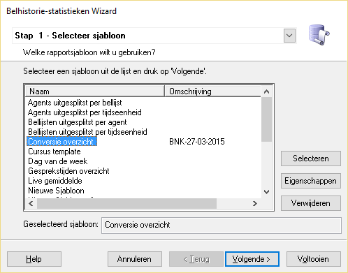 

In de tweede stap kiezen we de rapportage periode, meestal vandaag, deze
week, of deze maand, en optioneel nog welke dialingmode, bellijsten
en/of agenten we willen zien. Deze restrictie is vaak niet nodig omdat
alle resultaten zichtbaar moeten worden. Alleen als met teams wordt
gewerkt is het soms beter om een restrictie te zetten op bellijsten of
agenten.

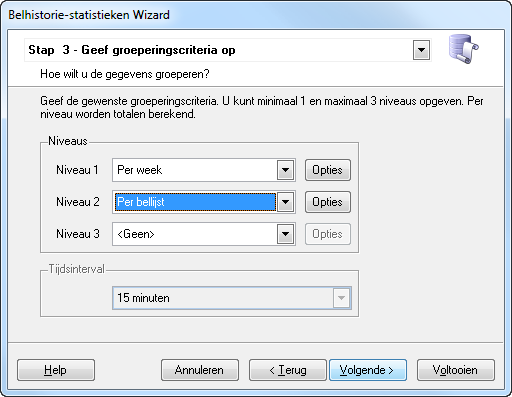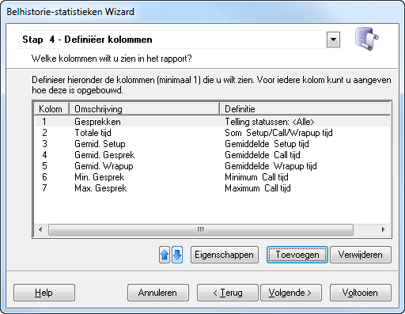

Vervolgens kan een aggregatieniveau worden ingesteld op maximaal 3
niveaus. Voor campagne scores wordt: “Per bellijst” of “Per campagne”
gebruikt, voor de agent scores “Per agent”. Voor een overzicht waarbij
de tijd meespeelt kan ook “Per dag” of “Per week” als een van de niveaus
worden toegevoegd. In stap 4 bepalen we de kolommen die gewenst zijn.
Een kolom kan een telling van belopdrachtstatussen, een tijdsmeting, of
een verhouding zijn.

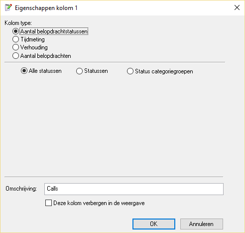
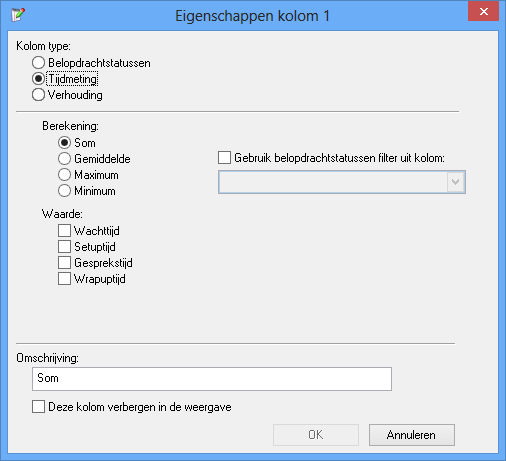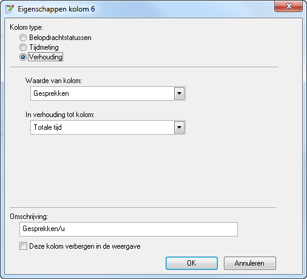

Bij de telling van belopdrachtstatussen kunnen individuele statussen
worden gekozen, of kan een “status categoriegroep” worden gekozen. Voor
de tijdsmeting wordt meestal de som of het gemiddelde gebruikt. Met
vinkjes kan worden aangegeven welke tijden gewenst zijn.

Let op\! Zet niet alle vinkjes. De wachttijd is de tijd die een Agent
heeft gewacht totdat hij/zij een nieuwe call kreeg, hierbij is de
setuptijd inbegrepen. De setuptijd telt alleen de tijd die het duurde om
het gesprek (live of non-live) op te zetten.  
Om alle tijd te krijgen moeten dus alle vinkjes
<span class="underline">behalve</span> Setuptijd worden gezet\! Of als
het gaat om de tijd die is besteed aan elke belpoging kan alles behalve
Wachttijd worden gebruikt.

Kies voor Verhouding om op basis van de waardes van 2 kolommen een
verhouding te berekenen. Als 2 aantallen kolommen worden gedeeld is het
resultaat een percentage. Wordt een tijdsmeting kolom gedeeld door een
aantal levert dit een gemiddelde tijd op, en als een aantal door een
tijdsmeting wordt gedeeld is het resultaat een aantal/uur.

Maak de kolommen op maat en bewaar de instellingen als nieuwe template.

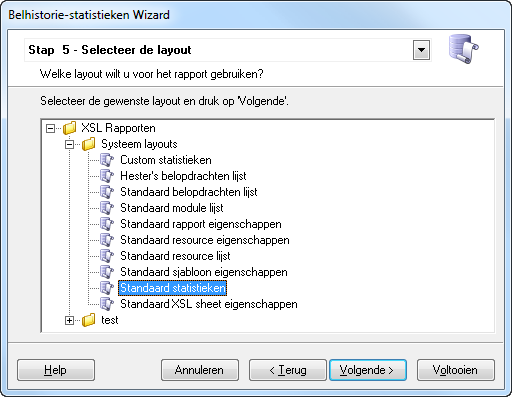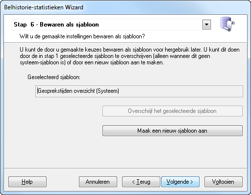

Als een bestaande template wordt gebruikt hoeft alleen stap 2 te worden
ingevuld en kan direct op voltooien worden gedrukt om naar stap 7 te
springen en het rapport uit te voeren.

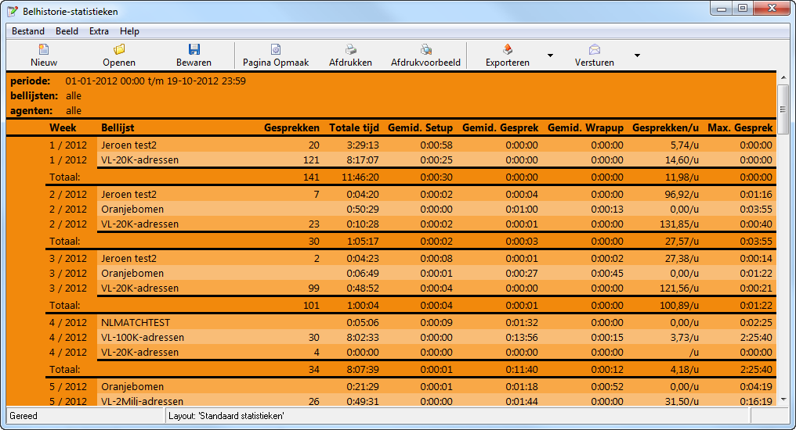

Kies voor “Beeld\\Verversen” om de cijfers te verversen, of kies voor
“Beeld\\Automatisch verversen” en kies het interval zodat CallPro
automatisch elke x minuten de cijfers actualiseert.

## Bellijst statistieken

Een eenvoudige vorm van de belhistoriestatistieken. Deze wizard laat
niet de belpogingen, maar de belopdrachten met hun actuele status zien.
In deze rapportage is daarom ook het aantal “Nieuwe belopdrachten” te
zien.

## Bellijst eigenschappen

Door op een bellijst onder “Resources\\Call-lists” of “Campaigns” met
right-click de optie “Statistieken” te kiezen worden de bellijst
statistieken getoond. Dezelfde informatie is ook zichtbaar in het
tabblad “Statistieken” in de eigenschappen schermen van de bellijst.

 

Zoals te zien is aan de bovenstaande screenshots is er wel een verschil.
Het scherm dat vanuit de campagne wordt geopend houdt rekening met het
filter dat op de bellijst in de betreffende campagne is gezet.

In de kolom “Aantal gedeactiveerd” worden belopdrachten getoond met de
betreffende status, maar die inactief staan en dus ook niet door CallPro
zullen worden aangeboden. \<REF:Verwijzing deactiveren belopdrachten\>

## Reportserver rapporten

Microsoft levert met SQL Server een rapportage tool “Reportserver” mee.
Vanuit een web-interface kunnen rapporten worden benaderd en op het
scherm, als pdf, of als Excel bestand worden weergegeven en opgehaald.

Ook biedt deze tool de mogelijkheid om rapporten periodiek uit te voeren
en het resultaat als email te versturen (niet bij de Express versie).
Bij CallPro worden standaard rapporten geleverd die op Reportserver
kunnen worden geïnstalleerd. Uitvoerige behandeling van deze rapporten
valt buiten de scope van dit handboek.

| Rapport                                      | Inhoud/gebruik                                                                                                                                                                                                                                                                                                                                               |
| -------------------------------------------- | ------------------------------------------------------------------------------------------------------------------------------------------------------------------------------------------------------------------------------------------------------------------------------------------------------------------------------------------------------------ |
| Standaard bellijst rapportage                | Dit rapport geeft een overzicht van een resultaten in de bellijst op basis van de huidige belopdrachtstatus. Statussen worden gegroepeerd onder “Te benaderen”, “Uitval”, “Geen interesse” en “Positief..                                                                                                                                                    |
| Standaard bellijst rapportage met beluren    | Hetzelfde rapport als de voorgaande, maar nu worden ook de beluren weergegeven.                                                                                                                                                                                                                                                                              |
| Standaard bellijst rapportage met scriptveld | Hetzelfde als de eerste, maar nu met de mogelijkheid om ook een uitsplitsing op een belscriptveld op te nemen.                                                                                                                                                                                                                                               |
| Standaard bellijst belvoorraad rapportage    | Dit rapport geeft een overzicht van de belbare adressen van alle campagne en per campagne de bellijsten uitgesplitst naar status. Hierbij wordt ook rekening gehouden met filters die op de bellijst in de campagnes zijn ingesteld.                                                                                                                         |
| Standaard Campagne voortgangsrapportage      | Dit rapport geeft de voortgang van een campagne weer op basis van de van te voren ingestelde parameters op de campagne. Zo worden het gesprekstarief, maximaal aantal gesprekken, conversie per live gesprek en conversie op gesprekken ingesteld en wordt op basis van de werkelijke cijfers een prognose van de totale kosten en kosten per score bepaald. |
| Standaard Agent conversie rapportage         | Dit rapport geeft per Agent inzicht in de beluren, en belpogingen gegroepeerd op belopdrachtstatus groepen. Tevens worden conversies per groep getoond in percentage en per uur.                                                                                                                                                                             |
| Agent sessietijden Rapportage                | Geeft inzage in het inlog- en pauze gedrag van agenten.                                                                                                                                                                                                                                                                                                      |
| Agent sessietijden Rapportage 2              | Een alternatieve versie met meer uitsplitsing                                                                                                                                                                                                                                                                                                                |
| Standaard Bellijst conversie rapportage      | Hetzelfde rapport als de voorgaande, maar nu per bellijst.                                                                                                                                                                                                                                                                                                   |
| Belvoorraad per scriptveld rapportage        | Dit rapport geeft een overzicht van de belbare adressen in een bellijst uitgesplitst naar de verdeling over een scriptveld (of een expressie)                                                                                                                                                                                                                |
| Bel-me-niet registraties per adverteerder    | Dit rapport geeft een overzicht van de aantallen bel-me-niet en RVV registraties per Adverteerder                                                                                                                                                                                                                                                            |
| Wachtrij overzicht                           | Geeft per wachtrij statistieken van aantallen gesprekken en wachttijd weer                                                                                                                                                                                                                                                                                   |
| Campagne Performance                         | Geeft voor 1 dag voor 1 of meer campagnes een performance overzicht van de dialer.                                                                                                                                                                                                                                                                           |
| Agendavulling                                | Een rapport dat voor een week de vulling van elke agenda per dag van de week weergeeft. Per dag is te zien hoeveel afspraken er staan, en hoeveel beschikbare blokken over zijn. Ook als een gebeurtenis op of over een afspraakblok staat telt deze niet meer als beschikbaar.                                                                              |

# Exporteren

Om de belresultaten die met CallPro worden gerealiseerd te exporteren
voor gebruik in andere systemen, of als terug levering naar de
opdrachtgever wordt gebruik gemakt van de Export optie in CallPro.


Na de keuze voor “exporteren...” start de exportwizard. Indien eerder
een export is gedaan op de bellijst dan zal de exportdefinitie van de
laatste export standaard zijn geselecteerd. Kies deze, een andere, of
maak een nieuwe exportdefinitie. Als we kiezen voor het maken van een
nieuwe exportdefinitie worden de volgende stappen doorlopen.

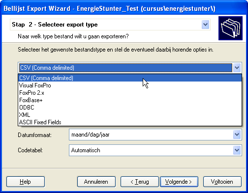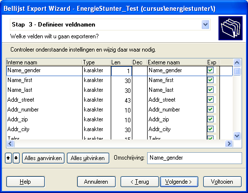

In stap 2 wordt het type exportbestand gekozen dat moet worden gemaakt.
Afhankelijk van deze keuze kunnen verdere instellingen worden gedaan.
Voor een CSV bestand moet worden opgegeven of het exportbestand een
kolom kop moet krijgen met de namen van de velden, of tekstvelden moeten
worden omsloten met een bepaald teken, welk karakter het
veldscheidingsteken moet zijn en in welk formaat een datum wordt
geschreven.

In stap 3 wordt aangegeven welke velden in het exportbestand worden
opgenomen. Alle scriptvelden staan standaard aan, en geen enkel
systeemveld van CallPro staat aangevinkt. Kies de velden die moeten
worden opgenomen en pas eventueel de externe naam aan. De externe naam
wordt bijvoorbeeld gebruikt als veldnaam in de kolomkop van
CSV-bestanden.

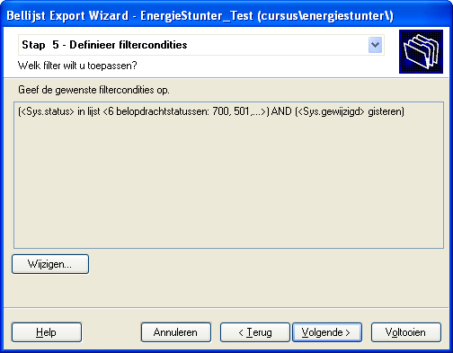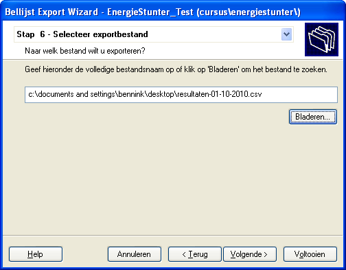

In Stap 4 wordt de nieuwe scriptdefinitie voorzien van een naam en
bewaard. Daarna vervolgt de export met stap 5 om een export filter te
definiëren. Meestal zal dit filter bestaan uit de te exporteren
belopdrachtstatussen en een gewijzigd datum. Export filters zijn gelijk
aan de filters die op bellijsten in de campagne kunnen worden gezet. Ten
slotte wordt in Stap 6 de bestandsnaam opgegeven van het exportbestand.


Bij reguliere exports van belresultaten zal Stap 7
<span class="underline">altijd met “nee” beantwoord</span> worden.
Alleen als het de bedoeling is om de belopdrachten ook te verwijderen
uit de bellijst moet hier “Ja” geantwoord worden. Let op dat bij de
keuze “Ja” alle belpogingen ook worden verwijderd en dus geen
rapportages meer mogelijk zijn.

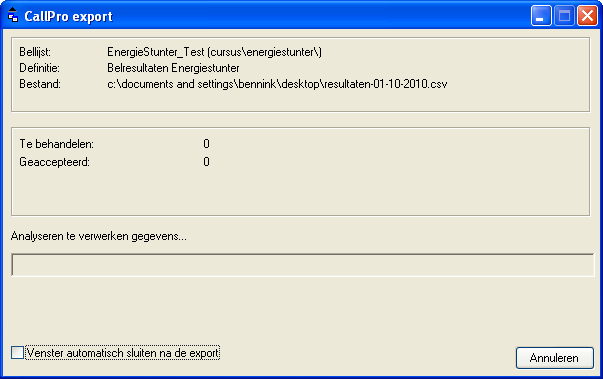

De export start en er wordt weergegeven hoeveel records er worden
geëxporteerd.

# CallPro FAQ

# Programma meldingen

## Melding bij aanmelden

Als bij het aanmelden vanuit pauze de volgende melding komt kan dit twee
oorzaken hebben.

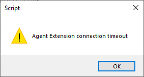

1.  De agent heeeft de oproep van zijn toestel (softphone) niet tijdig
    beantwoord. CallPro laat het toestel ongeveer 20 seconden overgaan.

2.  Het toestel bij de werkplek ging helemaal niet over. Ook dit kan
    weer meerdere oorzaken hebben.
    
    1.  Controleer eerst of het juiste toestelnummer is gebruikt
    
    2.  Controleer of het toestel kan bellen en gebeld worden op het
        nummer.

Na het oplossen van de problemen kan het aanmelden opnieuw worden
geprobeerd.

## Dubbel opstarten Scriptmodule

Als bij het opstarten van de Scriptmodule de onderstaande melding volgt
dan kan dit verschillende oorzaken hebben:


Voor Windows werkstations gelden de volgende stappen:

1.  Kijk in de statusbalk in windows of er niet al een Scriptmodule is
    gestart. 

2.  Open de Taskmanager en kijk of er nog een script.exe proces extra
    is. 

3.  Start de computer opnieuw en probeer de scriptmodule te starten. Als
    zich het probleem blijft voordoen dan is op de server (SQL Server)
    een proces voor dit werkstation blijven hangen). Start de Resource
    Explorer, ga naar de Werkplek resource toe, open de eigenschappen en
    ga naar het tabblad Inlogstatus. Gebruik nu de knop “Opruimen
    processen” of “Markeer als crashed” om de server processen op te
    ruimen.  
    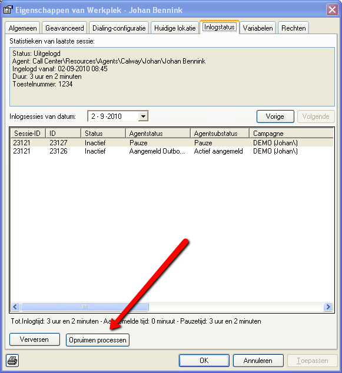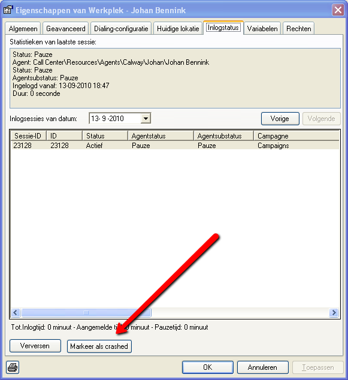

Voor Terminalserver thin-clients gelden de volgende stappen:

1.  Kijk op de terminal server of er een gedisconnecte sessie is voor de
    betreffende thin-client waar deze melding optreedt. Log deze sessie
    uit. Deze actie is meestal voorbehouden aan een windows gebruiker
    met administrator rechten. Het inloggen zou daarna weer mogelijk
    moeten zijn.

2.  Eventueel kan het nog nodig zijn om in de Resource Explorer met de
    optie “Processen opruimen” of “Markeer als crashed” de werkplek vrij
    te geven voor opnieuw inloggen.

## Ik krijg de melding “Belopdracht is al in gebruik” hoe kan dat?

Deze melding betekent dat de betreffende belopdracht die wordt geopend
of bewerkt al als “in gebruik” gemarkeerd staat door de Scriptmodule (of
de dialer). Meestal is de belopdracht op dat moment dan in het
callcenter in gebruik en moet er niets met deze melding worden gedaan.
Wacht tot de belopdracht is vrijgegeven en probeer het dan opnieuw.

Als het zeker is dat de belopdracht niet in het
callcenter in gebruik is, en ook de dialer de belopdracht niet actief
geladen heeft, dan kan het zijn dat de belopdracht vergrendeld is
gebleven nadat een gebruiker zijn Scriptmodule niet netjes heeft
afgesloten (crash). Als dit gebeurd en deze gebruiker start de
scriptmodule opnieuw en logt in dan zal CallPro de belopdracht
automatisch vrijgeven/ontgrendelen. Mocht dit om wat voor reden dan ook
niet gebeuren dan kan de belopdracht ook handmatig worden ontgrendeld.

Gebruik de zoeken belopdrachten applet om de belopdracht op te zoeken.
Dubbelklik de belopdracht om de eigenschappen te openen. Verwijder nu
het vinkje bij “Vergrendeld” om de belopdracht handmatig vrij te geven.
Druk dan op toepassen, of OK om de wijziging op te slaan.

## Hoe voorkom ik dat de klok op de werkstations fout staan ingesteld

CallPro heeft geen controle over de klok op de werkstations. Wel kan
CallPro een waarschuwing geven als de klok op het werkstation afwijkt
van de klok op de SQL Server.

De instelling hiervoor zit in het control panel van de Resource
Explorer. Ga naar Systeemconfiguratie en dan het tabblad Diagnose. Hier
wordt voor het werkstation de huidige afwijking van de lokale klok met
de SQL Server weergegeven. Ook kan hier de maximale afwijking worden
vastgelegd en of hier een waarschuwing voor moet worden gegeven bij het
opstarten van de Resource Explorer (en Script module).

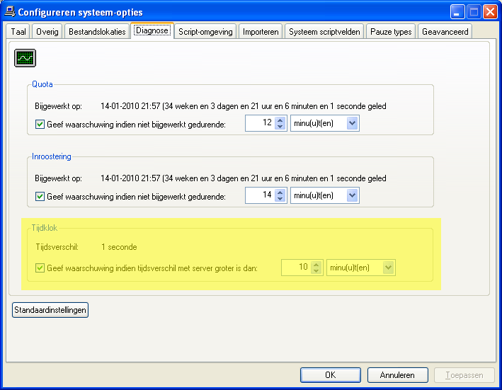

Het is belangrijk dat de klok op de werkstations gelijk lopen omdat de
terugbelafspraken anders niet correct worden aangeleverd en ingesteld.
Immers, als de klok op het werkstation 1 uur achterloopt en een agent
maakt een terugbelafspraak voor over een uur, dan zal CallPro deze
belopdracht direct weer aanleveren omdat de terugbeltijd die de agent
zal ingeven 1 uur achterloopt ten opzichte van de klok op de server.

Het is verstandig om via netwerk policies en Active Directory de rechten
van lokale gebruikers om de klok op het werkstation te wijzigen uit te
schakelen. Ook dient de klok op de werkstations en server te worden
gesynchroniseerd met 1 centrale klok in het netwerk (ntp).

## Optie “Processen opruimen” of “Markeer als crashed” werkt niet

Bij de installatie van CallPro worden op de database de juiste
instellingen gedaan om deze functies te laten werken. Als er iets met de
SQL Server gebeurd is of door andere software gewijzigd is kan het
gebeuren dat deze opties niet meer werken. Controleer dan de volgende
instellingen en corrigeer ze.

Open de Enterprise manager en ga naar Security\\Logins. Dubbelklik de
CALLPRO gebruiker.

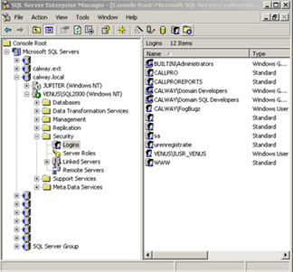 

Controleer dat de CALLPRO gebruiker een vinkje heeft staan bij “Process
administrator” zoals aangegeven.

P.S. De hier gebruikte screenshots zijn van SQL Server 2000. Voor
nieuwere versies van SQL Server zien de schermen er anders uit, maar de
werking is gelijk.

## Terminalserver ondersteuning CallPro

CallPro kan worden gebruikt via Terminalserver (of Citrix). Voor de
correcte werking van CallPro dient wel rekening te worden gehouden met
de volgende voorwaarden:

1.  CallPro dient <span class="underline">niet</span> te worden gestart
    vanuit een console sessie.

2.  CallPro dient netjes te worden afgesloten en de sessie dient ook te
    worden uitgelogd (niet gedisconnect). Als een gebruiker ingelogd
    staat in CallPro en de sessie afsluit zonder uit te loggen dan
    blijft deze sessie bij de meeste Terminalserver installaties
    bestaan. Een volgende gebruiker die inlogt (waarbij de bestaande
    sessie niet wordt hergebruikt) kan CallPro niet opstarten omdat er
    al iemand op deze thin-client is ingelogd in CallPro.

Callpro gebruikt op Terminalserver de environment variabele CLIENTNAME
om te bepalen welke seat moet worden gebruikt. Windows zet deze
standaard op de naam van de RDP client die verbindt met de server, maar
dit kan ook voor het starten van de scriptmodule worden gewijzigd.

## Kan de agent zien in welke fase hij/zij zit?

Ja, de actuele gespreksfase wordt in de statusbalk van de Scriptmodule
weergegeven. Na het inloggen wordt hier de actuele pauzetijd
weergegeven. Als de agent is aangemeld wordt hier de gespreksfase
“Wachten”, “Setup”, “Call”, “Wrapup” weergegeven met de tijd dat de
agent in deze fase actief is.

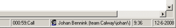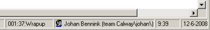

## Ik open een venster maar deze zie ik niet op de monitor verschijnen

CallPro onthoudt de locatie van vensters. Als je monitor van resolutie
veranderd, of je ontkoppelt een monitor die je eerder wel had dan kan
het gebeuren dat vensters buiten het scherm staan, of op de monitor die
niet meer aanwezig is.

Omdat sommige vensters “modaal” openen lijkt het of CallPro vast zit
omdat de nog wel zichtbare venster niet meer regeren op muisklikken.

Om dit op te lossen zijn diverse Windows sneltoetsen die kunnen worden
gebruikt.

### Vensters met icoon in de linker bovenhoek

Voor vensters waarbij in de linkerbovenhoek een icoon staat zijn
vensters met het toetsenbord te verplaatsen door Alt-Spatie daarna
Pijltje naar beneden en dan Enter te drukken.


Dit zet het “onzichtbare” venster in Verplaatsen mode. Nu kan met de
pijtjes toetsen het venster links en rechts worden verplaatst. Als de
monitor die is verwijderd rechts van de actieve monitor stond moet het
venster naar links worden verplaatst netzolang totdat dit op de actieve
monitor in beeld komt.

### Overige vensters

Voor vensters zonder icoon is er ook een optie om het venster tussen de
monitoren te verplaatsen. Druk hiervoor Windows-key+Shift ingedrukt en
gebruik vervolgens de links en rechts pijltjes om een venster tussen de
monitoren te wisselen.
